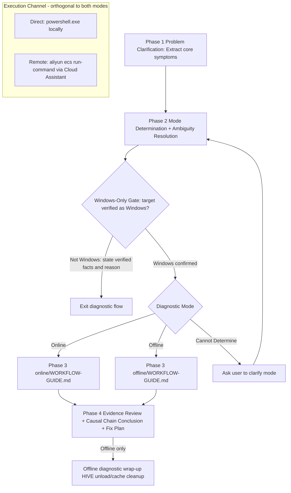

# ECS Windows Troubleshooting

This skill performs anomaly troubleshooting and diagnosis for **Alibaba Cloud ECS Windows instances** (online 7 problem domain groups and offline problem domain routing are defined in [WORKFLOW-GUIDE.md](references/online/WORKFLOW-GUIDE.md) and [WORKFLOW-GUIDE.md](references/offline/WORKFLOW-GUIDE.md) respectively). It supports two diagnostic modes:

- **Online Diagnosis**: The current Windows system is running. Troubleshoot layer by layer inside the GuestOS using PowerShell commands.
- **Offline Diagnosis**: The faulty system disk has been mounted as a data disk on the current instance. Perform root cause analysis and fix on the mounted offline system disk.

This file only defines **functional description and top-level flow**. The specific troubleshooting logic, criteria, and fix scripts are all defined in the corresponding files under `references/`. When executing, you MUST load the corresponding file and strictly follow its content—relying on memory will miss root causes or produce incorrect fixes.

## Out of Scope

- Non-Alibaba Cloud ECS, non-Windows GuestOS, other clouds or physical machines
- Pure management/billing/API-side issues with no GuestOS involvement
- When no channel (online or offline) is available to perform troubleshooting inside the target instance

## Principles and Requirements

1. **Collection result reuse**: Prioritize reusing command collection results already executed within the session. Except when truly necessary (e.g., time window change, need for latest state, previous execution failed), it is prohibited to repeatedly execute the same collection command with the same parameters.
2. **Classify before investigate**: First converge the user's description into a **problem domain** (pattern determination is described in "Phase 2" below; classification and sequence determination is executed in the "Path Planning" step after entering the corresponding mode's WORKFLOW-GUIDE), then execute according to the unified troubleshooting sequence for that domain. You must not skip classification and proceed with free-form troubleshooting.
3. **Self-service troubleshooting priority**: Any information that can be obtained through PowerShell commands in the target environment MUST be collected directly; users must not be asked to execute manually. Only when the command execution channel cannot cover should you ask the user, and the query MUST include a complete copyable collection command.
4. **Collection rules loaded by mode**: Collection channel rules and tool invocation rules are mode-specific details. After entering the corresponding mode, load the relevant rule files according to the "Collection Channel Rules" and "Collection Fallback Chain" sections of its WORKFLOW-GUIDE.
5. **Mode routing must not be skipped**: Before entering any troubleshooting action, you MUST first complete "Diagnostic Mode Determination" (online/offline). The two modes operate on different objects (online operates on the current running system, offline operates on the mounted offline system disk), and the loaded rule files and fix methods are also different. Mixing rules will produce invalid or even dangerous operations.
6. **Fix requires confirmation**: Any fix operation MUST present the complete plan and risk notes, and wait for the user's explicit confirmation before execution. Automatic execution of fix commands is prohibited. After presenting the plan, END the current turn — execution may start only after the user's explicit confirmation reply in a later turn; presenting the plan and executing the fix in the same turn is prohibited.
7. **Hide internal markers from users**: When presenting progress to users, it is prohibited to expose internal file names/paths, Step numbers, Direct/Critical labels, Skill design concepts (problem domain, fixed prerequisite chain, dynamic planning, etc.) and tool invocation class implementation descriptions. Communication rules are in the "User Presentation Rules" section of each mode's WORKFLOW-GUIDE. When requesting user cooperation for operations, only present "what to do" (purpose, operation content, precautions), and do not explain internal decision sources such as "based on a certain file's Step determination, execution is needed"—users only care about what to do, not internal troubleshooting details.
8. **Collection missing tolerance**: When some collection information cannot be obtained due to command execution failure or environment incompatibility, prioritize using the available information already collected to attempt to provide a diagnostic conclusion. Only when existing information is insufficient to support a conclusion should you disclose the supplementary collection items and corresponding commands to the user, and continue analysis after the user provides them.
9. **Speculative diagnosis disclosure**: Unless a root cause is directly confirmed by explicit collection evidence (e.g., registry value mismatch, missing file, driver disabled, corrupted BCD entry), the diagnostic conclusion and fix plan are **speculative** — based on inference from available data rather than definitive proof. You MUST clearly label speculative conclusions as such and advise the user to verify by testing the fix in a non-production environment first. When presenting the conclusion, distinguish between "confirmed by evidence" (cite the specific data) and "speculative — recommended for testing". This transparency helps users make informed decisions about risk and avoids overconfidence in uncertain diagnoses. This principle is enforced through the **Evidence Review** step in each mode's WORKFLOW-GUIDE ([online](references/online/WORKFLOW-GUIDE.md#evidence-review) / [offline](references/offline/WORKFLOW-GUIDE.md#evidence-review)), where judgments lacking direct evidence are downgraded to hypotheses pending verification with specific collection commands provided.
10. **Windows-only target**: Every procedure in this skill (online and offline, collection and fix) is PowerShell-based Windows diagnosis. Before ANY troubleshooting action, the target MUST be verified as Windows — this gate applies to all scenarios, regardless of diagnostic mode (online/offline) or execution channel (direct/remote). A non-Windows target is out of scope: state the verified facts and the reason, then exit the diagnostic flow. See the "Windows-Only Gate" section below for the per-channel verification method.

## Execution Channel

The execution channel determines **how** PowerShell commands are delivered to the target instance. This is orthogonal to the diagnostic mode (online/offline) — both modes support both channels. The channel is determined based on where the agent is running relative to the target instance.

- **Direct execution channel** (Local): Commands executed locally via `powershell.exe` on the same instance being diagnosed or where the offline disk is mounted. This is the default when the skill is running inside the target GuestOS.
- **Remote execution channel** (Remote): Commands sent via Alibaba Cloud CLI (`aliyun ecs run-command`) to a remote ECS instance through Cloud Assistant. Applies to both online diagnosis (commands sent to the target instance itself) and offline diagnosis (commands sent to the instance where the faulty disk is mounted). For detailed API reference, execution templates, and timeout guidelines, see [REMOTE-EXECUTION.md](references/REMOTE-EXECUTION.md). In online diagnosis this channel additionally supports fetching platform-side cross-validation data (instance/disk monitoring metrics, system events, console screenshot); see the online WORKFLOW-GUIDE.

**Channel determination is environmental, not lexical**: decide the channel from where the agent actually runs, never from the user's wording — a prompt saying "troubleshoot this server locally" does not place you inside the GuestOS. If the current environment cannot execute PowerShell at all (e.g., the agent is running on Linux/macOS or any non-Windows machine), you are by definition NOT inside the target Windows instance: the direct channel is unavailable, and this is a **channel blocker, not a scope exit**. Switch to the remote execution channel — verify its prerequisites (aliyun CLI, instance ID, region ID, instance Running + Windows) and deliver the same PowerShell diagnostic commands via `aliyun ecs run-command`. Only if the remote prerequisites also fail, present the complete copyable PowerShell scripts and ask the user to run them on the target instance. Terminating the troubleshooting with "PowerShell is not available here" is prohibited.

### Remote CLI Quick Reference (MUST copy these forms)

The `aliyun-cli-ecs` plugin's subcommands and flags are kebab-case and do NOT follow OpenAPI parameter names. Never construct `aliyun ecs` commands from memory of the OpenAPI docs — copy the tested forms below verbatim; for any subcommand not listed here, load [REMOTE-EXECUTION.md](references/REMOTE-EXECUTION.md) §CLI Flag Reference BEFORE the first call.

| Purpose | Tested invocation |
| --- | --- |
| Prerequisite check (Status + OSType gate) | `aliyun ecs describe-instances --biz-region-id <region-id> --instance-ids '["<instance-id>"]'` |
| Send PowerShell script | `aliyun ecs run-command --biz-region-id <region-id> --type RunPowerShellScript --command-content '<script>' --instance-id <instance-id> --name <name> --timeout <seconds>` |
| Poll execution result | `aliyun ecs describe-invocation-results --biz-region-id <region-id> --invoke-id <t-prefixed-invocation-id>` |
| List regions (fallback sweep) | `aliyun ecs describe-regions` |

Hard rules (verified against aliyun-cli-ecs 0.7.8):

- The region flag is `--biz-region-id` with a plain string value (e.g. `cn-hangzhou`) — never `--RegionId` or `--region-id`; the only exceptions are the monitor-data APIs, which take global `--region`
- `--instance-ids` takes a JSON array string (`'["i-..."]'`); on Windows targets `--type` is `RunPowerShellScript`
- Invocation result `Output` is Base64 with embedded `\n` escapes — strip then decode (tested pipeline in REMOTE-EXECUTION.md §Core Execution Pattern)

**On parameter/syntax errors** (`InvalidParameter`, `unknown flag`, `Did you mean:` hint, missing required parameter): STOP — do not guess flags or retry variants. Re-read [REMOTE-EXECUTION.md](references/REMOTE-EXECUTION.md) §CLI Flag Reference, copy the exact template, and re-run once. Semantic/transient errors (Throttling, Forbidden, InstanceNotFound, NetworkError) do NOT benefit from reloading flag docs — route them to the Error Handling table in REMOTE-EXECUTION.md.

### Remote Execution Prerequisites

When the remote execution channel is needed (for either online or offline diagnosis), MUST verify before proceeding to the corresponding WORKFLOW-GUIDE: (1) aliyun CLI installed (with the `aliyun-cli-ecs` plugin — ECS commands use plugin mode with kebab-case subcommands **and flags**, see the tested flag reference in [REMOTE-EXECUTION.md](references/REMOTE-EXECUTION.md) §CLI Flag Reference) and configured, (2) target instance ID and region ID known (for offline diagnosis, the instance with the faulty disk mounted), (3) target instance in Running state, (4) target instance `OSType` confirmed as `windows` by that same `describe-instances` call (the remote-channel implementation of the Windows-Only Gate). Verification commands and installation guidance are in [REMOTE-EXECUTION.md](references/REMOTE-EXECUTION.md) §Prerequisites; required RAM permissions are declared per-action in [ram-policies.md](references/ram-policies.md).

Store the verified `RegionId` and `InstanceId` as session context for reuse across all subsequent remote commands. If the `OSType` check fails, apply the Windows-Only Gate exit below. If any other prerequisite fails and cannot be resolved, inform the user and suggest alternative approaches (e.g., manual execution, console-based troubleshooting).

### Observability

Every `aliyun` CLI call in the remote execution channel carries a User-Agent header identifying this skill and the current troubleshooting session, so cloud-side logs (ActionTrail, Cloud Assistant invocation history) can be correlated to a single diagnostic run:

- **UA template**: `--user-agent AlibabaCloud-Agent-Skills/alibabacloud-ecs-windows-os-troubleshooting/{session-id}` — the platform-standard UA declaration for agent skills: fixed prefix `AlibabaCloud-Agent-Skills`, then the skill `name` from this file's frontmatter, then one session-id. Append this flag to every `aliyun` CLI invocation in the channel.
- **Session-id rule**: generate one session-id when the remote channel first passes prerequisites (UTC timestamp + short random hex suffix), store it in session context beside `RegionId`/`InstanceId`, and reuse it unchanged for every CLI call in the session; regenerate only when the user starts a new, unrelated troubleshooting task

Full rules and filled examples are in [REMOTE-EXECUTION.md](references/REMOTE-EXECUTION.md) §Observability. The direct execution channel makes no cloud API calls, so these rules do not apply to it.

## Troubleshooting Flow (Top-Level)

### Phase 1: Problem Clarification

Extract core symptoms from the user's description and accompanying materials (error codes, error text, screenshots, time of occurrence, and recent changes). When information is insufficient, you MUST ask follow-up questions first; do not proceed to classification with vague descriptions.

### Phase 2: Mode Determination

This skill runs inside the GuestOS or remotely via Cloud Assistant. The problem boundary has been determined as a GuestOS issue; no platform-side boundary determination is needed. This phase determines the **online/offline** diagnostic mode and resolves key ambiguities. The execution channel (local vs remote) is determined separately in the "Execution Channel" section below.

**Determination Flow (MUST execute in order)**:

1. **Online Diagnosis**: The problem points to the currently running Windows system → Determine **Online Diagnosis** → [WORKFLOW-GUIDE.md](references/online/WORKFLOW-GUIDE.md)
2. **Offline Diagnosis**: The faulty system disk has been mounted as a data disk offline on the current instance (or a remote instance); troubleshooting of the offline disk is needed → Determine **Offline Diagnosis** → [WORKFLOW-GUIDE.md](references/offline/WORKFLOW-GUIDE.md)
3. **Cannot Determine**: Based on the user's description, it cannot be determined which of the above situations applies → Ask the user to clarify: is the fault a problem with the currently running system, or has the faulty system disk been mounted offline to an instance for troubleshooting?

**Key Ambiguity Resolution** (the domain identifiers below are only used to help determine the direction; they do not trigger routing; formal routing is executed in the "Path Planning" step):

| Easily Confused Description | Determination |
| --- | --- |
| Slow boot / slow shutdown / overall sluggishness | Operation **completes but slowly** → Performance issue group (`UnexpectedlySlowLoading` / `SystemSlowPerformance`) |
| Cannot start / shutdown stuck and cannot complete / crash/hang | Operation **cannot complete or is unresponsive** → Boot issue / crash-hang or lifecycle exception group |
| Instance cannot access internet internally, cannot ping external | `GuestOS.InsideNetworkAccessFailed` |
| Cannot connect to instance business port / website from outside | `GuestOS.OutsideNetworkAccessFailed` |
| Disk not visible after online mount, detach failure | `GuestOS.AttachOrDetachDiskFailed` |
| Offline mounted partition is RAW / unreadable, spec change prompts recovery key | `GuestOS.BitLockerLocked` (offline branch) |

**Platform instance status vs GuestOS state**: The console instance status reflects the lifecycle of the virtualization layer, not the health of the operating system. "Running" only means the platform has finished provisioning hardware resources and the instance is powered on — at most it says the instance has *begun attempting* to load the OS; underlying hardware or software faults, system misconfiguration, or file corruption can all leave the GuestOS unusable while the platform still shows Running. Therefore "console shows Running but the system cannot boot / cannot connect / business is down" is **not contradictory** — it is the typical presentation of a GuestOS-level boot failure, and console VNC output is the direct evidence of where the boot stopped. Conversely, an instance remaining in "Starting" for an abnormally long time indicates a startup-stage anomaly on the platform side (non-GuestOS primary cause).

Problem classification (determining problem domain and unified troubleshooting sequence) is executed in the "Path Planning" step after entering the corresponding mode's WORKFLOW-GUIDE. This phase does not load the domain routing table.

### Windows-Only Gate (after Phase 2, before entering Phase 3; applies to all modes and both channels)

The target of the diagnosis MUST be a Windows system before any troubleshooting action starts. This gate is orthogonal to the mode determination above — it applies to every scenario (online/offline, direct/remote), because the entire procedure body of this skill is PowerShell-based Windows diagnosis: on a non-Windows target the collection scripts either fail outright or produce misleading output, and a non-Windows GuestOS is outside this skill's declared scope. The verification method depends on the execution channel:

- **Remote channel (either mode)**: the check rides the mandatory `aliyun ecs describe-instances` prerequisite call — `OSType` must be `windows`. The API result is authoritative: it wins over the user's statement ("my Windows server"), the instance name, or any ID-prefix guess. This holds even when the user explicitly asserted the instance is Windows. For offline remote diagnosis, the checked instance is the one receiving commands (the instance with the faulty disk mounted), since all offline procedures (registry HIVE, DISM) are also PowerShell/Windows operations.
- **Direct channel**: PowerShell 5.1+ executing successfully inside the GuestOS is itself the Windows confirmation — no cloud API is involved or required. If the current environment cannot execute PowerShell, that only means the direct channel is unavailable (you are not inside the target GuestOS) — treat it as a channel blocker and switch to the remote channel per the Execution Channel section; the local environment's OS says nothing about the target's OS, so this is NOT a Windows-Only Gate failure and NOT a reason to stop.

**On failure — exit, do not degrade**: if the check shows the target is not Windows, do NOT enter any WORKFLOW-GUIDE, do NOT send or execute any diagnostic command, and do NOT offer channel fallbacks or alternative collection paths — this is a scope boundary, not a channel failure. Report to the user the verified facts (what was checked, what was found — e.g., instance ID, region, actual `OSType` value) and the reason the flow stops (this skill supports Windows ECS instances only), then exit the diagnostic flow.

### Phase 3: Execute Troubleshooting by Mode

| Mode | Load | Content |
| --- | --- | --- |
| Online Diagnosis | [WORKFLOW-GUIDE.md](references/online/WORKFLOW-GUIDE.md) | Complete online diagnosis execution flow (problem understanding → path planning → step-by-step execution → causal chain analysis → evidence review → fix plan) |
| Offline Diagnosis | [WORKFLOW-GUIDE.md](references/offline/WORKFLOW-GUIDE.md) | Complete offline diagnosis execution flow (prerequisite checks → problem understanding → path planning → step-by-step execution → causal chain analysis → evidence review → fix plan → diagnostic wrap-up) |

After entering the corresponding WORKFLOW-GUIDE, strictly follow its flow; do not mix rules from the other mode. During troubleshooting, intra-domain details are routed by sequence to specific troubleshooting files under `references/online/` or `references/offline/`.

### Phase 4: Conclusion and Fix

1. **Evidence Review**: Before outputting diagnostic conclusions, review all collected data and judgments as a whole. For each judgment in the causal chain, cite the specific collected data that supports it. Any judgment lacking direct evidence MUST be labeled as "speculative — inference only" with a note on what additional data would confirm it. Every causal edge ("A caused B") must carry the evidence triple — the collection command + output excerpt, the matched documented judgment, and time-window consistency (cause timestamps precede or overlap the symptom window). Co-occurrence is not causation: temporal linkage, the same object on both sides, and a documented mechanism are all required, otherwise A and B are reported as separate observations. Each asserted root cause must include the differential diagnosis — which alternative causes were examined and what data excluded them. Present this consolidated evidence review to the user before proceeding to the fix plan — this prevents unsupported conclusions from reaching the fix phase, and gives the user the opportunity to spot gaps or provide additional context.
2. Output structured diagnostic conclusions (evidence, causal chain, fix plan, verification) according to the WORKFLOW-GUIDE's "Causal Chain Analysis", "Evidence Review", and "Output Format Template".
3. Fix plans must comply with all constraints in the WORKFLOW-GUIDE's "Fix Plan" section (confirm before execution, risk notes, aggregate same-issue fixes, separate different-issue fixes).
4. Offline mode wrap-up MUST execute the WORKFLOW-GUIDE's "Diagnostic Cleanup" section (HIVE unload and cache cleanup).

## Flow Overview (Decision Order)

