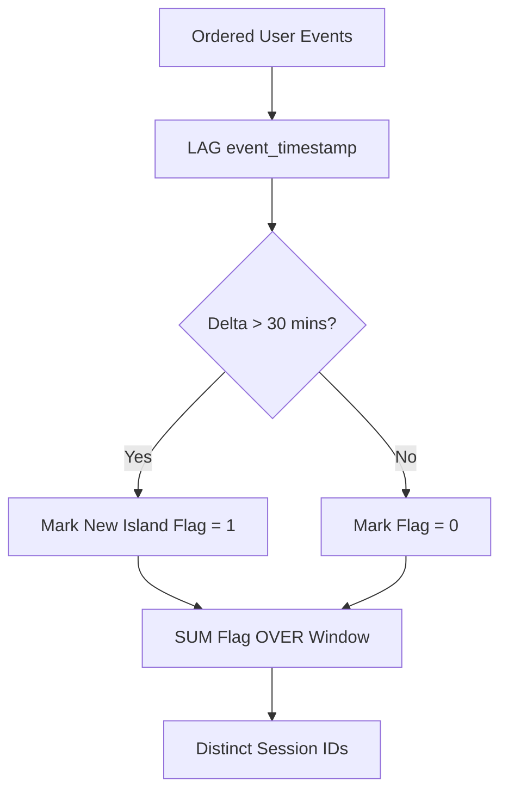

# Analytics Advanced Sql Windowing
> Based on **SQL for Data Analysis - Cathy Tanimura**

## 1. Canonical Architecture & Data Modeling (DDL)

```sql
-- Event Stream Table for Window Analytics
CREATE TABLE user_events (
    event_id BIGINT PRIMARY KEY,
    user_id BIGINT NOT NULL,
    event_timestamp TIMESTAMP NOT NULL,
    event_type VARCHAR(50) NOT NULL,
    page_url VARCHAR(255)
);

CREATE INDEX idx_user_events_stream ON user_events(user_id, event_timestamp);
```

## 2. Core Mathematical Foundations & Analytical Invariants

### 2.1 Dense Rank Continuity Invariant
For sorted series $X = [x_1, x_2, \dots, x_n]$:
$$\text{DENSE\_RANK}(x_i) - \text{DENSE\_RANK}(x_{i-1}) \in \{0, 1\}$$

### 2.2 Gaps-and-Islands Grouping Invariant
Let $t_i$ be event time and $t_{i-1}$ be preceding event time for a user:
$$\text{IsNewSession} = \begin{cases} 1 & \text{if } t_i - t_{i-1} > 30 \text{ minutes} \lor t_{i-1} \text{ is NULL} \\ 0 & \text{otherwise} \end{cases}$$
$$\text{SessionID} = \sum_{k=1}^i \text{IsNewSession}_k$$

## 3. Pipeline Flow & State Machine Invariants



## 4. Production Implementation Guidelines (Rust / SQL / Python)

```sql
-- 30-Minute Inactivity Sessionization in SQL
WITH flagged_events AS (
    SELECT 
        event_id,
        user_id,
        event_timestamp,
        CASE 
            WHEN event_timestamp - LAG(event_timestamp) OVER (PARTITION BY user_id ORDER BY event_timestamp) > INTERVAL '30 minutes'
                 OR LAG(event_timestamp) OVER (PARTITION BY user_id ORDER BY event_timestamp) IS NULL 
            THEN 1 ELSE 0 
        END AS is_new_session
    FROM user_events
)
SELECT 
    event_id,
    user_id,
    event_timestamp,
    SUM(is_new_session) OVER (PARTITION BY user_id ORDER BY event_timestamp ROWS UNBOUNDED PRECEDING) AS session_id
FROM flagged_events;
```

## 5. Actionable Prompt Recipes

### 5.1 Local Ollama Cheat Sheet (Actionable Constraints & Invariants)
```markdown
- Use ROWS BETWEEN for deterministic physical window frames; avoid unbounded RANGE unless ordering is unique.
- Solve sessionization via LAG() timestamp delta followed by running SUM() over partition.
- DENSE_RANK guarantees consecutive integer rank without gaps; RANK skips numbers on ties.
- Compute rolling 7-day or 30-day moving averages using PRECEDING frame bounds.
```

### 5.2 Cloud LLM Architectural Prompt (Comprehensive Engineering Blueprint)
```markdown
Author advanced analytical SQL solutions:
1. Formulate sessionization and gaps-and-islands algorithms using window offsets and running sums.
2. Build cohort retention matrices and rolling trailing aggregations with exact window frames.
3. Optimize window execution plans via composite sorting indexes on PARTITION BY + ORDER BY keys.
```
