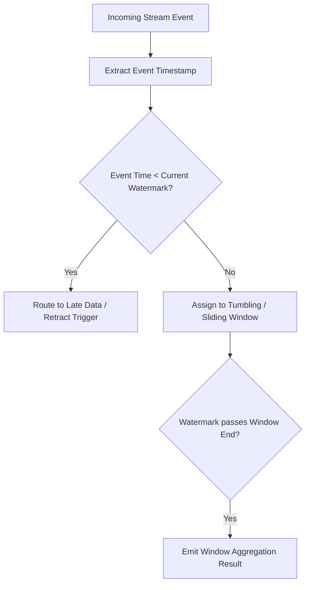

# Analytics Akidau Stream Processing
> Based on **Streaming Systems - Tyler Akidau, Slava Chernyak, Reuven Lax**

## 1. Canonical Architecture & Data Modeling (DDL)

```sql
-- Stream Watermark & Window State Tracking
CREATE TABLE stream_watermark_state (
    partition_id INT PRIMARY KEY,
    current_watermark TIMESTAMP NOT NULL,
    max_event_time_seen TIMESTAMP NOT NULL,
    allowed_lateness_sec INT NOT NULL DEFAULT 300
);
```

## 2. Core Mathematical Foundations & Analytical Invariants

### 2.1 Watermark Monotonicity Invariant
Let $W(t)$ be the event-time watermark at processing time $t$:
$$W(t) = \max_{i} (E_i) - \Delta_{\text{skew}}$$
$$W(t_2) \ge W(t_1) \quad \forall t_2 > t_1 \quad (\text{Watermark never moves backwards})$$
Late data condition: Event $e$ is late iff $\text{event\_time}(e) < W(t)$.

## 3. Pipeline Flow & State Machine Invariants



## 4. Production Implementation Guidelines (Rust / SQL / Python)

```sql
// Rust Monotonic Watermark Tracker
pub struct WatermarkTracker {
    current_watermark: u64,
    allowed_lateness_ms: u64,
}

impl WatermarkTracker {
    pub fn update(&mut self, event_time_ms: u64) -> u64 {
        if event_time_ms > self.allowed_lateness_ms {
            let proposed = event_time_ms - self.allowed_lateness_ms;
            if proposed > self.current_watermark {
                self.current_watermark = proposed;
            }
        }
        self.current_watermark
    }
}
```

## 5. Actionable Prompt Recipes

### 5.1 Local Ollama Cheat Sheet (Actionable Constraints & Invariants)
```markdown
- The 4 questions: What is computed (transforms)? Where in event time (windowing)? When in processing time (watermarks)? How results relate (accumulating/retracting)?
- Watermarks must be monotonically increasing; they establish completeness guarantees in event time.
- Tumbling windows partition time discretely; session windows dynamically merge on user inactivity gaps.
- Handle late arrivals explicitly using allowed lateness windows and retraction streams.
```

### 5.2 Cloud LLM Architectural Prompt (Comprehensive Engineering Blueprint)
```markdown
Design real-time stream processing architectures:
1. Implement heuristic and punctuated event-time watermarking engines in Rust/Flink.
2. Build dynamic sessionization windows merging overlapping state upon out-of-order event arrival.
3. Configure accumulating and retracting triggers emitting low-latency speculative updates.
```
