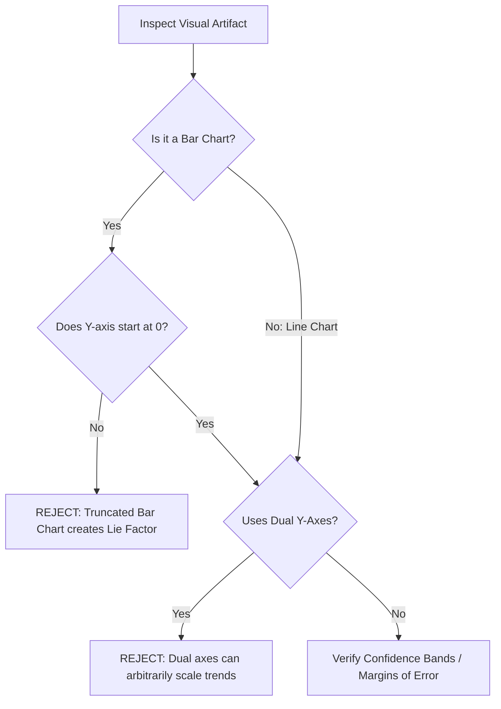

# Analytics Cairo Visual Integrity
> Based on **How Charts Lie - Alberto Cairo**

## 1. Canonical Architecture & Data Modeling (DDL)

```sql
-- Chart Validation Rule Results
CREATE TABLE chart_deception_audits (
    chart_id VARCHAR(50) PRIMARY KEY,
    chart_type VARCHAR(30) NOT NULL,
    y_axis_starts_at_zero BOOLEAN NOT NULL,
    is_scale_truncated BOOLEAN NOT NULL,
    visualizes_uncertainty BOOLEAN NOT NULL,
    audit_verdict VARCHAR(20) NOT NULL CHECK (audit_verdict IN ('PASS', 'FAIL_MISLEADING_AXIS'))
);
```

## 2. Core Mathematical Foundations & Analytical Invariants

### 2.1 Bar Chart Zero-Baseline Invariant
For bar charts where magnitude is encoded as bar length/height:
$$y_{\text{baseline}} = 0.0000$$
Truncating the baseline ($y_{\text{min}} > 0$) distorts the visual ratio of lengths:
$$\frac{\text{Length}(A)}{\text{Length}(B)} = \frac{A - y_{\text{min}}}{B - y_{\text{min}}} \neq \frac{A}{B}$$
This produces visual exaggeration and violates graphical truthfulness.

## 3. Pipeline Flow & State Machine Invariants



## 4. Production Implementation Guidelines (Rust / SQL / Python)

```sql
# Automated Bar Chart Axis Validator
def audit_bar_chart_axes(ymin: float, chart_type: str) -> bool:
    if chart_type.lower() == 'bar':
        if abs(ymin) > 1e-6:
            return False # Fails zero-baseline invariant
    return True
```

## 5. Actionable Prompt Recipes

### 5.1 Local Ollama Cheat Sheet (Actionable Constraints & Invariants)
```markdown
- Bar charts MUST always start at zero; truncating the baseline exaggerates minor differences.
- Line charts do not require zero baseline, but the non-zero origin must be clearly labeled.
- Never use dual axes with different scales; they allow author to manipulate visual intersection points.
- Always display uncertainty: show confidence intervals, margin of error, or hypothetical outcome plots.
```

### 5.2 Cloud LLM Architectural Prompt (Comprehensive Engineering Blueprint)
```markdown
Deploy automated chart integrity linters:
1. Build continuous CI tests scanning dashboard Vega/D3 specs for truncated bar chart baselines.
2. Flag deceptive visualizations exhibiting cherry-picked time intervals or uncalibrated dual axes.
3. Enforce visual uncertainty representation (gradient bands, error bars) on all predictive forecasts.
```
