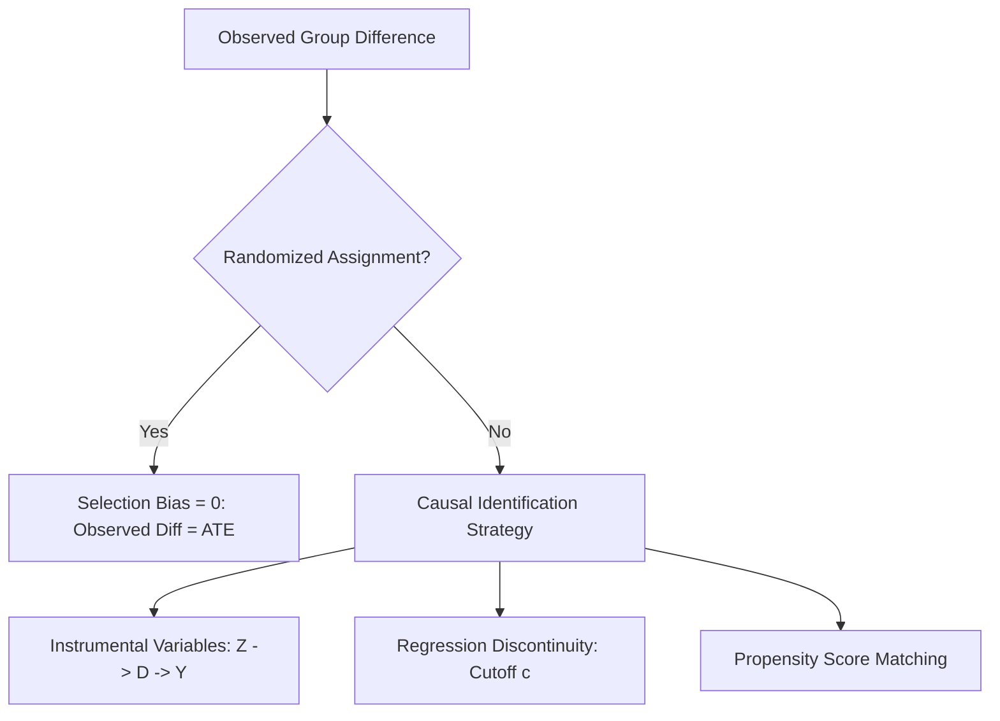

# Analytics Causal Mixtape
> Based on **Causal Inference: The Mixtape - Scott Cunningham**

## 1. Canonical Architecture & Data Modeling (DDL)

```sql
-- Causal Analysis Cohort Data Table
CREATE TABLE causal_cohort_observations (
    entity_id BIGINT PRIMARY KEY,
    treatment_assigned INT NOT NULL CHECK (treatment_assigned IN (0, 1)),
    observed_outcome DOUBLE PRECISION NOT NULL,
    running_variable DOUBLE PRECISION, -- For Regression Discontinuity
    instrument DOUBLE PRECISION -- For Instrumental Variables
);
```

## 2. Core Mathematical Foundations & Analytical Invariants

### 2.1 Potential Outcomes & Selection Bias Decomposition
Let $Y_i(1)$ and $Y_i(0)$ be potential outcomes under treatment and control:
$$E[Y | D = 1] - E[Y | D = 0] = \underbrace{E[Y(1) - Y(0)]}_{\text{ATE}} + \underbrace{\{E[Y(0) | D=1] - E[Y(0) | D=0]\}}_{\text{Selection Bias}}$$
In randomized experiments, assignment $D \perp (Y(1), Y(0)) \implies \text{Selection Bias} = 0$.

### 2.2 Wald Instrumental Variable Estimator
For binary instrument $Z$, treatment $D$, and outcome $Y$:
$$\hat{\beta}_{\text{IV}} = \frac{E[Y | Z = 1] - E[Y | Z = 0]}{E[D | Z = 1] - E[D | Z = 0]} = \frac{\text{Cov}(Y, Z)}{\text{Cov}(D, Z)}$$

## 3. Pipeline Flow & State Machine Invariants



## 4. Production Implementation Guidelines (Rust / SQL / Python)

```sql
# Instrumental Variable Wald Estimator in Python
import numpy as np

def wald_iv_estimator(z: np.ndarray, d: np.ndarray, y: np.ndarray) -> float:
    delta_y = np.mean(y[z == 1]) - np.mean(y[z == 0])
    delta_d = np.mean(d[z == 1]) - np.mean(d[z == 0])
    if abs(delta_d) < 1e-6:
        raise ValueError("Weak instrument: zero compliance effect")
    return delta_y / delta_d
```

## 5. Actionable Prompt Recipes

### 5.1 Local Ollama Cheat Sheet (Actionable Constraints & Invariants)
```markdown
- Observed difference in means equals ATE plus Selection Bias; observational studies contain selection bias.
- An instrument Z must satisfy Relevance (Cov(Z, D) != 0) and Exclusion Restriction (Cov(Z, epsilon) = 0).
- Regression Discontinuity compares entities immediately above and below an arbitrary threshold cutoff.
- Never interpret raw correlation as causation without an explicit identification strategy.
```

### 5.2 Cloud LLM Architectural Prompt (Comprehensive Engineering Blueprint)
```markdown
Build production causal inference engines:
1. Implement potential outcomes estimation with explicit selection bias diagnostics.
2. Build Two-Stage Least Squares (2SLS) and Wald instrumental variable estimators with weak instrument F-tests.
3. Design Sharp and Fuzzy Regression Discontinuity (RDD) pipelines with optimal bandwidth selection.
```
