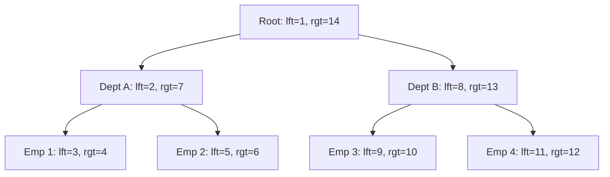

# Analytics Celko Relational Logic
> Based on **Joe Celko's SQL for Smarties - Joe Celko**

## 1. Canonical Architecture & Data Modeling (DDL)

```sql
-- Celko Nested Sets Hierarchy
CREATE TABLE org_chart (
    emp_id INT PRIMARY KEY,
    emp_name VARCHAR(100) NOT NULL,
    lft INT NOT NULL UNIQUE CHECK (lft > 0),
    rgt INT NOT NULL UNIQUE CHECK (rgt > lft),
    CONSTRAINT chk_nested_range CHECK (lft < rgt)
);

CREATE INDEX idx_nested_sets ON org_chart(lft, rgt);
```

## 2. Core Mathematical Foundations & Analytical Invariants

### 2.1 Nested Sets Invariant
For every node $N$ in a nested sets hierarchy:
$$\text{Count of Subtree Descendants} = \frac{\text{rgt}_N - \text{lft}_N - 1}{2}$$
For any child node $C$ under parent $P$:
$$\text{lft}_P < \text{lft}_C < \text{rgt}_C < \text{rgt}_P$$

### 2.2 Relational Exact Division
A entity $E$ matches all requirements $R$ if and only if:
$$\text{Count}(E \cap R) = |R| \land \text{Count}(E \setminus R) = 0$$

## 3. Pipeline Flow & State Machine Invariants



## 4. Production Implementation Guidelines (Rust / SQL / Python)

```sql
-- Relational Division: Candidates possessing ALL required skills
SELECT candidate_id
FROM candidate_skills
WHERE skill_name IN ('SQL', 'Rust', 'DuckDB')
GROUP BY candidate_id
HAVING COUNT(DISTINCT skill_name) = 3;
```

## 5. Actionable Prompt Recipes

### 5.1 Local Ollama Cheat Sheet (Actionable Constraints & Invariants)
```markdown
- In nested sets: node descendants count is strictly (rgt - lft - 1) / 2.
- Querying entire subtrees in nested sets requires zero recursion: WHERE lft BETWEEN p.lft AND p.rgt.
- Remember 3-valued logic: NULL = NULL yields UNKNOWN; NOT IN with NULL returns zero rows.
- Implement relational division using GROUP BY and HAVING COUNT(DISTINCT requirement) = total.
```

### 5.2 Cloud LLM Architectural Prompt (Comprehensive Engineering Blueprint)
```markdown
Implement complex relational structures using Celko's engineering principles:
1. Design Nested Sets tree schemas supporting instant sub-tree traversal without recursive CTEs.
2. Implement exact relational division queries for multi-attribute matching and skill matrices.
3. Enforce strict ANSI 3-valued logic safety when handling NULLs in outer joins and NOT IN clauses.
```
