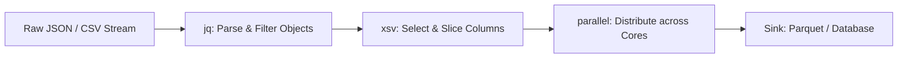

# Analytics Cli Data Science
> Based on **Data Science on the Command Line - Jeroen Janssens**

## 1. Canonical Architecture & Data Modeling (DDL)

```sql
-- CLI Pipeline Run Tracking
CREATE TABLE cli_job_executions (
    command_hash CHAR(32) PRIMARY KEY,
    raw_command TEXT NOT NULL,
    exit_code INT NOT NULL,
    input_records BIGINT NOT NULL,
    output_records BIGINT NOT NULL,
    execution_time_sec DOUBLE PRECISION NOT NULL
);
```

## 2. Core Mathematical Foundations & Analytical Invariants

### 2.1 Pipe Stream Invariance
Let $f_1, f_2, \dots, f_k$ be stateless stream filter programs:
$$(f_k \circ \dots \circ f_1)(S) = f_k(\dots(f_1(S)))$$
Memory overhead remains strictly $O(1)$ constant buffer size regardless of stream size $|S|$.

## 3. Pipeline Flow & State Machine Invariants



## 4. Production Implementation Guidelines (Rust / SQL / Python)

```sql
# High-Performance CLI One-Liner Pipeline
# Extract 99th percentile response time per endpoint from 10GB logs
cat access.log \
  | jq -r '[.endpoint, .response_time_ms] | @csv' \
  | xsv select 1,2 \
  | xsv stats --nulls \
  | xsv table
```

## 5. Actionable Prompt Recipes

### 5.1 Local Ollama Cheat Sheet (Actionable Constraints & Invariants)
```markdown
- Compose UNIX command-line tools via standard pipes (stdin -> filter -> stdout).
- Use xsv for blazing-fast CSV slicing, indexing, frequency counts, and joins.
- Use jq for zero-dependency JSON extraction and reshaping.
- Scale multi-core batch processing using GNU parallel: parallel --jobs 8 < jobs.txt.
```

### 5.2 Cloud LLM Architectural Prompt (Comprehensive Engineering Blueprint)
```markdown
Build reproducible command-line data processing architectures:
1. Construct streaming UNIX pipelines utilizing jq, xsv, and awk operating in constant memory.
2. Parallelize batch processing across multi-core systems using GNU parallel.
3. Package CLI tools into deterministic, containerized pipelines for automated CI/CD validation.
```
