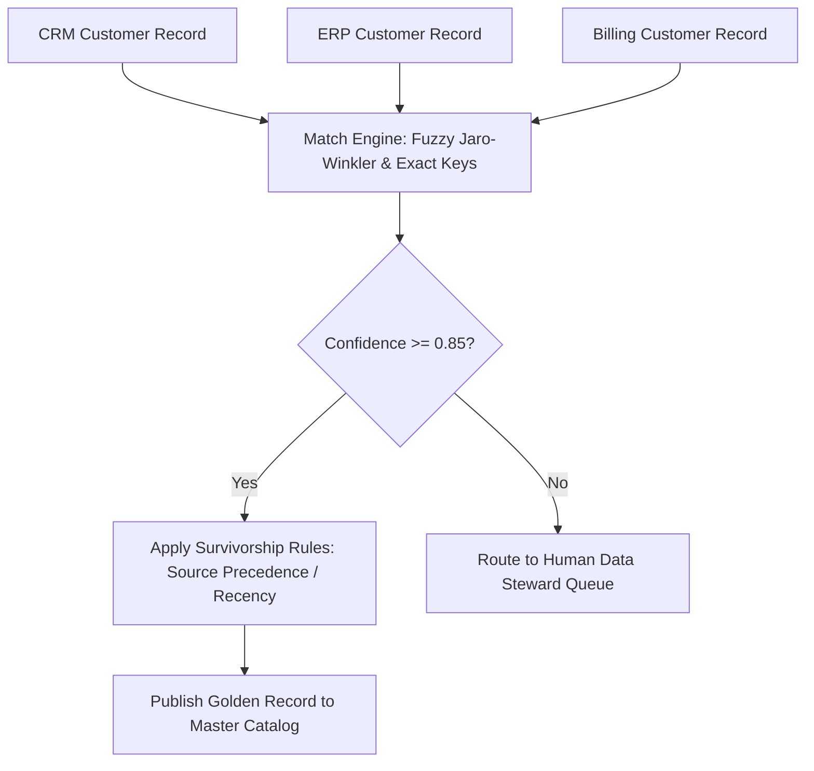

# Analytics Dama Data Governance
> Based on **DAMA-DMBOK - DAMA International**

## 1. Canonical Architecture & Data Modeling (DDL)

```sql
-- Master Data Management (MDM) Golden Record Store
CREATE TABLE mdm_golden_customer (
    golden_customer_id UUID PRIMARY KEY,
    primary_source_system VARCHAR(50) NOT NULL,
    source_record_id VARCHAR(100) NOT NULL,
    consolidated_name VARCHAR(100) NOT NULL,
    consolidated_email VARCHAR(100) NOT NULL,
    confidence_score DOUBLE PRECISION NOT NULL CHECK (confidence_score >= 0.0 AND confidence_score <= 1.0),
    survivorship_rule_applied VARCHAR(50) NOT NULL,
    updated_at TIMESTAMP NOT NULL DEFAULT CURRENT_TIMESTAMP
);
```

## 2. Core Mathematical Foundations & Analytical Invariants

### 2.1 MDM Golden Record Deterministic Survivorship Invariant
Let entity records $R_1, \dots, R_m$ represent the same real-world identity from source systems $S_1, \dots, S_m$:
$$\text{Value}(A_{\text{golden}}) = \text{Select}\left( \{R_i.A\}, \text{Precedence}(S_1 \succ S_2 \succ \dots \succ S_m) \lor \max(R_i.\text{timestamp}) \right)$$
The survivorship function must be deterministic and fully auditable.

## 3. Pipeline Flow & State Machine Invariants



## 4. Production Implementation Guidelines (Rust / SQL / Python)

```sql
// Rust MDM Survivorship Rule Engine
pub struct SourceAttribute {
    pub system_priority: usize, // Lower number = higher priority
    pub timestamp: u64,
    pub value: String,
}

pub fn resolve_golden_value(candidates: &[SourceAttribute]) -> Option<String> {
    candidates.iter()
        .min_by_key(|c| (c.system_priority, u64::MAX - c.timestamp))
        .map(|c| c.value.clone())
}
```

## 5. Actionable Prompt Recipes

### 5.1 Local Ollama Cheat Sheet (Actionable Constraints & Invariants)
```markdown
- The DAMA-DMBOK wheel centers on Data Governance, surrounded by 10 knowledge areas.
- Master Data Management (MDM) establishes a Single Source of Truth ('Golden Record') for core entities.
- Survivorship rules must be deterministic: define source-of-record hierarchy or most-recent-valid-timestamp.
- Route ambiguous identity matches below confidence threshold (e.g. < 0.85) to Data Stewards.
```

### 5.2 Cloud LLM Architectural Prompt (Comprehensive Engineering Blueprint)
```markdown
Architect an enterprise data governance program adhering to DAMA-DMBOK:
1. Formulate master data golden record survivorship rules (source-of-record priority and recency).
2. Establish a Data Governance Council charter with clear stewardship roles and RACI matrices.
3. Deploy automated metadata catalogs tracking classification, data lineage, and retention policies.
```
