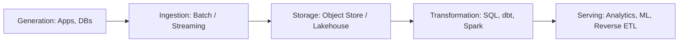

# Analytics Data Engineering Lifecycle
> Based on **Fundamentals of Data Engineering - Joe Reis & Matt Housley**

## 1. Canonical Architecture & Data Modeling (DDL)

```sql
-- Pipeline SLA Performance Metadata
CREATE TABLE pipeline_sla_metrics (
    pipeline_id VARCHAR(100) PRIMARY KEY,
    cadence VARCHAR(20) NOT NULL CHECK (cadence IN ('STREAMING', 'MICROBATCH', 'HOURLY', 'DAILY')),
    target_sla_sec INT NOT NULL,
    actual_latency_sec INT NOT NULL,
    cost_per_run_usd NUMERIC(10, 4) NOT NULL,
    last_success_timestamp TIMESTAMP NOT NULL
);
```

## 2. Core Mathematical Foundations & Analytical Invariants

### 2.1 Latency vs Throughput Tradeoff
Let $B$ be batch size and $T_{\text{overhead}}$ be per-batch fixed overhead:
$$\text{Throughput}(B) = \frac{B}{B \cdot t_{\text{item}} + T_{\text{overhead}}}$$
As $B \to \infty$, throughput reaches maximum $\frac{1}{t_{\text{item}}}$, but latency increases linearly with $B$.

## 3. Pipeline Flow & State Machine Invariants



## 4. Production Implementation Guidelines (Rust / SQL / Python)

```sql
# Batch vs Streaming Tradeoff Decision Matrix
def choose_pipeline_architecture(max_tolerable_latency_sec: int, budget_tier: str) -> str:
    if max_tolerable_latency_sec < 60:
        return "STREAMING_EVENT_DRIVEN"
    elif max_tolerable_latency_sec < 3600 and budget_tier != "LOW":
        return "MICROBATCH_5MIN"
    else:
        return "SCHEDULED_BATCH_HOURLY" 
```

## 5. Actionable Prompt Recipes

### 5.1 Local Ollama Cheat Sheet (Actionable Constraints & Invariants)
```markdown
- The 5 lifecycle stages: Generation -> Ingestion -> Storage -> Transformation -> Serving.
- Address undercurrents throughout: Security, Data Management, DataOps, Architecture, Orchestration.
- Choose batch by default unless business value demonstrably requires sub-minute streaming latency.
- Design every transformation step to be idempotent: re-running never produces duplicate data.
```

### 5.2 Cloud LLM Architectural Prompt (Comprehensive Engineering Blueprint)
```markdown
Formulate end-to-end data engineering lifecycle blueprints:
1. Conduct objective latency vs cost tradeoff evaluations between streaming and micro-batch architectures.
2. Design secure, cost-optimized object storage lakehouse tiering (Bronze/Silver/Gold).
3. Implement automated orchestration DAGs embedding DataOps and governance undercurrents.
```
