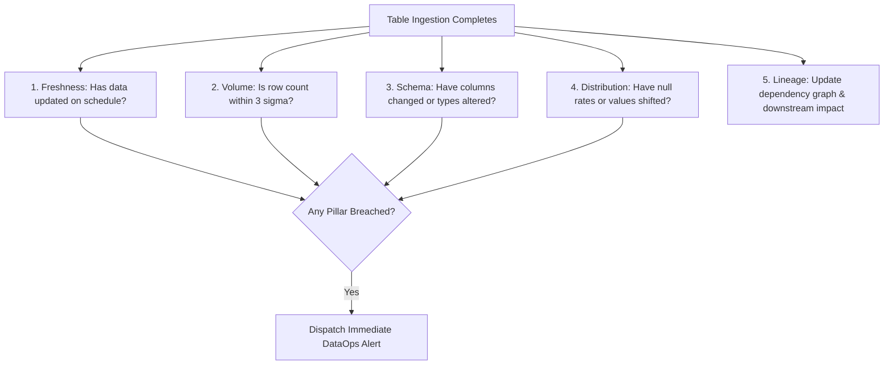

# Analytics Data Observability Monitors
> Based on **Data Observability - Barr Moses, Lior Gavrish, Andy Petrella**

## 1. Canonical Architecture & Data Modeling (DDL)

```sql
-- Data Observability 5 Pillars Monitoring Store
CREATE TABLE table_observability_monitors (
    table_name VARCHAR(100) PRIMARY KEY,
    last_updated_at TIMESTAMP NOT NULL,
    freshness_sla_sec INT NOT NULL,
    current_row_count BIGINT NOT NULL,
    expected_row_count_mean DOUBLE PRECISION NOT NULL,
    expected_row_count_std DOUBLE PRECISION NOT NULL,
    schema_hash CHAR(32) NOT NULL,
    null_rate_percent DOUBLE PRECISION NOT NULL,
    is_freshness_breached BOOLEAN NOT NULL DEFAULT FALSE,
    is_volume_anomalous BOOLEAN NOT NULL DEFAULT FALSE,
    is_schema_drifted BOOLEAN NOT NULL DEFAULT FALSE
);
```

## 2. Core Mathematical Foundations & Analytical Invariants

### 2.1 The 5 Pillars of Data Observability Invariants
1. **Freshness Invariant**:
   $$\Delta t = T_{\text{now}} - \max(T_{\text{updated}}) \le \text{SLA}_{\text{freshness}}$$
2. **Volume Anomaly Invariant**:
   $$Z_{\text{volume}} = \frac{|N_{\text{rows}} - \mu_{\text{volume}}|}{\sigma_{\text{volume}}} \le 3.0$$
3. **Schema Integrity Invariant**:
   $$\text{Hash}(\text{Schema}_{t}) \equiv \text{Hash}(\text{Schema}_{t-1})$$
4. **Distribution Invariant**: Null rates and quantile metrics within historical control bounds.
5. **Lineage Invariant**: Directed acyclic graph tracking upstream dependencies and downstream consumers.

## 3. Pipeline Flow & State Machine Invariants



## 4. Production Implementation Guidelines (Rust / SQL / Python)

```sql
-- Freshness and Volume Automated Observability Check
SELECT 
    'fct_orders' AS table_name,
    EXTRACT(EPOCH FROM (CURRENT_TIMESTAMP - MAX(updated_at))) AS freshness_delay_sec,
    COUNT(*) AS current_row_count,
    COUNT(*) FILTER (WHERE customer_id IS NULL) * 100.0 / COUNT(*) AS null_rate_customer
FROM fct_orders;
```

## 5. Actionable Prompt Recipes

### 5.1 Local Ollama Cheat Sheet (Actionable Constraints & Invariants)
```markdown
- Monitor the 5 Pillars of Data Observability: Freshness, Volume, Schema, Distribution, Lineage.
- Freshness breach alert triggers when CURRENT_TIMESTAMP - MAX(updated_at) > SLA.
- Volume anomaly triggers when current row count deviates > 3 standard deviations from rolling mean.
- Schema drift must block downstream pipeline jobs to prevent silent analytics corruption.
```

### 5.2 Cloud LLM Architectural Prompt (Comprehensive Engineering Blueprint)
```markdown
Construct an enterprise Data Observability platform:
1. Deploy continuous monitoring daemons evaluating the 5 pillars across all production analytical tables.
2. Build statistical volume and freshness anomaly detectors with rolling seasonal baselines.
3. Automatically maintain and visualize end-to-end column-level lineage dependency graphs.
```
