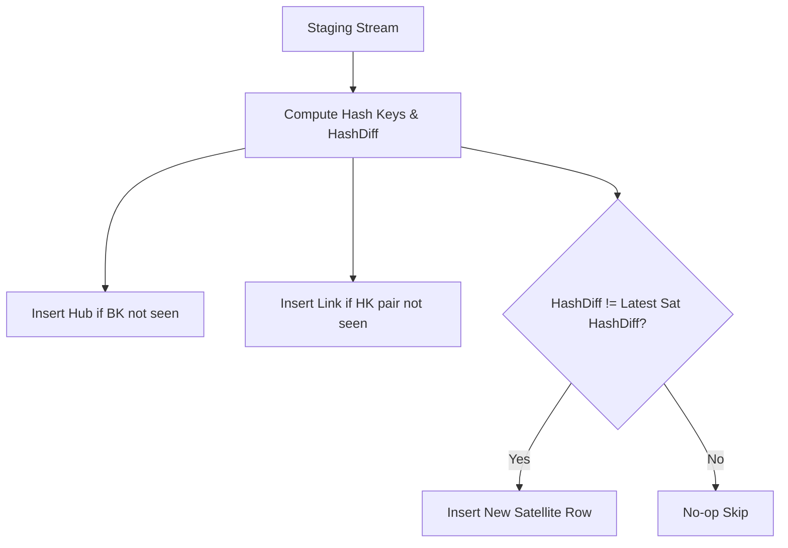

# Analytics Data Vault Architecture
> Based on **Building a Scalable Data Warehouse with Data Vault 2.0 - Dan Linstedt & Michael Olschimke**

## 1. Canonical Architecture & Data Modeling (DDL)

```sql
-- Data Vault 2.0 Core DDL
CREATE TABLE hub_customer (
    customer_hk CHAR(32) PRIMARY KEY, -- MD5/SHA256 Hash Key
    customer_bk VARCHAR(50) NOT NULL, -- Business Key
    load_dts TIMESTAMP NOT NULL,
    rec_src VARCHAR(50) NOT NULL
);

CREATE TABLE lnk_customer_order (
    order_customer_hk CHAR(32) PRIMARY KEY,
    customer_hk CHAR(32) NOT NULL REFERENCES hub_customer(customer_hk),
    order_hk CHAR(32) NOT NULL,
    load_dts TIMESTAMP NOT NULL,
    rec_src VARCHAR(50) NOT NULL
);

CREATE TABLE sat_customer (
    customer_hk CHAR(32) NOT NULL REFERENCES hub_customer(customer_hk),
    load_dts TIMESTAMP NOT NULL,
    hash_diff CHAR(32) NOT NULL, -- Hash of all descriptive columns
    customer_name VARCHAR(100) NOT NULL,
    email VARCHAR(100),
    tier VARCHAR(20),
    rec_src VARCHAR(50) NOT NULL,
    PRIMARY KEY (customer_hk, load_dts)
);
```

## 2. Core Mathematical Foundations & Analytical Invariants

### 2.1 Hash Key & Hash Diff Computation
Let $BK$ be the business key and $C_1, C_2, \dots, C_n$ be descriptive attributes:
$$HK = \text{MD5}(\text{UPPER}(\text{TRIM}(BK)))$$
$$\text{HashDiff} = \text{MD5}(\text{COALESCE}(\text{TRIM}(C_1), '') \parallel ';' \parallel \dots \parallel ';' \parallel \text{COALESCE}(\text{TRIM}(C_n), ''))$$

### 2.2 Insert-Only Satellite Invariant
A new satellite record is inserted if and only if:
$$\text{HashDiff}_{\text{incoming}} \neq \text{HashDiff}_{\text{current}}$$
No rows in Hubs, Links, or Satellites are ever updated or deleted in Raw Vault.

## 3. Pipeline Flow & State Machine Invariants



## 4. Production Implementation Guidelines (Rust / SQL / Python)

```sql
-- DuckDB Data Vault Hash Staging
SELECT 
    md5(upper(trim(customer_id))) AS customer_hk,
    customer_id AS customer_bk,
    md5(coalesce(trim(name),'') || ';' || coalesce(trim(email),'') || ';' || coalesce(trim(tier),'')) AS hash_diff,
    current_timestamp AS load_dts,
    'CRM_SOURCE' AS rec_src
FROM raw_customers;
```

## 5. Actionable Prompt Recipes

### 5.1 Local Ollama Cheat Sheet (Actionable Constraints & Invariants)
```markdown
- Hash keys must be deterministic: UPPER, TRIM, and standard concatenation separator.
- Hubs store business keys and hash keys only; never put descriptive attributes in Hubs or Links.
- Satellites are strictly append-only; insert a new row only when HashDiff changes.
- Links model unit-of-work relationships across multiple hubs.
```

### 5.2 Cloud LLM Architectural Prompt (Comprehensive Engineering Blueprint)
```markdown
Build an enterprise Data Vault 2.0 architecture:
1. Generate Raw Vault DDL (Hubs, Links, Satellites) with cryptographic hash keys (SHA-256/MD5).
2. Author scalable ingestion pipelines applying deterministic HashDiff comparison.
3. Design the Business Vault and Information Mart layer (Point-in-Time PIT and Bridge tables).
```
