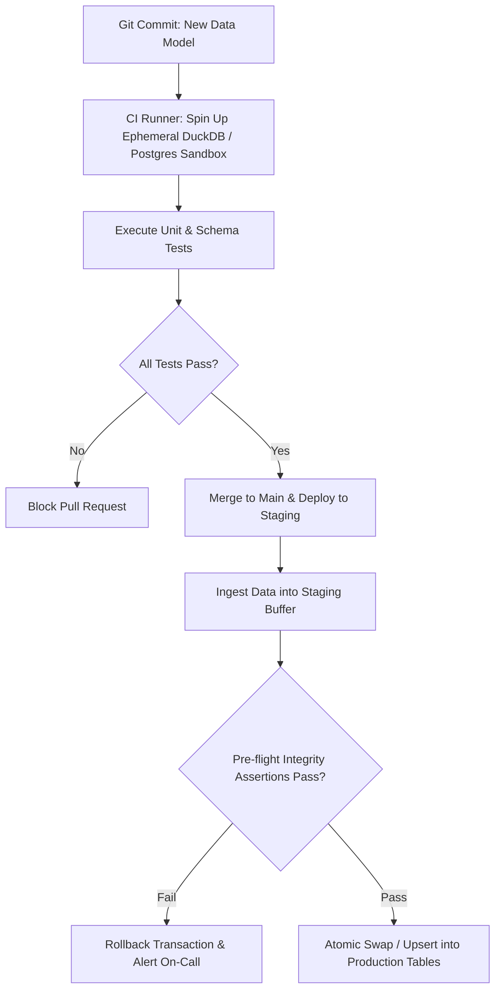

# Analytics Dataops Automated Testing
> Based on **The DataOps Cookbook - Christopher Bergh et al.**

## 1. Canonical Architecture & Data Modeling (DDL)

```sql
-- DataOps Pipeline Test Execution Log
CREATE TABLE dataops_test_executions (
    test_run_id UUID PRIMARY KEY,
    pipeline_id VARCHAR(100) NOT NULL,
    git_commit_sha CHAR(40) NOT NULL,
    environment VARCHAR(20) NOT NULL CHECK (environment IN ('DEV', 'STAGING', 'PROD')),
    tests_executed INT NOT NULL,
    tests_passed INT NOT NULL,
    tests_failed INT NOT NULL,
    circuit_breaker_triggered BOOLEAN NOT NULL,
    executed_at TIMESTAMP NOT NULL DEFAULT CURRENT_TIMESTAMP
);
```

## 2. Core Mathematical Foundations & Analytical Invariants

### 2.1 Production Circuit Breaker Invariant
Let $T = \{t_1, t_2, \dots, t_k\}$ be the pre-flight assertion suite executed on staging buffer $S$:
$$\text{If } \sum_{i=1}^k [t_i(S) = \text{FAIL}] > 0 \implies \text{TRIGGER CIRCUIT BREAKER}$$
$$\text{Action}: \quad \text{ROLLBACK TRANSACTION} \land \text{PREVENT PROD MERGE} \land \text{ALERT}$$
Dirty data is strictly quarantined before reaching consumer-facing tables.

## 3. Pipeline Flow & State Machine Invariants



## 4. Production Implementation Guidelines (Rust / SQL / Python)

```sql
# Python DataOps Circuit Breaker Runner
def run_preflight_circuit_breaker(connection, checks: list[str]) -> bool:
    cursor = connection.cursor()
    for query in checks:
        cursor.execute(query)
        result = cursor.fetchone()[0]
        if result > 0: # Check query returns count of invalid rows
            connection.rollback()
            return False # Circuit breaker triggered
    connection.commit()
    return True
```

## 5. Actionable Prompt Recipes

### 5.1 Local Ollama Cheat Sheet (Actionable Constraints & Invariants)
```markdown
- Apply DataOps principles: version control all code, automate CI/CD testing, spin up isolated sandboxes.
- Implement automated circuit breakers: abort the pipeline and rollback if pre-flight assertions fail.
- Test both data code (unit tests in CI) and data content (integrity tests on staging data).
- Ensure environment parity: development sandboxes must mirror production schema and constraints.
```

### 5.2 Cloud LLM Architectural Prompt (Comprehensive Engineering Blueprint)
```markdown
Build enterprise DataOps continuous integration and automated testing systems:
1. Establish automated CI/CD workflows provisioning ephemeral DuckDB/PostgreSQL sandboxes on every PR.
2. Deploy pre-flight transactional circuit breakers aborting data loads on integrity violations.
3. Implement automated regression testing harnesses comparing production vs pull-request data diffs.
```
