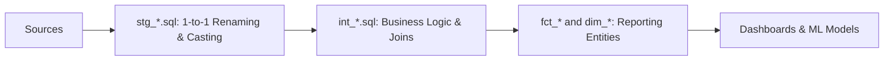

# Analytics Dbt Modeling Dag
> Based on **Analytics Engineering with SQL and dbt - Rui Machado & Helder Silva**

## 1. Canonical Architecture & Data Modeling (DDL)

```sql
-- Mart Incremental Table DDL (DuckDB / Snowflake)
CREATE TABLE fct_orders (
    order_id VARCHAR(50) PRIMARY KEY,
    customer_id VARCHAR(50) NOT NULL,
    order_date DATE NOT NULL,
    status VARCHAR(20) NOT NULL,
    total_amount NUMERIC(14, 4) NOT NULL,
    updated_at TIMESTAMP NOT NULL
);
```

## 2. Core Mathematical Foundations & Analytical Invariants

### 2.1 Incremental Convergence Invariant
An incremental model $M$ evaluated on window $[t_0, t]$ must yield identical state to full refresh:
$$M_{\text{incremental}}(\Delta D_t) \equiv M_{\text{full}}(D_{0..t})$$

### 2.2 DAG Acyclicity Invariant
Let $G = (V, E)$ be the dbt dependency graph where $u \to v$ indicates model $v$ depends on $u$:
$$\forall v \in V, \quad v \notin \text{Descendants}(v) \quad (\text{No cycles permitted})$$

## 3. Pipeline Flow & State Machine Invariants



## 4. Production Implementation Guidelines (Rust / SQL / Python)

```sql
-- dbt Incremental Pattern
{{ config(
    materialized='incremental',
    unique_key='order_id',
    incremental_strategy='merge'
) }}

WITH source_data AS (
    SELECT * FROM {{ ref('stg_orders') }}
    
    WHERE updated_at > (SELECT MAX(updated_at) FROM {{ this }})
    
)
SELECT * FROM source_data;
```

## 5. Actionable Prompt Recipes

### 5.1 Local Ollama Cheat Sheet (Actionable Constraints & Invariants)
```markdown
- Structure dbt models into 3 distinct layers: staging (cleaning), intermediate (joins), and marts (business facts/dims).
- Always specify unique_key in incremental models to avoid duplicate records on merge.
- Add primary key uniqueness and not_null schema tests to every staging and mart model.
- Refactor repeated CTEs into intermediate models or generic dbt macros.
```

### 5.2 Cloud LLM Architectural Prompt (Comprehensive Engineering Blueprint)
```markdown
Construct a production dbt analytics engineering DAG:
1. Establish modular staging, intermediate, and marts layers following medallion architecture.
2. Implement high-performance incremental models using merge strategies and lookback windows.
3. Formulate comprehensive generic tests, singular tests, and dbt snapshots for SCD tracking.
```
