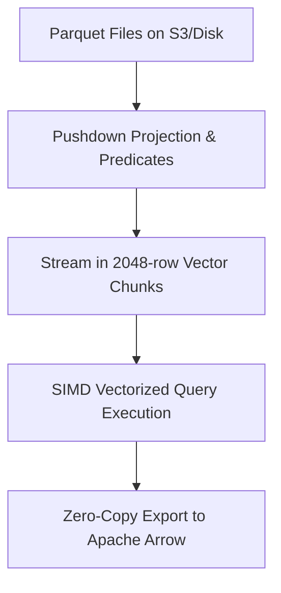

# Analytics Duckdb Embedded Olap
> Based on **DuckDB in Action - Mark Needham & Michael Hunger**

## 1. Canonical Architecture & Data Modeling (DDL)

```sql
-- DuckDB Analytical Persistent Catalog
CREATE TABLE parquet_metadata_cache (
    file_path VARCHAR PRIMARY KEY,
    row_count BIGINT NOT NULL,
    min_timestamp TIMESTAMP,
    max_timestamp TIMESTAMP,
    file_size_bytes BIGINT NOT NULL
);
```

## 2. Core Mathematical Foundations & Analytical Invariants

### 2.1 Parquet Statistics Min/Max Pushdown
For query with filter condition $X > c$ over Parquet row group $RG_j$:
$$\text{If } \max_{x \in RG_j}(X) \le c, \quad \text{Skip reading entire Row Group } RG_j$$
Eliminates I/O for non-matching data partitions entirely.

## 3. Pipeline Flow & State Machine Invariants



## 4. Production Implementation Guidelines (Rust / SQL / Python)

```sql
-- DuckDB In-Place Parquet Aggregation
SELECT 
    vendor_id,
    date_trunc('month', pickup_datetime) AS month,
    count(*) AS trip_count,
    avg(trip_distance) AS avg_dist,
    sum(total_amount) AS revenue
FROM read_parquet('s3://taxi-data/parquet/*.parquet')
WHERE passenger_count > 0
GROUP BY ALL
ORDER BY month, revenue DESC;
```

## 5. Actionable Prompt Recipes

### 5.1 Local Ollama Cheat Sheet (Actionable Constraints & Invariants)
```markdown
- Query Parquet files directly using read_parquet('*.parquet') without loading data into tables.
- DuckDB executes in vectorized 2048-row chunks with automatic SIMD hardware acceleration.
- Use GROUP BY ALL to automatically infer grouping keys from the SELECT list.
- Interoperate with Polars, Pandas, and Arrow using zero-copy in-process pointers.
```

### 5.2 Cloud LLM Architectural Prompt (Comprehensive Engineering Blueprint)
```markdown
Architect embedded OLAP analytical runtimes using DuckDB:
1. Build direct-query engines over Parquet data lakes utilizing min/max column statistics pushdown.
2. Integrate DuckDB with Apache Arrow for zero-copy memory transfers into local ML pipelines.
3. Configure out-of-core spilling thresholds to process datasets larger than physical RAM.
```
