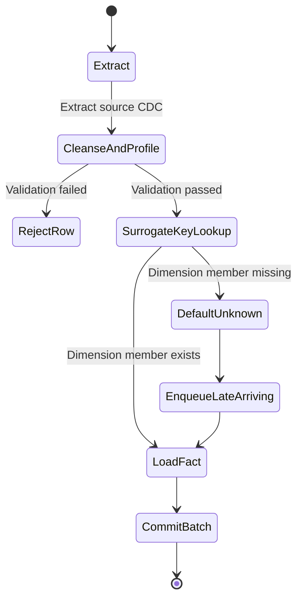

# Analytics Etl Pipeline Patterns
> Based on **The Data Warehouse ETL Toolkit - Ralph Kimball & Joe Caserta**

## 1. Canonical Architecture & Data Modeling (DDL)

```sql
-- Pipeline Audit & Control Metadata Schema
CREATE TABLE etl_batch_control (
    batch_id UUID PRIMARY KEY,
    pipeline_name VARCHAR(100) NOT NULL,
    status VARCHAR(20) NOT NULL CHECK (status IN ('RUNNING', 'SUCCESS', 'FAILED')),
    rows_extracted BIGINT NOT NULL DEFAULT 0,
    rows_inserted BIGINT NOT NULL DEFAULT 0,
    rows_updated BIGINT NOT NULL DEFAULT 0,
    rows_rejected BIGINT NOT NULL DEFAULT 0,
    start_time TIMESTAMP NOT NULL DEFAULT CURRENT_TIMESTAMP,
    end_time TIMESTAMP
);

CREATE TABLE etl_late_arriving_facts (
    fact_id BIGINT PRIMARY KEY,
    natural_key VARCHAR(100) NOT NULL,
    unresolved_dimension VARCHAR(50) NOT NULL,
    payload JSONB NOT NULL,
    received_at TIMESTAMP NOT NULL DEFAULT CURRENT_TIMESTAMP,
    resolved_at TIMESTAMP
);
```

## 2. Core Mathematical Foundations & Analytical Invariants

### 2.1 Late-Arriving Dimension Invariant
When a fact arrives with natural key $K_{dim}$ not yet present in dimension $D$:
$$\text{Assign surrogate key } SK = -1 \quad (\text{Default 'Unknown' Member})$$
$$\text{Enqueue to } \text{LateArrivingQueue}(K_{dim}, \text{fact\_id})$$
Upon arrival of dimension record $K_{dim}$ at $T_{load}$:
$$\text{UPDATE } F \text{ SET } SK = SK_{new} \text{ WHERE } SK = -1 \land K_{dim} = \text{match}$$

### 2.2 Pipeline Row Conservation Invariant
For every batch execution $B$:
$$\text{Rows}_{\text{Extracted}} = \text{Rows}_{\text{Inserted}} + \text{Rows}_{\text{Updated}} + \text{Rows}_{\text{Rejected}}$$

## 3. Pipeline Flow & State Machine Invariants



## 4. Production Implementation Guidelines (Rust / SQL / Python)

```sql
-- Late Arriving Surrogate Key Resolution
INSERT INTO dim_customer (customer_sk, customer_id, full_name, segment, state, valid_from, is_current)
VALUES (-1, 'UNKNOWN', 'Unknown Customer', 'Unknown', 'NA', '1970-01-01', TRUE)
ON CONFLICT (customer_sk) DO NOTHING;
```

## 5. Actionable Prompt Recipes

### 5.1 Local Ollama Cheat Sheet (Actionable Constraints & Invariants)
```markdown
- Maintain an audit log for every pipeline run recording extracted, inserted, updated, and rejected row counts.
- Allocate surrogate key -1 for missing dimension members; never allow NULL foreign keys in fact tables.
- Isolate bad source data into error quarantine tables without terminating the pipeline.
- Implement strictly idempotent load steps using staging deduplication and upserts.
```

### 5.2 Cloud LLM Architectural Prompt (Comprehensive Engineering Blueprint)
```markdown
Architect a fault-tolerant Kimball ETL delivery subsystem:
1. Implement surrogate key generation and late-arriving dimension handling with placeholder keys.
2. Build an audit logging mechanism tracking row conservation: Extracted = Inserted + Updated + Rejected.
3. Design change data capture (CDC) deduplication and backfill replay strategies.
```
