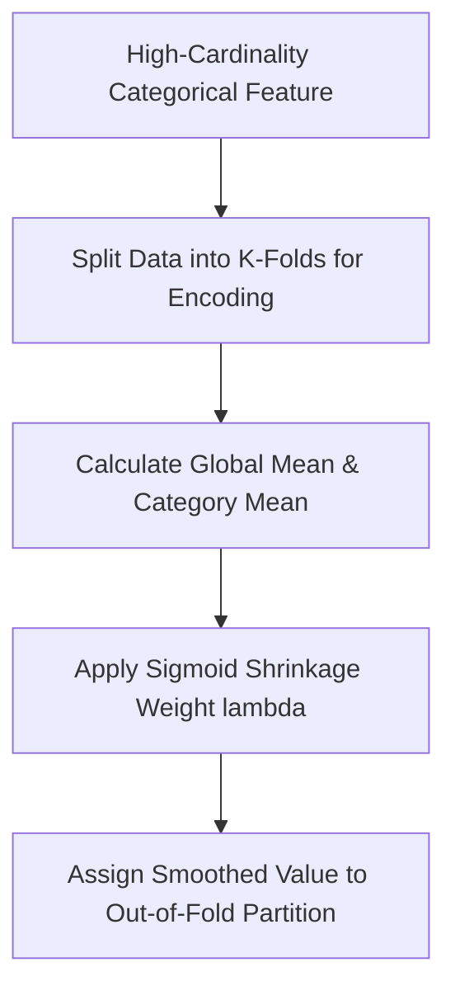

# Analytics Feature Engineering Pipeline
> Based on **Feature Engineering for Machine Learning - Alice Zheng & Amanda Casari**

## 1. Canonical Architecture & Data Modeling (DDL)

```sql
-- Target Encoding Metadata Store
CREATE TABLE target_encoding_priors (
    feature_name VARCHAR(100) NOT NULL,
    category_value VARCHAR(100) NOT NULL,
    global_mean DOUBLE PRECISION NOT NULL,
    category_mean DOUBLE PRECISION NOT NULL,
    category_count BIGINT NOT NULL,
    smoothed_value DOUBLE PRECISION NOT NULL,
    PRIMARY KEY (feature_name, category_value)
);
```

## 2. Core Mathematical Foundations & Analytical Invariants

### 2.1 Empirical Bayes Smoothed Target Encoding
For category $k$ with $n_k$ observations and sample mean $\bar{y}_k$:
$$S_k = \lambda(n_k) \bar{y}_k + (1 - \lambda(n_k)) \bar{y}_{\text{global}}$$
$$\text{where } \lambda(n_k) = \frac{1}{1 + e^{-(n_k - m) / s}}$$
Prevents target leakage and overfitting on rare categories.

### 2.2 Box-Cox Power Transformation
$$y^{(\lambda)} = \begin{cases} \frac{y^\lambda - 1}{\lambda} & \text{if } \lambda \neq 0 \\ \ln(y) & \text{if } \lambda = 0 \end{cases} \quad (y > 0)$$

## 3. Pipeline Flow & State Machine Invariants



## 4. Production Implementation Guidelines (Rust / SQL / Python)

```sql
import numpy as np

def empirical_bayes_target_encode(n_k: np.ndarray, y_k: np.ndarray, global_mean: float, m: float = 10.0, s: float = 2.0) -> np.ndarray:
    # Sigmoid smoothing weight
    weight = 1.0 / (1.0 + np.exp(-(n_k - m) / s))
    return weight * y_k + (1.0 - weight) * global_mean
```

## 5. Actionable Prompt Recipes

### 5.1 Local Ollama Cheat Sheet (Actionable Constraints & Invariants)
```markdown
- Prevent target encoding leakage: always compute target encoding out-of-fold using cross-validation.
- Smooth small categories toward the global prior using empirical Bayes shrinkage.
- Apply Box-Cox or Log1p transformations to heavy-tailed continuous variables to normalize distributions.
- Quantile binning transforms non-linear variables into uniform categorical intervals.
```

### 5.2 Cloud LLM Architectural Prompt (Comprehensive Engineering Blueprint)
```markdown
Architect enterprise ML feature engineering platforms:
1. Build leak-free out-of-fold target encoding pipelines with empirical Bayes smoothing.
2. Implement automated power transforms (Box-Cox, Yeo-Johnson) normalizing skewed feature inputs.
3. Deploy centralized feature stores ensuring training-serving feature parity across online and offline engines.
```
