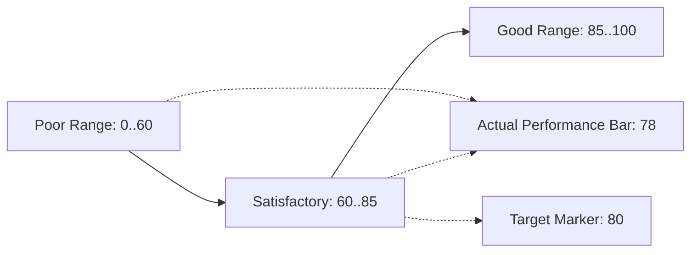

# Analytics Few Dashboard Design
> Based on **Information Dashboard Design - Stephen Few**

## 1. Canonical Architecture & Data Modeling (DDL)

```sql
-- Bullet Graph KPI Target Configuration
CREATE TABLE bullet_graph_configs (
    kpi_id VARCHAR(50) PRIMARY KEY,
    title VARCHAR(100) NOT NULL,
    current_value DOUBLE PRECISION NOT NULL,
    target_value DOUBLE PRECISION NOT NULL,
    poor_threshold DOUBLE PRECISION NOT NULL,
    satisfactory_threshold DOUBLE PRECISION NOT NULL,
    max_range DOUBLE PRECISION NOT NULL
);
```

## 2. Core Mathematical Foundations & Analytical Invariants

### 2.1 Bullet Graph Spatial Efficiency Invariant
A bullet graph displays 5 distinct quantitative dimensions within a 1D linear profile:
$$\text{Dimensions} = \{ \text{Actual Value}, \text{Target Marker}, \text{Poor Range}, \text{Satisfactory Range}, \text{Good Range} \}$$
$$\text{Area}_{\text{Bullet}} \le 0.25 \times \text{Area}_{\text{Radial Gauge}}$$
Yields $> 75\%$ screen space reduction while presenting richer operational context.

## 3. Pipeline Flow & State Machine Invariants



## 4. Production Implementation Guidelines (Rust / SQL / Python)

```sql
// Rust Bullet Graph Validator
pub struct BulletGraph {
    pub actual: f64,
    pub target: f64,
    pub poor: f64,
    pub satisfactory: f64,
    pub max: f64,
}

impl BulletGraph {
    pub fn is_on_target(&self) -> bool {
        self.actual >= self.target
    }
}
```

## 5. Actionable Prompt Recipes

### 5.1 Local Ollama Cheat Sheet (Actionable Constraints & Invariants)
```markdown
- Single-screen constraint: all vital operational metrics must fit on one screen without scrolling.
- Replace circular dial gauges with linear Bullet Graphs to save 75% screen space.
- Avoid 13 classic mistakes: excessive detail, inadequate context, useless decoration, pie charts.
- Design for glanceability: alert status (normal, warning, critical) must be instantly perceptible.
```

### 5.2 Cloud LLM Architectural Prompt (Comprehensive Engineering Blueprint)
```markdown
Engineer operational dashboards following Stephen Few's principles:
1. Enforce strict single-screen non-scrolling layouts displaying high data density without clutter.
2. Implement custom Bullet Graph components encoding actuals, comparative targets, and qualitative ranges.
3. Establish glanceable operational hierarchies prioritizing immediate exception detection.
```
