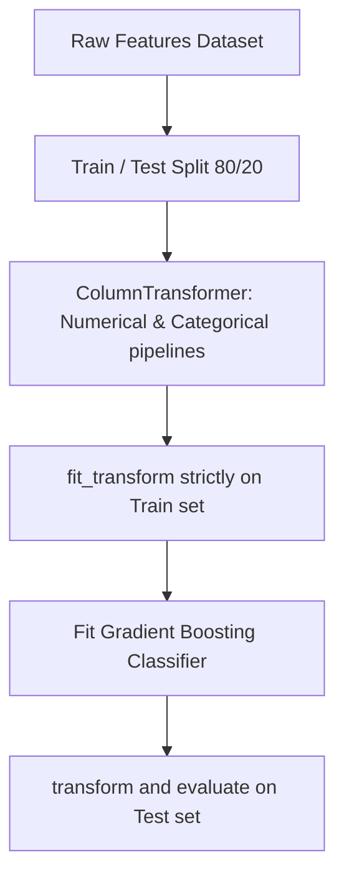

# Analytics Geron Ml Pipelines
> Based on **Hands-On Machine Learning - Aurélien Géron**

## 1. Canonical Architecture & Data Modeling (DDL)

```sql
-- Trained ML Model Artifact Registry
CREATE TABLE ml_model_artifacts (
    model_id UUID PRIMARY KEY,
    model_name VARCHAR(100) NOT NULL,
    version VARCHAR(20) NOT NULL,
    train_roc_auc DOUBLE PRECISION NOT NULL,
    test_roc_auc DOUBLE PRECISION NOT NULL,
    f1_score DOUBLE PRECISION NOT NULL,
    created_at TIMESTAMP NOT NULL DEFAULT CURRENT_TIMESTAMP
);
```

## 2. Core Mathematical Foundations & Analytical Invariants

### 2.1 Data Leakage Prevention Invariant
Let $T$ be a transformer with parameters $\theta$. For dataset split $D_{\text{train}}, D_{\text{test}}$:
$$\theta \text{ must be estimated strictly from } D_{\text{train}}: \quad \theta = \text{Fit}(D_{\text{train}})$$
$$D_{\text{test}}^{\prime} = \text{Transform}(D_{\text{test}}, \theta)$$
Fitting on the combined dataset $D_{\text{train}} \cup D_{\text{test}}$ produces severe optimistic bias.

## 3. Pipeline Flow & State Machine Invariants



## 4. Production Implementation Guidelines (Rust / SQL / Python)

```sql
from sklearn.compose import ColumnTransformer
from sklearn.pipeline import Pipeline
from sklearn.preprocessing import StandardScaler, OneHotEncoder
from sklearn.ensemble import HistGradientBoostingClassifier

num_pipe = Pipeline([('scaler', StandardScaler())])
cat_pipe = Pipeline([('encoder', OneHotEncoder(handle_unknown='ignore'))])

preprocessor = ColumnTransformer([
    ('num', num_pipe, ['age', 'income', 'credit_score']),
    ('cat', cat_pipe, ['channel', 'state'])
])

full_model = Pipeline([
    ('prep', preprocessor),
    ('clf', HistGradientBoostingClassifier(random_state=42))
])
```

## 5. Actionable Prompt Recipes

### 5.1 Local Ollama Cheat Sheet (Actionable Constraints & Invariants)
```markdown
- Wrap preprocessing and estimation inside a single sklearn Pipeline to eliminate data leakage.
- Use ColumnTransformer to apply different transformations to numerical vs categorical features.
- Evaluate imbalanced classifiers using ROC-AUC and Precision-Recall AUC, never accuracy alone.
- Tune hyperparameters with RandomizedSearchCV to explore high-dimensional spaces efficiently.
```

### 5.2 Cloud LLM Architectural Prompt (Comprehensive Engineering Blueprint)
```markdown
Build enterprise production machine learning pipelines:
1. Deploy end-to-end Scikit-Learn pipelines utilizing ColumnTransformer preventing data leakage.
2. Train gradient boosted ensembles with early stopping on validation metric plateaus.
3. Export pipeline artifacts to ONNX runtimes for low-latency sub-millisecond scoring.
```
