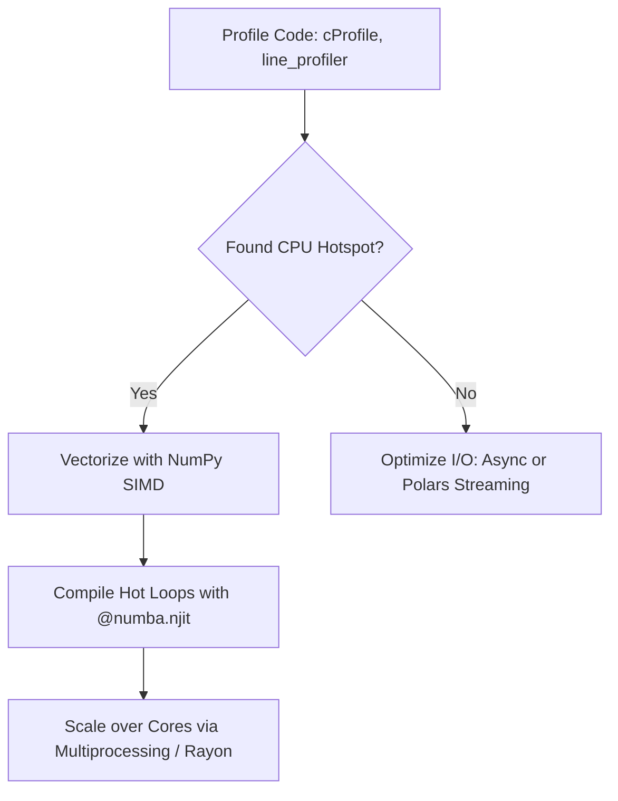

# Analytics High Performance Compute
> Based on **High Performance Python - Micha Gorelick & Ian Ozsvald**

## 1. Canonical Architecture & Data Modeling (DDL)

```sql
-- Compute Profiling Benchmark Results
CREATE TABLE compute_benchmarks (
    function_name VARCHAR(100) PRIMARY KEY,
    implementation VARCHAR(50) NOT NULL, -- PURE_PYTHON, NUMPY, NUMBA_JIT
    execution_time_ms DOUBLE PRECISION NOT NULL,
    speedup_factor DOUBLE PRECISION NOT NULL,
    memory_peak_mb DOUBLE PRECISION NOT NULL
);
```

## 2. Core Mathematical Foundations & Analytical Invariants

### 2.1 Amdahl's Law Speedup Limit
For program with parallel fraction $p$ accelerated by factor $s$ across $n$ cores:
$$S(n) = \frac{1}{(1 - p) + \frac{p}{n}}$$
As $n \to \infty$, maximum theoretical speedup is bounded strictly by $\frac{1}{1 - p}$.

## 3. Pipeline Flow & State Machine Invariants



## 4. Production Implementation Guidelines (Rust / SQL / Python)

```sql
from numba import njit, prange
import numpy as np

@njit(parallel=True, fastmath=True)
def compute_distance_matrix(x: np.ndarray, y: np.ndarray) -> np.ndarray:
    n = len(x)
    dist = np.zeros((n, n), dtype=np.float64)
    for i in prange(n):
        for j in range(n):
            dist[i, j] = np.sqrt((x[i] - x[j])**2 + (y[i] - y[j])**2)
    return dist
```

## 5. Actionable Prompt Recipes

### 5.1 Local Ollama Cheat Sheet (Actionable Constraints & Invariants)
```markdown
- Measure first with cProfile and line_profiler before attempting any code optimization.
- Replace Python loops over numerical arrays with @numba.njit(parallel=True, fastmath=True).
- Amdahl's Law dictates that optimizing a step taking 10% of runtime can never exceed 1.11x total speedup.
- Use zero-copy memory views and contiguous NumPy arrays (C-contiguous) for optimal CPU cache utilization.
```

### 5.2 Cloud LLM Architectural Prompt (Comprehensive Engineering Blueprint)
```markdown
Engineer high-throughput quantitative compute runtimes:
1. Conduct granular profiling (CPU instructions, cache misses, memory footprint) across analytical bottlenecks.
2. Implement JIT-compiled kernels (Numba / Cython / Rust FFI) achieving native C-speed execution.
3. Structure parallel tasks bypassing the GIL via multiprocessing and shared-memory Arrow buffers.
```
