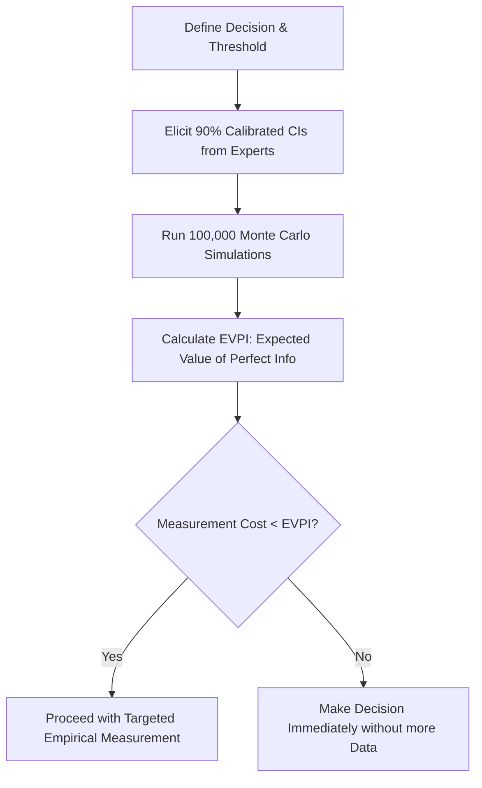

# Analytics Hubbard Measurement Value
> Based on **How to Measure Anything - Douglas W. Hubbard**

## 1. Canonical Architecture & Data Modeling (DDL)

```sql
-- Information Economics Decision Model Table
CREATE TABLE decision_information_values (
    decision_id VARCHAR(50) PRIMARY KEY,
    description TEXT NOT NULL,
    cost_of_measurement DOUBLE PRECISION NOT NULL,
    expected_value_perfect_info DOUBLE PRECISION NOT NULL,
    should_measure BOOLEAN NOT NULL,
    created_at TIMESTAMP NOT NULL DEFAULT CURRENT_TIMESTAMP
);
```

## 2. Core Mathematical Foundations & Analytical Invariants

### 2.1 Expected Value of Perfect Information (EVPI)
Let $D$ be decision choices and $\theta$ be states of nature with prior distribution $P(\theta)$:
$$\text{EVPI} = \sum_{\theta} P(\theta) \max_{d \in D} V(d, \theta) - \max_{d \in D} \sum_{\theta} P(\theta) V(d, \theta)$$
Rule: Never spend more on data measurement than the EVPI of the decision:
$$\text{Cost of Measurement} \le \text{EVPI}$$

## 3. Pipeline Flow & State Machine Invariants



## 4. Production Implementation Guidelines (Rust / SQL / Python)

```sql
# Monte Carlo EVPI Calculation in Python
import numpy as np

def calculate_evpi(net_benefits_scenario: np.ndarray, prob_success: float) -> float:
    # Vector of payoffs under (Decision 1 vs Decision 2) across simulations
    val_with_info = np.mean(np.maximum(net_benefits_scenario, 0.0))
    val_without_info = max(np.mean(net_benefits_scenario), 0.0)
    return float(val_with_info - val_without_info)
```

## 5. Actionable Prompt Recipes

### 5.1 Local Ollama Cheat Sheet (Actionable Constraints & Invariants)
```markdown
- Anything can be measured: if it matters to business, it is observable in the real world.
- Calculate EVPI before funding analytics: never spend $50k on research if EVPI is only $10k.
- Calibrate estimators to give true 90% confidence intervals (hits target 9 times out of 10).
- Run Monte Carlo simulations over range distributions rather than single-point estimates.
```

### 5.2 Cloud LLM Architectural Prompt (Comprehensive Engineering Blueprint)
```markdown
Implement Applied Information Economics (AIE) decision systems:
1. Build Monte Carlo decision simulation models incorporating calibrated probabilistic ranges.
2. Compute Expected Value of Information (EVI/EVPI) to mathematically prioritize data investments.
3. Establish training and verification scoring loops to calibrate human expert probabilistic judgments.
```
