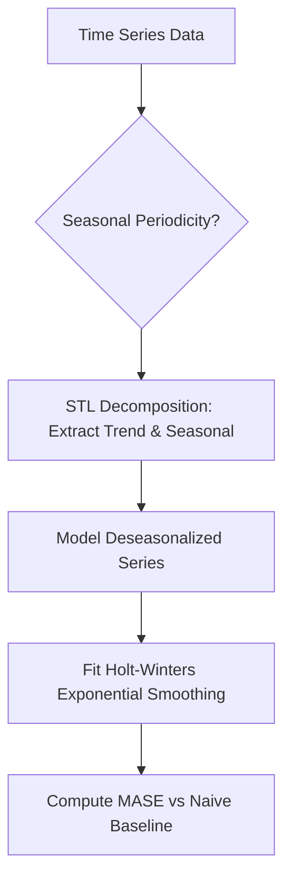

# Analytics Hyndman Time Series
> Based on **Forecasting: Principles and Practice - Rob J. Hyndman & George Athanasopoulos**

## 1. Canonical Architecture & Data Modeling (DDL)

```sql
-- Time Series Forecast Evaluations
CREATE TABLE time_series_forecast_evals (
    series_id VARCHAR(50) PRIMARY KEY,
    model_name VARCHAR(50) NOT NULL,
    horizon_days INT NOT NULL,
    mae DOUBLE PRECISION NOT NULL,
    rmse DOUBLE PRECISION NOT NULL,
    mase DOUBLE PRECISION NOT NULL,
    is_better_than_naive BOOLEAN NOT NULL
);
```

## 2. Core Mathematical Foundations & Analytical Invariants

### 2.1 STL Additive Decomposition Invariant
$$Y_t = T_t + S_t + R_t$$
where $T_t$ is trend, $S_t$ is seasonal component, and $R_t$ is remainder.

### 2.2 Mean Absolute Scaled Error (MASE)
$$\text{MASE} = \frac{\frac{1}{h} \sum_{t=T+1}^{T+h} |Y_t - \hat{Y}_t|}{\frac{1}{T-1} \sum_{t=2}^T |Y_t - Y_{t-1}|}$$
- $\text{MASE} < 1.0 \implies$ Model outperforms in-sample naive persistence baseline.
- $\text{MASE} > 1.0 \implies$ Model performs worse than a simple naive forecast.

## 3. Pipeline Flow & State Machine Invariants



## 4. Production Implementation Guidelines (Rust / SQL / Python)

```sql
# MASE Calculation in Python
import numpy as np

def calculate_mase(y_train: np.ndarray, y_test: np.ndarray, y_pred: np.ndarray) -> float:
    naive_mae = np.mean(np.abs(np.diff(y_train)))
    if naive_mae == 0:
        return 1.0
    model_mae = np.mean(np.abs(y_test - y_pred))
    return float(model_mae / naive_mae)
```

## 5. Actionable Prompt Recipes

### 5.1 Local Ollama Cheat Sheet (Actionable Constraints & Invariants)
```markdown
- Decompose time series using STL (LOESS) into Trend, Seasonality, and Remainder.
- Use MASE (Mean Absolute Scaled Error) to evaluate forecasts: MASE < 1 beats the naive forecast.
- Always benchmark complex forecasting models against Naive and Seasonal Naive baselines.
- Holt-Winters supports additive (constant variance) and multiplicative (proportional variance) seasonality.
```

### 5.2 Cloud LLM Architectural Prompt (Comprehensive Engineering Blueprint)
```markdown
Engineer scalable automated time-series forecasting pipelines:
1. Implement STL decomposition pipelines isolating seasonal patterns and baseline trends.
2. Build multi-model tournament runners (ETS, ARIMA, Prophet) evaluating out-of-sample MASE.
3. Generate calibrated prediction intervals (80% and 95%) modeling demand uncertainty for operations.
```
