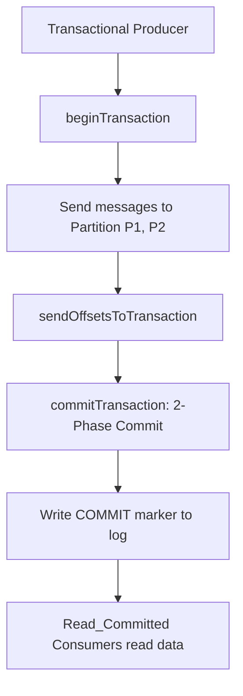

# Analytics Kafka Event Streaming
> Based on **Kafka: The Definitive Guide - Gwen Shapira et al.**

## 1. Canonical Architecture & Data Modeling (DDL)

```sql
-- Kafka Consumer Offset Checkpoint Table
CREATE TABLE kafka_consumer_offsets (
    consumer_group VARCHAR(100) NOT NULL,
    topic VARCHAR(100) NOT NULL,
    partition_id INT NOT NULL,
    committed_offset BIGINT NOT NULL,
    last_heartbeat TIMESTAMP NOT NULL DEFAULT CURRENT_TIMESTAMP,
    PRIMARY KEY (consumer_group, topic, partition_id)
);
```

## 2. Core Mathematical Foundations & Analytical Invariants

### 2.1 Exactly-Once Semantics (EOS) Sequence Invariant
For producer with Producer ID ($PID$) sending message with sequence number $seq$:
$$\text{Broker Acceptance Condition}: \quad seq = seq_{\text{last}} + 1$$
If $seq \le seq_{\text{last}}$, message is rejected as duplicate. If $seq > seq_{\text{last}} + 1$, broker raises out-of-order error.

## 3. Pipeline Flow & State Machine Invariants



## 4. Production Implementation Guidelines (Rust / SQL / Python)

```sql
# Python Kafka Idempotent Producer Configuration
producer_config = {
    'bootstrap.servers': 'localhost:9092',
    'enable.idempotence': True,
    'acks': 'all',
    'retries': 10000000,
    'max.in.flight.requests.per.connection': 5
}
```

## 5. Actionable Prompt Recipes

### 5.1 Local Ollama Cheat Sheet (Actionable Constraints & Invariants)
```markdown
- Set enable.idempotence=True and acks=all to guarantee zero message duplication and zero data loss.
- Partition key determines ordering: Kafka guarantees strict ordering within a single partition only.
- Consumer lag (LogEndOffset - CurrentOffset) is the primary operational health metric.
- Use transactional producer (read-process-write) for end-to-end Exactly-Once Semantics.
```

### 5.2 Cloud LLM Architectural Prompt (Comprehensive Engineering Blueprint)
```markdown
Construct production Apache Kafka event architectures:
1. Size and distribute partition counts matching analytical consumer parallelism requirements.
2. Implement transactional producers achieving Exactly-Once Semantics (EOS) across topic hops.
3. Build consumer lag monitoring systems automatically remediating rebalance storms.
```
