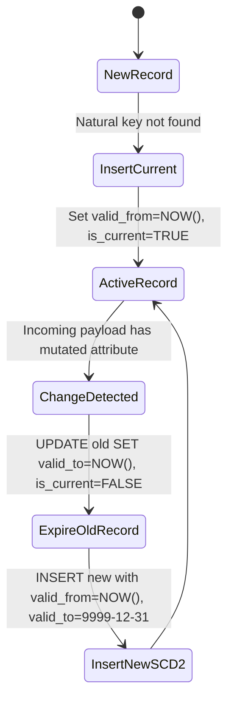

# Analytics Kimball Dimensional Modeling
> Based on **The Data Warehouse Toolkit - Ralph Kimball & Margy Ross**

## 1. Canonical Architecture & Data Modeling (DDL)

```sql
-- Star Schema DDL: DuckDB & PostgreSQL
CREATE TABLE dim_date (
    date_key INT PRIMARY KEY, -- YYYYMMDD
    full_date DATE NOT NULL,
    day_of_week VARCHAR(10) NOT NULL,
    month INT NOT NULL,
    quarter INT NOT NULL,
    year INT NOT NULL,
    is_weekend BOOLEAN NOT NULL
);

CREATE TABLE dim_customer (
    customer_sk BIGINT PRIMARY KEY, -- Surrogate Key
    customer_id VARCHAR(50) NOT NULL, -- Natural/Business Key
    full_name VARCHAR(100) NOT NULL,
    segment VARCHAR(50) NOT NULL,
    state VARCHAR(50) NOT NULL,
    valid_from TIMESTAMP NOT NULL,
    valid_to TIMESTAMP NOT NULL DEFAULT '9999-12-31 23:59:59',
    is_current BOOLEAN NOT NULL DEFAULT TRUE
);

CREATE TABLE fct_sales (
    sales_key BIGINT PRIMARY KEY,
    date_key INT NOT NULL REFERENCES dim_date(date_key),
    customer_sk BIGINT NOT NULL REFERENCES dim_customer(customer_sk),
    order_number VARCHAR(50) NOT NULL, -- Degenerate Dimension
    quantity INT NOT NULL CHECK (quantity > 0),
    unit_price NUMERIC(12, 4) NOT NULL,
    discount_amount NUMERIC(12, 4) NOT NULL DEFAULT 0.0000,
    net_sales_amount NUMERIC(12, 4) NOT NULL
);

CREATE INDEX idx_fct_sales_date ON fct_sales(date_key);
CREATE INDEX idx_fct_sales_cust ON fct_sales(customer_sk);
```

## 2. Core Mathematical Foundations & Analytical Invariants

### 2.1 SCD Type 2 Temporal Validity Invariant
For any customer record $i$ with natural key $K$:
$$\text{valid\_from}_{i} < \text{valid\_to}_{i}$$
For consecutive revisions $i$ and $i+1$ of the same natural key $K$:
$$\text{valid\_to}_{i} = \text{valid\_from}_{i+1}$$
$$\sum_{r \in \text{Revisions}(K)} [\text{is\_current} = \text{TRUE}] \equiv 1$$

### 2.2 Additive vs Non-Additive Metric Invariant
Net sales is fully additive across all dimensions:
$$\text{Net Sales} = \sum_{j \in \text{Lines}} (\text{quantity}_j \times \text{unit\_price}_j - \text{discount}_j)$$
Unit prices and ratios are non-additive and must be calculated post-aggregation:
$$\text{Average Unit Price} = \frac{\sum \text{Net Sales}}{\sum \text{Quantity}} \neq \text{AVG}(\text{unit\_price})$$

## 3. Pipeline Flow & State Machine Invariants


- **Invariant**: Once expired (`is_current = FALSE`), a historical dimension row is immutable.

## 4. Production Implementation Guidelines (Rust / SQL / Python)

```sql
-- SCD Type 2 Merge in DuckDB / PostgreSQL
WITH incoming AS (
    SELECT customer_id, full_name, segment, state FROM staging_customer
),
to_expire AS (
    SELECT d.customer_sk
    FROM dim_customer d
    JOIN incoming i ON d.customer_id = i.customer_id
    WHERE d.is_current = TRUE
      AND (d.full_name != i.full_name OR d.segment != i.segment OR d.state != i.state)
)
UPDATE dim_customer
SET valid_to = CURRENT_TIMESTAMP, is_current = FALSE
WHERE customer_sk IN (SELECT customer_sk FROM to_expire);
```

## 5. Actionable Prompt Recipes

### 5.1 Local Ollama Cheat Sheet (Actionable Constraints & Invariants)
```markdown
- Enforce grain strictly: one row per physical transaction event.
- Use integer surrogate keys for dimensions; never expose natural keys as primary keys.
- Preserve temporal continuity in SCD2: valid_from < valid_to, exactly one is_current=TRUE per natural key.
- Never aggregate non-additive metrics (averages/ratios) in ETL; store raw numerators and denominators.
```

### 5.2 Cloud LLM Architectural Prompt (Comprehensive Engineering Blueprint)
```markdown
Design and implement an enterprise dimensional star schema following Kimball best practices:
1. Formulate a conformed bus matrix identifying shared dimensions (Date, Customer, Organization, Product) across business processes.
2. Implement automated SCD Type 2 dimension loaders in SQL/dbt with zero temporal overlap.
3. Validate grain integrity and fact additive behavior using automated assertions.
```
