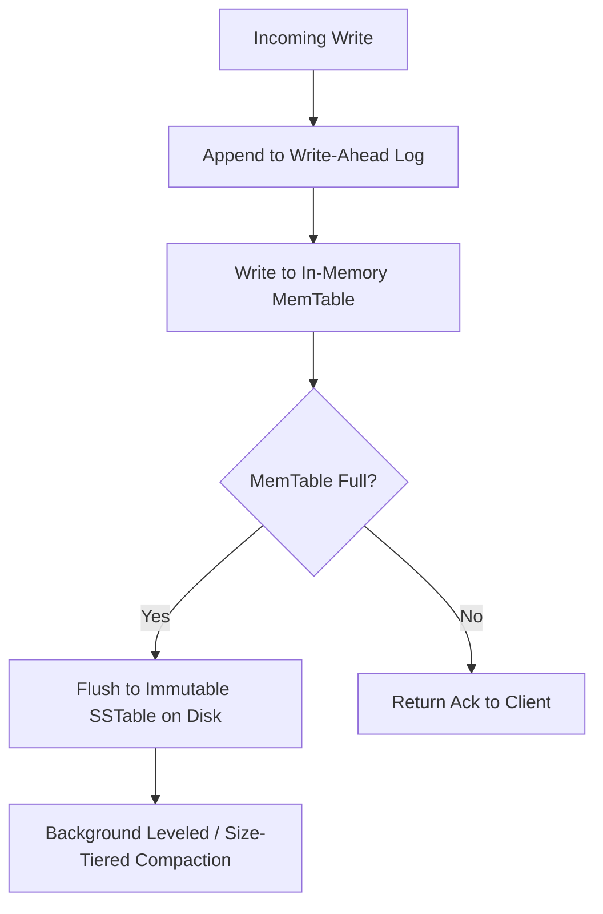

# Analytics Kleppmann Data Intensive
> Based on **Designing Data-Intensive Applications - Martin Kleppmann**

## 1. Canonical Architecture & Data Modeling (DDL)

```sql
-- Replication Quorum Node Metadata
CREATE TABLE quorum_cluster_nodes (
    node_id INT PRIMARY KEY,
    datacenter VARCHAR(50) NOT NULL,
    role VARCHAR(20) NOT NULL CHECK (role IN ('LEADER', 'FOLLOWER')),
    last_applied_index BIGINT NOT NULL,
    is_alive BOOLEAN NOT NULL DEFAULT TRUE
);
```

## 2. Core Mathematical Foundations & Analytical Invariants

### 2.1 Quorum Consensus Invariant
In a cluster of $N$ replicas with read quorum $R$ and write quorum $W$:
$$R + W > N$$
Guarantees that at least one node in the read set $R$ contains the latest write from $W$.

## 3. Pipeline Flow & State Machine Invariants



## 4. Production Implementation Guidelines (Rust / SQL / Python)

```sql
// Rust Quorum Overlap Validator
pub fn validate_quorum(n: usize, r: usize, w: usize) -> bool {
    r + w > n && w > n / 2
}
```

## 5. Actionable Prompt Recipes

### 5.1 Local Ollama Cheat Sheet (Actionable Constraints & Invariants)
```markdown
- Quorum consensus condition: R + W > N ensures read quorum contains at least one up-to-date replica.
- LSM-Trees (Log-Structured Merge-trees) optimize sequential writes; B-Trees optimize random reads.
- Prevent write-skew race conditions under Snapshot Isolation using explicit row locking or serializable isolation.
- Change Data Capture (CDC) turns operational database commit logs into deterministic event streams.
```

### 5.2 Cloud LLM Architectural Prompt (Comprehensive Engineering Blueprint)
```markdown
Architect reliable, high-throughput distributed data backends:
1. Configure leaderless and leader-based replication topologies with strict quorum validation (R + W > N).
2. Tune LSM-tree SSTable compaction algorithms (leveled vs size-tiered) to balance write amplification.
3. Design CDC-driven event-sourced pipelines ensuring zero loss and deterministic ordering.
```
