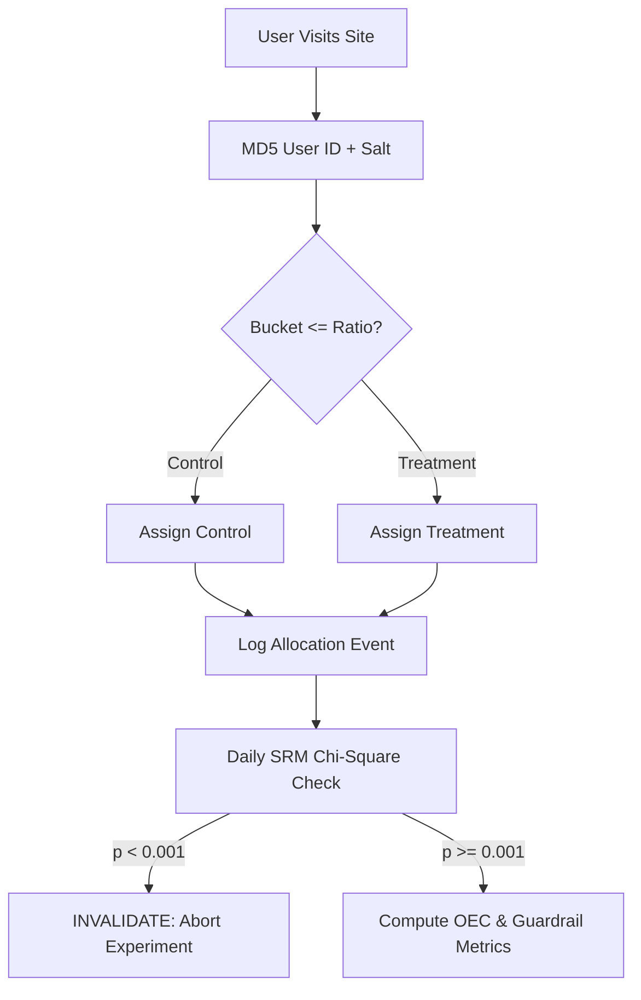

# Analytics Kohavi Ab Experimentation
> Based on **Trustworthy Online Controlled Experiments - Ronny Kohavi, Diane Tang, Ya Xu**

## 1. Canonical Architecture & Data Modeling (DDL)

```sql
-- A/B Experiment Registry & SRM Guardrails
CREATE TABLE experiment_runs (
    experiment_id VARCHAR(50) PRIMARY KEY,
    name VARCHAR(100) NOT NULL,
    control_ratio DOUBLE PRECISION NOT NULL DEFAULT 0.5,
    treatment_ratio DOUBLE PRECISION NOT NULL DEFAULT 0.5,
    control_count BIGINT NOT NULL DEFAULT 0,
    treatment_count BIGINT NOT NULL DEFAULT 0,
    srm_p_value DOUBLE PRECISION,
    srm_flagged BOOLEAN NOT NULL DEFAULT FALSE,
    status VARCHAR(20) NOT NULL CHECK (status IN ('ACTIVE', 'CONCLUDED', 'INVALID_SRM'))
);
```

## 2. Core Mathematical Foundations & Analytical Invariants

### 2.1 Sample Ratio Mismatch (SRM) Chi-Square Invariant
Let $O_C, O_T$ be observed traffic counts and $E_C, E_T$ be expected counts based on design ratios $r_C, r_T$:
$$E_C = (O_C + O_T) \times r_C, \quad E_T = (O_C + O_T) \times r_T$$
$$\chi^2 = \frac{(O_C - E_C)^2}{E_C} + \frac{(O_T - E_T)^2}{E_T} \sim \chi^2(1)$$
If $p = P(\chi^2(1) \ge \chi^2_{\text{obs}}) < 0.001$, experiment is invalid due to SRM. All downstream metrics are VOID.

### 2.2 Sample Size Determination per Variant
For two-sided test with significance $\alpha = 0.05$ ($z_{1-\alpha/2} = 1.96$) and power $1 - \beta = 0.80$ ($z_{1-\beta} = 0.84$):
$$n \approx \frac{16 \sigma^2}{\Delta^2}$$
where $\Delta = \mu_T - \mu_C$ is the Minimum Detectable Effect (MDE).

## 3. Pipeline Flow & State Machine Invariants



## 4. Production Implementation Guidelines (Rust / SQL / Python)

```sql
from scipy.stats import chisquare

def verify_srm(obs_control: int, obs_treatment: int, p_control: float = 0.5) -> dict:
    total = obs_control + obs_treatment
    exp_control = total * p_control
    exp_treatment = total * (1.0 - p_control)
    chi2_stat, p_val = chisquare([obs_control, obs_treatment], [exp_control, exp_treatment])
    is_srm = p_val < 0.001
    return {"chi2": chi2_stat, "p_value": p_val, "srm_detected": is_srm}
```

## 5. Actionable Prompt Recipes

### 5.1 Local Ollama Cheat Sheet (Actionable Constraints & Invariants)
```markdown
- Always run the SRM Chi-Square test before analyzing A/B experiment results.
- If SRM p-value < 0.001, halt the experiment; never attempt to interpret metric deltas.
- Twyman's Law: Any statistic that appears extraordinarily positive or negative is almost certainly an error.
- Enforce sample size requirements prior to launch: n >= 16 * sigma^2 / MDE^2.
```

### 5.2 Cloud LLM Architectural Prompt (Comprehensive Engineering Blueprint)
```markdown
Architect an enterprise experimentation platform:
1. Build automated SRM detection pipelines terminating skewed experiments (p < 0.001).
2. Formulate composite OEC (Overall Evaluation Criterion) functions balancing conversion vs latency.
3. Enforce sequential testing and variance reduction (CUPED) to accelerate decision cycles.
```
