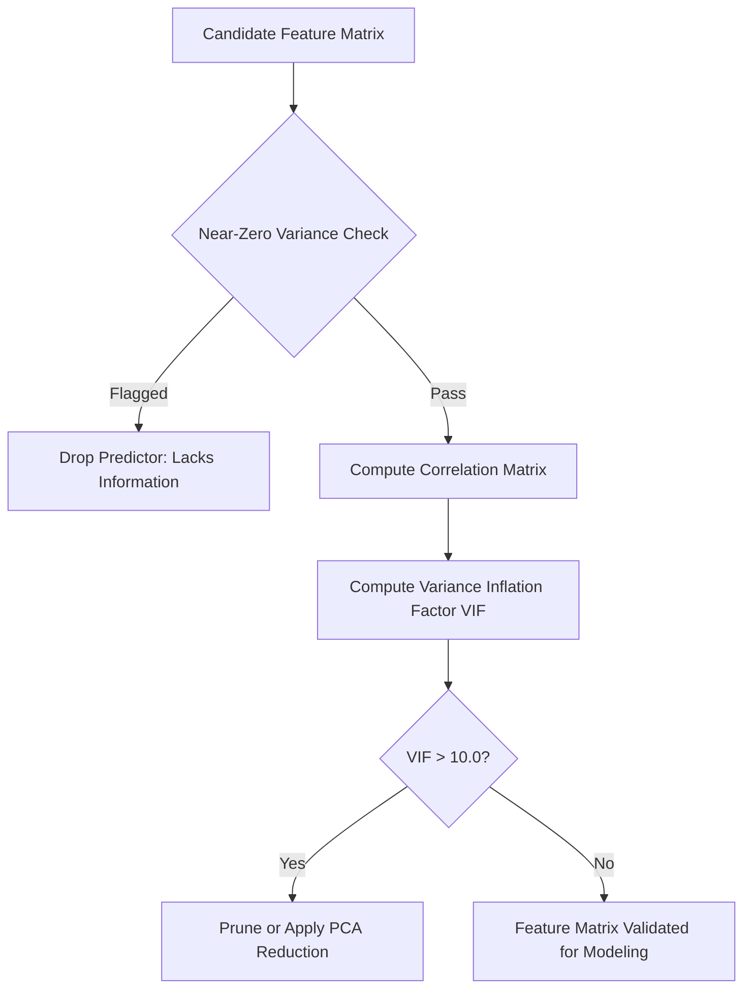

# Analytics Kuhn Predictive Modeling
> Based on **Applied Predictive Modeling - Max Kuhn & Kjell Johnson**

## 1. Canonical Architecture & Data Modeling (DDL)

```sql
-- Predictor Quality Diagnostics Cache
CREATE TABLE predictor_quality_audits (
    feature_name VARCHAR(100) PRIMARY KEY,
    frequency_ratio DOUBLE PRECISION NOT NULL,
    percent_unique DOUBLE PRECISION NOT NULL,
    is_near_zero_variance BOOLEAN NOT NULL,
    vif_score DOUBLE PRECISION NOT NULL,
    action_taken VARCHAR(50) NOT NULL
);
```

## 2. Core Mathematical Foundations & Analytical Invariants

### 2.1 Variance Inflation Factor (VIF)
For predictor $X_j$ regressed on all other $p-1$ predictors:
$$VIF_j = \frac{1}{1 - R_j^2}$$
- $VIF_j > 5.0$: Moderate multicollinearity.
- $VIF_j > 10.0$: Severe collinearity; predictor coefficients become numerically unstable and must be pruned.

### 2.2 Near-Zero Variance Condition
A feature has near-zero variance if:
$$\frac{\text{Freq}(\text{Most Common})}{\text{Freq}(\text{2nd Most Common})} > 19.0 \quad (95/5 \text{ split}) \quad \land \quad \frac{\text{Unique Count}}{N} < 0.10$$

## 3. Pipeline Flow & State Machine Invariants



## 4. Production Implementation Guidelines (Rust / SQL / Python)

```sql
# Near-Zero Variance Filter in Python
import pandas as pd

def filter_near_zero_variance(df: pd.DataFrame, freq_cut: float = 95/5, unique_cut: float = 10.0) -> list[str]:
    dropped = []
    n = len(df)
    for col in df.columns:
        counts = df[col].value_counts()
        if len(counts) <= 1:
            dropped.append(col); continue
        freq_ratio = counts.iloc[0] / counts.iloc[1]
        pct_unique = (df[col].nunique() / n) * 100
        if freq_ratio > freq_cut and pct_unique < unique_cut:
            dropped.append(col)
    return dropped
```

## 5. Actionable Prompt Recipes

### 5.1 Local Ollama Cheat Sheet (Actionable Constraints & Invariants)
```markdown
- Drop near-zero variance features: frequency ratio > 95/5 and unique percentage < 10%.
- Compute Variance Inflation Factor (VIF): remove or combine features with VIF > 10.
- Multicollinearity inflates standard errors of regression coefficients without improving predictive power.
- Apply SMOTE (Synthetic Minority Over-sampling) strictly on training folds to address class imbalance.
```

### 5.2 Cloud LLM Architectural Prompt (Comprehensive Engineering Blueprint)
```markdown
Engineer robust feature preprocessing architectures:
1. Implement automated near-zero variance and multi-collinearity filtering pipelines.
2. Build iterative VIF reduction algorithms eliminating correlated predictors prior to linear modeling.
3. Deploy cross-validated SMOTE and downsampling routines balancing severe class skew.
```
