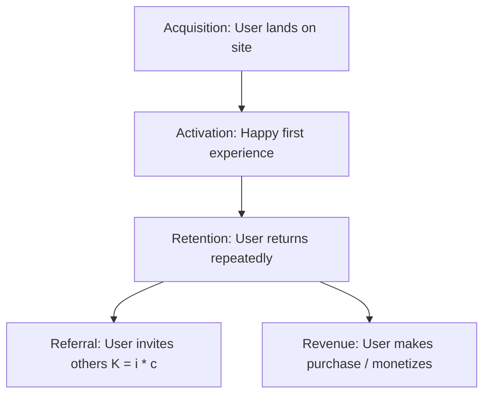

# Analytics Lean Startup Metrics
> Based on **Lean Analytics - Alistair Croll & Benjamin Yoskovitz**

## 1. Canonical Architecture & Data Modeling (DDL)

```sql
-- Cohort Retention Activity Ledger
CREATE TABLE cohort_retention_records (
    cohort_week DATE NOT NULL,
    user_id BIGINT NOT NULL,
    week_number INT NOT NULL,
    is_active INT NOT NULL CHECK (is_active IN (0, 1)),
    PRIMARY KEY (cohort_week, user_id, week_number)
);
```

## 2. Core Mathematical Foundations & Analytical Invariants

### 2.1 Viral Coefficient Invariant
Let $i$ be invitations sent per customer and $c$ be conversion rate per invite:
$$K = i \times c$$
If $K > 1.0$, the product experiences exponential viral growth.

### 2.2 Cohort Retention Decay Invariant
Retention of a cohort over time $t$:
$$R(t) = R_0 \cdot t^{-\gamma} + c$$
- If $c = 0$, retention asymptotically decays to zero (broken product).
- If $c > 0$, the retention curve flattens, indicating Product-Market Fit (PMF).

## 3. Pipeline Flow & State Machine Invariants



## 4. Production Implementation Guidelines (Rust / SQL / Python)

```sql
# Retention Flattening Calculator in Python
import numpy as np

def check_pmf_retention_flattening(retention_weeks: list[float]) -> bool:
    # If delta between week 8 and week 12 is less than 1%, retention has flattened
    if len(retention_weeks) >= 12:
        return abs(retention_weeks[-1] - retention_weeks[-4]) < 0.01 and retention_weeks[-1] > 0.05
    return False
```

## 5. Actionable Prompt Recipes

### 5.1 Local Ollama Cheat Sheet (Actionable Constraints & Invariants)
```markdown
- Focus on the One Metric That Matters (OMTM) for your current startup stage.
- Pirate Metrics (AARRR): Acquisition -> Activation -> Retention -> Referral -> Revenue.
- Retention is the most critical metric: if the retention curve doesn't flatten, growth will fail.
- Viral coefficient K = invites_per_user * conversion_rate; K > 1.0 indicates viral loop.
```

### 5.2 Cloud LLM Architectural Prompt (Comprehensive Engineering Blueprint)
```markdown
Build product analytics and growth experimentation frameworks:
1. Construct automated cohort retention analysis matrices tracking curve stabilization and PMF.
2. Build AARRR pirate metrics tracking pipelines differentiating actionable metrics from vanity metrics.
3. Model viral loop coefficients (K-factor) and user referral attribution graphs.
```
