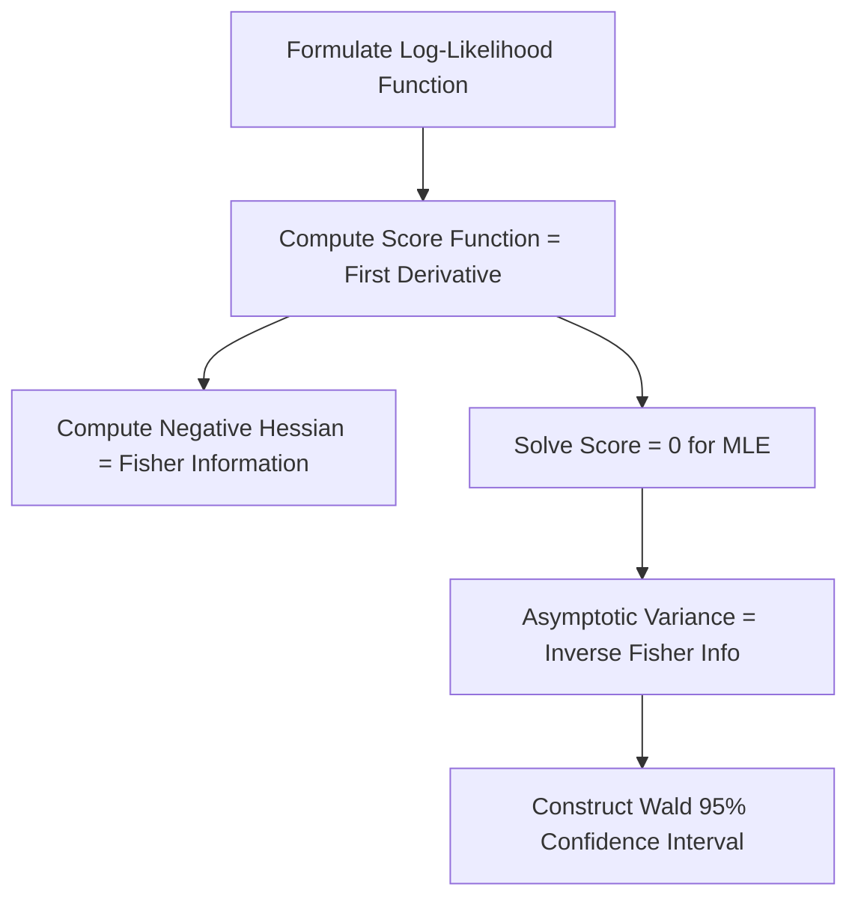

# Analytics Mathematical Inference
> Based on **All of Statistics - Larry Wasserman**

## 1. Canonical Architecture & Data Modeling (DDL)

```sql
-- MLE Estimation Results Store
CREATE TABLE mle_parameter_estimates (
    estimation_id UUID PRIMARY KEY,
    model_type VARCHAR(50) NOT NULL,
    param_name VARCHAR(50) NOT NULL,
    mle_value DOUBLE PRECISION NOT NULL,
    fisher_info DOUBLE PRECISION NOT NULL,
    cramer_rao_bound DOUBLE PRECISION NOT NULL,
    asymptotic_se DOUBLE PRECISION NOT NULL
);
```

## 2. Core Mathematical Foundations & Analytical Invariants

### 2.1 Fisher Information & Cramér-Rao Invariant
$$I_n(\theta) = -E\left[ \frac{\partial^2}{\partial \theta^2} \ell_n(\theta) \right] = n I_1(\theta)$$
For any unbiased estimator $\hat{\theta}$:
$$\text{Var}(\hat{\theta}) \ge \frac{1}{I_n(\theta)}$$

### 2.2 Asymptotic Normality of MLE
$$\sqrt{n}(\hat{\theta}_{\text{MLE}} - \theta_0) \xrightarrow{d} \mathcal{N}\left(0, I_1(\theta_0)^{-1}\right)$$

## 3. Pipeline Flow & State Machine Invariants



## 4. Production Implementation Guidelines (Rust / SQL / Python)

```sql
import numpy as np

def mle_exponential(data: np.ndarray):
    n = len(data)
    lambda_hat = n / np.sum(data)
    fisher_info = n / (lambda_hat ** 2)
    se = 1.0 / np.sqrt(fisher_info)
    return {"lambda_mle": lambda_hat, "se": se, "ci_95": (lambda_hat - 1.96*se, lambda_hat + 1.96*se)}
```

## 5. Actionable Prompt Recipes

### 5.1 Local Ollama Cheat Sheet (Actionable Constraints & Invariants)
```markdown
- Maximum Likelihood Estimator (MLE) is asymptotically efficient, attaining Cramér-Rao lower bound.
- Asymptotic variance of MLE equals the inverse of the Fisher Information matrix.
- Construct Wald confidence intervals as theta_hat +/- z * SE where SE = 1 / sqrt(I(theta)).
- Glivenko-Cantelli theorem guarantees uniform convergence of empirical CDF to true CDF.
```

### 5.2 Cloud LLM Architectural Prompt (Comprehensive Engineering Blueprint)
```markdown
Construct mathematically rigorous statistical inference modules:
1. Derive exact log-likelihoods, score equations, and Fisher Information matrices.
2. Prove asymptotic normality and construct Wald and Likelihood-Ratio test statistics.
3. Validate coverage probabilities of parametric and non-parametric confidence intervals.
```
