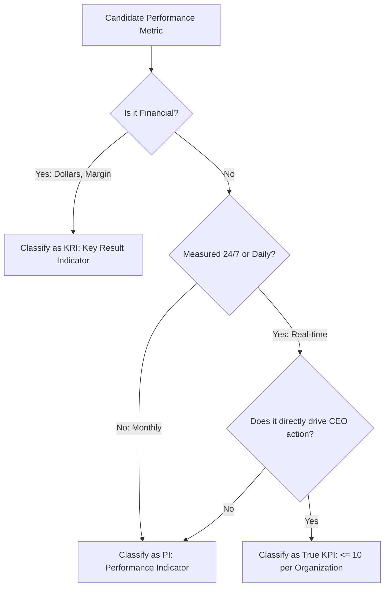

# Analytics Parmenter Kpi Framework
> Based on **Key Performance Indicators - David Parmenter**

## 1. Canonical Architecture & Data Modeling (DDL)

```sql
-- KPI Classification & Governance Schema
CREATE TABLE metric_governance_registry (
    metric_id VARCHAR(50) PRIMARY KEY,
    name VARCHAR(100) NOT NULL,
    measure_type VARCHAR(10) NOT NULL CHECK (measure_type IN ('KRI', 'RI', 'PI', 'KPI')),
    is_financial BOOLEAN NOT NULL,
    frequency VARCHAR(20) NOT NULL CHECK (frequency IN ('REALTIME', 'DAILY', 'WEEKLY', 'MONTHLY')),
    executive_owner VARCHAR(100) NOT NULL,
    critical_success_factor VARCHAR(255) NOT NULL
);
```

## 2. Core Mathematical Foundations & Analytical Invariants

### 2.1 The 10 / 80 / 10 Metric Distribution Invariant
In a well-governed enterprise performance management framework:
$$\text{Count}(\text{KRIs}) \approx 10, \quad \text{Count}(\text{PIs}) \approx 80, \quad \text{Count}(\text{KPIs}) \le 10$$
True KPIs must satisfy:
$$\text{is\_financial} = \text{FALSE} \land \text{frequency} \in \{\text{'REALTIME'}, \text{'DAILY'}\}$$
Financial metrics (e.g. Net Profit, EBITDA) are KRIs (outcomes), never actionable leading KPIs.

## 3. Pipeline Flow & State Machine Invariants



## 4. Production Implementation Guidelines (Rust / SQL / Python)

```sql
// Rust KPI Classification Rule
pub fn classify_metric(is_financial: bool, is_daily: bool, is_ceo_actionable: bool) -> &'static str {
    if is_financial {
        "KRI" // Key Result Indicator (lagging outcome)
    } else if is_daily && is_ceo_actionable {
        "KPI" // True Key Performance Indicator (leading, non-financial)
    } else {
        "PI"  // Operational Performance Indicator
    }
}
```

## 5. Actionable Prompt Recipes

### 5.1 Local Ollama Cheat Sheet (Actionable Constraints & Invariants)
```markdown
- The 10/80/10 Rule: Max 10 KRIs (lagging results), 80 PIs (operational), 10 KPIs (critical leading).
- True KPIs are non-financial, measured daily or 24/7, and immediately actionable by the CEO.
- Profit, Revenue, and EBITDA are Key Result Indicators (KRIs), NOT KPIs.
- Tie every single KPI directly to one of the organization's Critical Success Factors (CSFs).
```

### 5.2 Cloud LLM Architectural Prompt (Comprehensive Engineering Blueprint)
```markdown
Architect an enterprise KPI governance and semantics layer:
1. Audit corporate scorecard metrics against Parmenter's 10/80/10 rule, separating KRIs from true KPIs.
2. Link every leading operational KPI directly to Critical Success Factors (CSFs).
3. Build real-time alerting engines notifying executive leadership upon KPI boundary deviations.
```
