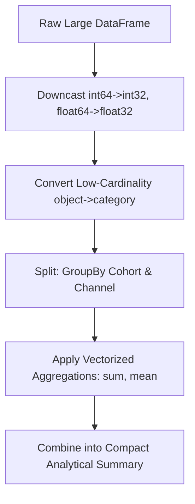

# Analytics Python Pandas Wrangling
> Based on **Python for Data Analysis - Wes McKinney**

## 1. Canonical Architecture & Data Modeling (DDL)

```sql
-- Analytical Aggregation Table Result
CREATE TABLE pandas_agg_results (
    cohort_month VARCHAR(7) NOT NULL,
    channel VARCHAR(50) NOT NULL,
    active_users BIGINT NOT NULL,
    total_spend NUMERIC(14, 2) NOT NULL,
    retention_rate_d30 NUMERIC(6, 4) NOT NULL,
    PRIMARY KEY (cohort_month, channel)
);
```

## 2. Core Mathematical Foundations & Analytical Invariants

### 2.1 Split-Apply-Combine Partition Invariant
Let dataframe $D$ be partitioned by key set $K = \{k_1, \dots, k_m\}$:
$$\bigcup_{i=1}^m D_{k_i} = D \quad \text{and} \quad D_{k_i} \cap D_{k_j} = \emptyset \quad \forall i \neq j$$
$$\sum_{i=1}^m |D_{k_i}| = |D|$$

## 3. Pipeline Flow & State Machine Invariants



## 4. Production Implementation Guidelines (Rust / SQL / Python)

```sql
import pandas as pd

def optimize_pandas_memory(df: pd.DataFrame) -> pd.DataFrame:
    for col in df.columns:
        if df[col].dtype == 'object' and df[col].nunique() / len(df) < 0.5:
            df[col] = df[col].astype('category')
        elif df[col].dtype == 'int64':
            df[col] = pd.to_numeric(df[col], downcast='integer')
        elif df[col].dtype == 'float64':
            df[col] = pd.to_numeric(df[col], downcast='float')
    return df
```

## 5. Actionable Prompt Recipes

### 5.1 Local Ollama Cheat Sheet (Actionable Constraints & Invariants)
```markdown
- Convert low-cardinality string columns (nunique / len < 0.5) to category to slash RAM usage.
- Downcast int64 -> int32/int16 and float64 -> float32; cuts memory consumption up to 75%.
- Avoid row-by-row iteration (iterrows); always use vectorized expressions or groupby agg.
- Chain operations using pipe() for readable, functional data transformation pipelines.
```

### 5.2 Cloud LLM Architectural Prompt (Comprehensive Engineering Blueprint)
```markdown
Build enterprise Python pandas data manipulation pipelines:
1. Implement automated memory profiling and type downcasting routines for large-scale datasets.
2. Build multi-level index pivot tables and windowed aggregations using vectorized groupby idioms.
3. Benchmark and refactor bottlenecks utilizing PyArrow-backed pandas 2.0 backend engines.
```
