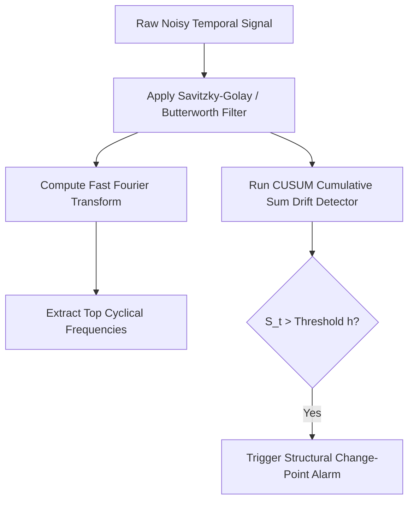

# Analytics Python Signal Processing
> Based on **Practical Time Series Analysis - Aileen Nielsen**

## 1. Canonical Architecture & Data Modeling (DDL)

```sql
-- Signal Spectral Profile Cache
CREATE TABLE signal_spectral_peaks (
    sensor_id VARCHAR(50) NOT NULL,
    dominant_frequency_hz DOUBLE PRECISION NOT NULL,
    peak_amplitude DOUBLE PRECISION NOT NULL,
    detected_at TIMESTAMP NOT NULL,
    PRIMARY KEY (sensor_id, dominant_frequency_hz)
);
```

## 2. Core Mathematical Foundations & Analytical Invariants

### 2.1 Discrete Fourier Transform (FFT)
For discrete signal $x_0, \dots, x_{N-1}$:
$$X_k = \sum_{n=0}^{N-1} x_n \cdot e^{-i 2\pi k n / N}$$
Identifies hidden periodic frequencies and cyclical components in time series.

### 2.2 CUSUM Change-Point Detection Invariant
$$S_t^+ = \max(0, S_{t-1}^+ + (X_t - \mu_0) - k)$$
Alarm triggers when $S_t^+ > h$ where $h$ is decision threshold and $k$ is allowance.

## 3. Pipeline Flow & State Machine Invariants



## 4. Production Implementation Guidelines (Rust / SQL / Python)

```sql
import numpy as np

def cusum_detector(series: np.ndarray, target_mean: float, allowance: float = 0.5, threshold: float = 5.0) -> list[int]:
    s_pos = 0.0
    change_points = []
    for t, val in enumerate(series):
        s_pos = max(0.0, s_pos + (val - target_mean) - allowance)
        if s_pos > threshold:
            change_points.append(t)
            s_pos = 0.0 # reset
    return change_points
```

## 5. Actionable Prompt Recipes

### 5.1 Local Ollama Cheat Sheet (Actionable Constraints & Invariants)
```markdown
- Use FFT (Fast Fourier Transform) to discover hidden cyclical periodicities in time-series data.
- CUSUM triggers alerts on mean drift: S_t = max(0, S_{t-1} + (x_t - target) - k) > h.
- Dynamic Time Warping (DTW) measures similarity between time series of differing lengths and speeds.
- Apply rolling window filters (Butterworth or Savitzky-Golay) to smooth high-frequency noise.
```

### 5.2 Cloud LLM Architectural Prompt (Comprehensive Engineering Blueprint)
```markdown
Build signal processing and change-point analytics pipelines:
1. Implement spectral decomposition using FFT and Wavelet transforms to isolate cyclical signals.
2. Deploy real-time CUSUM change-point detectors identifying structural macroeconomic shifts.
3. Build Dynamic Time Warping (DTW) distance matrix engines clustering customer trajectory patterns.
```
