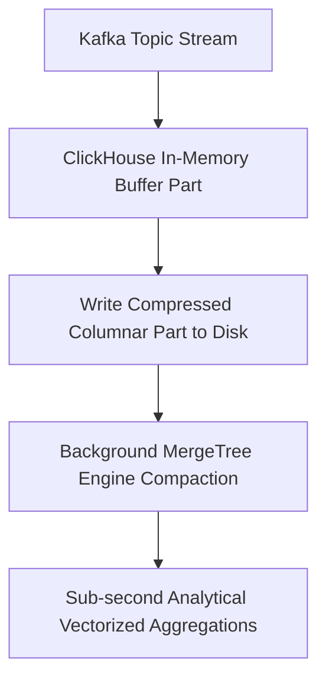

# Analytics Realtime Olap Pipelines
> Based on **Building Real-Time Data Pipelines - Gerard Maas & François Garillot**

## 1. Canonical Architecture & Data Modeling (DDL)

```sql
-- ClickHouse Real-Time OLAP DDL
CREATE TABLE default.events_stream (
    event_time DateTime64(3),
    user_id UInt64,
    event_type LowCardinality(String),
    cost Float64
) ENGINE = MergeTree()
PARTITION BY toYYYYMM(event_time)
ORDER BY (event_type, user_id, event_time)
SETTINGS index_granularity = 8192;

CREATE MATERIALIZED VIEW default.events_hourly_mv
ENGINE = SummingMergeTree()
PRIMARY KEY (toStartOfHour(event_time), event_type)
AS SELECT 
    toStartOfHour(event_time) AS hour,
    event_type,
    count() AS total_events,
    sum(cost) AS total_cost
FROM default.events_stream
GROUP BY hour, event_type;
```

## 2. Core Mathematical Foundations & Analytical Invariants

### 2.1 Sparse Index Granularity Invariant
Let $N$ be total row count and $G = 8192$ be index granularity:
$$\text{Number of Index Marks} = \left\lceil \frac{N}{8192} \right\rceil$$
Binary search over primary index marks runs in $O(\log_2(N/G))$ memory buffer operations.

## 3. Pipeline Flow & State Machine Invariants



## 4. Production Implementation Guidelines (Rust / SQL / Python)

```sql
-- ClickHouse Query with SummingMergeTree final state
SELECT hour, event_type, sum(total_events), sum(total_cost)
FROM default.events_hourly_mv
GROUP BY hour, event_type;
```

## 5. Actionable Prompt Recipes

### 5.1 Local Ollama Cheat Sheet (Actionable Constraints & Invariants)
```markdown
- Use MergeTree engines in ClickHouse; choose primary key ordering to maximize compression and filter skipping.
- SummingMergeTree and AggregatingMergeTree perform pre-aggregations during background part merges.
- LowCardinality(String) dictionary-encodes repetitive string columns, slashing memory by 80%.
- Stream into buffer tables or ingest in micro-batches (>= 1,000 rows) to avoid creating tiny disk parts.
```

### 5.2 Cloud LLM Architectural Prompt (Comprehensive Engineering Blueprint)
```markdown
Build sub-second real-time OLAP systems with ClickHouse/Pinot:
1. Design optimized sparse primary keys matching the dominant query filter and group-by predicates.
2. Deploy materialized views with AggregatingMergeTree engines for pre-computed metric rollups.
3. Architect Kafka streaming ingestion pipelines buffering micro-batches to prevent part explosion.
```
