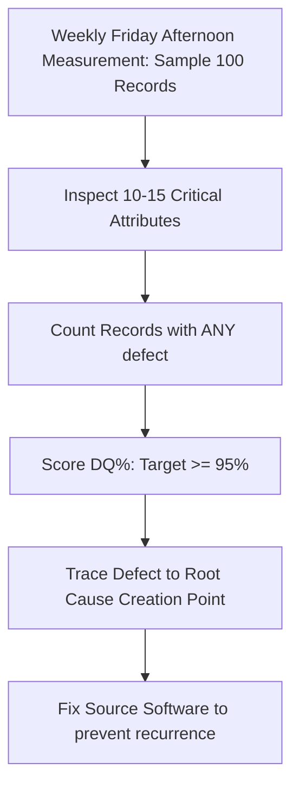

# Analytics Redman Data Quality
> Based on **Data Quality: The Field Guide - Thomas C. Redman**

## 1. Canonical Architecture & Data Modeling (DDL)

```sql
-- Friday Afternoon Measurement (FAM) Log
CREATE TABLE fam_data_quality_audits (
    audit_date DATE PRIMARY KEY,
    dataset_name VARCHAR(100) NOT NULL,
    sample_size INT NOT NULL DEFAULT 100,
    perfect_records INT NOT NULL,
    defective_records INT NOT NULL,
    data_quality_percent NUMERIC(5, 2) NOT NULL,
    primary_defect_root_cause TEXT
);
```

## 2. Core Mathematical Foundations & Analytical Invariants

### 2.1 The 1-10-100 Rule of Ten Invariant
$$\text{Cost of Data Error} = \begin{cases} \$1 & \text{Prevention at point of creation} \\ \$10 & \text{Correction in ETL / warehouse} \\ \$100+ & \text{Failure remediation in business operations} \end{cases}$$
Economic imperative: Move validation rules upstream to data entry sources.

### 2.2 FAM Quality Fraction
For a sample of $N = 100$ records across $K$ critical attributes:
$$DQ\% = \frac{\text{Count}(\text{Records with ZERO defects})}{100} \times 100\%$$

## 3. Pipeline Flow & State Machine Invariants



## 4. Production Implementation Guidelines (Rust / SQL / Python)

```sql
// Rust Friday Afternoon Measurement Calculator
pub struct FamAudit {
    pub total_records: usize,
    pub defective_records: usize,
}

impl FamAudit {
    pub fn quality_percentage(&self) -> f64 {
        if self.total_records == 0 { return 100.0; }
        let perfect = self.total_records.saturating_sub(self.defective_records);
        (perfect as f64 / self.total_records as f64) * 100.0
    }
}
```

## 5. Actionable Prompt Recipes

### 5.1 Local Ollama Cheat Sheet (Actionable Constraints & Invariants)
```markdown
- Rule of Ten (1-10-100): $1 to prevent at source, $10 to fix in ETL, $100+ to remediate downstream.
- Run Friday Afternoon Measurement (FAM): audit 100 random records weekly across core business attributes.
- A record with a single defective field is defective; measure percentage of completely error-free records.
- Stop cleaning data repeatedly in ETL; trace defects to the source application and prevent them there.
```

### 5.2 Cloud LLM Architectural Prompt (Comprehensive Engineering Blueprint)
```markdown
Build enterprise data quality management systems:
1. Implement weekly automated Friday Afternoon Measurement (FAM) sampling protocols across operational databases.
2. Formulate upstream validation gates enforcing the 1-10-100 cost prevention rule.
3. Build root-cause tracking incident dashboards linking warehouse errors directly to source application defects.
```
