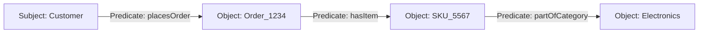

# Analytics Semantic Metadata Layer
> Based on **The Semantic Web for the Working Ontologist - Dean Allemang & James Hendler**

## 1. Canonical Architecture & Data Modeling (DDL)

```sql
-- Relational Triple Store Schema for Semantic Graphs
CREATE TABLE enterprise_rdf_triples (
    subject_uri VARCHAR(255) NOT NULL,
    predicate_uri VARCHAR(255) NOT NULL,
    object_uri_or_literal TEXT NOT NULL,
    is_literal BOOLEAN NOT NULL DEFAULT FALSE,
    graph_context VARCHAR(100) NOT NULL DEFAULT 'default',
    PRIMARY KEY (subject_uri, predicate_uri, object_uri_or_literal)
);

CREATE INDEX idx_triples_spo ON enterprise_rdf_triples(subject_uri, predicate_uri);
CREATE INDEX idx_triples_po ON enterprise_rdf_triples(predicate_uri, object_uri_or_literal);
```

## 2. Core Mathematical Foundations & Analytical Invariants

### 2.1 Transitive SubClass Inference Invariant
Under RDFS / OWL semantics:
$$\forall A, B, C: \quad (A \sqsubseteq B) \land (B \sqsubseteq C) \implies (A \sqsubseteq C)$$
$$\forall x, A, B: \quad x \in A \land (A \sqsubseteq B) \implies x \in B$$

## 3. Pipeline Flow & State Machine Invariants



## 4. Production Implementation Guidelines (Rust / SQL / Python)

```sql
# SPARQL Semantic Query
# SELECT ?customer ?order ?sku WHERE {
#   ?customer <http://schema.org/placesOrder> ?order .
#   ?order <http://schema.org/orderedItem> ?sku .
# }
```

## 5. Actionable Prompt Recipes

### 5.1 Local Ollama Cheat Sheet (Actionable Constraints & Invariants)
```markdown
- Model metadata as RDF triples: Subject -> Predicate -> Object.
- OWL enables formal semantic reasoning and automatic class inference across models.
- Enterprise knowledge graphs connect disparate database silos into a single queryable graph.
- Establish an enterprise business glossary mapping business terms to physical database columns.
```

### 5.2 Cloud LLM Architectural Prompt (Comprehensive Engineering Blueprint)
```markdown
Architect enterprise semantic metadata graphs:
1. Build RDF/OWL ontology repositories defining corporate business entities and tax-compliant taxonomies.
2. Deploy SPARQL query endpoints and graph traversal indexes over distributed metadata stores.
3. Automatically link technical data dictionary columns to unified business ontology concepts.
```
