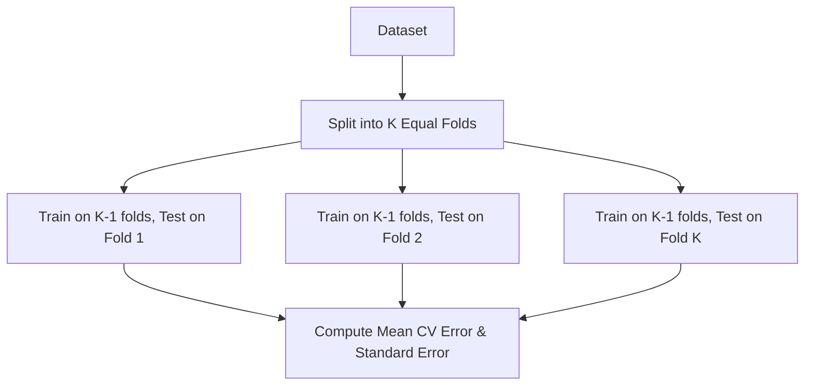

# Analytics Statistical Learning Islp
> Based on **An Introduction to Statistical Learning - Gareth James, Daniela Witten, Trevor Hastie, Robert Tibshirani**

## 1. Canonical Architecture & Data Modeling (DDL)

```sql
-- Cross-Validation Performance Log
CREATE TABLE model_cv_runs (
    model_id UUID PRIMARY KEY,
    algorithm VARCHAR(50) NOT NULL,
    hyperparameters JSONB NOT NULL,
    k_folds INT NOT NULL DEFAULT 5,
    mean_cv_rmse DOUBLE PRECISION NOT NULL,
    std_cv_rmse DOUBLE PRECISION NOT NULL,
    created_at TIMESTAMP NOT NULL DEFAULT CURRENT_TIMESTAMP
);
```

## 2. Core Mathematical Foundations & Analytical Invariants

### 2.1 Bias-Variance Decomposition
For target $y = f(x) + \epsilon$ with $\epsilon \sim \mathcal{N}(0, \sigma^2_\epsilon)$:
$$E[(y - \hat{f}(x))^2] = \text{Bias}(\hat{f}(x))^2 + \text{Var}(\hat{f}(x)) + \sigma^2_\epsilon$$

### 2.2 Elastic Net & Regularized Loss Invariant
$$\min_\beta \left( \frac{1}{2n} \|y - X\beta\|_2^2 + \lambda_1 \|\beta\|_1 + \frac{\lambda_2}{2} \|\beta\|_2^2 \right)$$
- When $\lambda_2 = 0$, pure Lasso ($L_1$ penalty) forces non-informative coefficients to exact zero.

## 3. Pipeline Flow & State Machine Invariants



## 4. Production Implementation Guidelines (Rust / SQL / Python)

```sql
from sklearn.linear_model import LassoCV
from sklearn.preprocessing import StandardScaler
from sklearn.pipeline import make_pipeline

pipeline = make_pipeline(StandardScaler(), LassoCV(cv=5, random_state=42))
# pipeline.fit(X_train, y_train)
```

## 5. Actionable Prompt Recipes

### 5.1 Local Ollama Cheat Sheet (Actionable Constraints & Invariants)
```markdown
- High bias causes underfitting; high variance causes overfitting on training data.
- Use K-Fold Cross-Validation (K=5 or 10) to select hyperparameters minimizing test error.
- Lasso (L1) yields sparse models via feature selection; Ridge (L2) shrinks collinear weights.
- Always standardize features (zero mean, unit variance) prior to fitting penalized regression.
```

### 5.2 Cloud LLM Architectural Prompt (Comprehensive Engineering Blueprint)
```markdown
Build statistical learning regression and classification engines:
1. Implement cross-validated Ridge and Lasso pipelines with automated lambda grid search.
2. Evaluate bias-variance profiles using empirical learning curves across training set sizes.
3. Validate classification thresholds optimizing precision-recall tradeoffs for imbalanced business KPIs.
```
