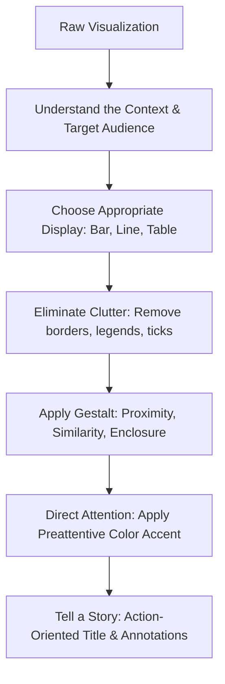

# Analytics Storytelling With Data
> Based on **Storytelling with Data - Cole Nussbaumer Knaflic**

## 1. Canonical Architecture & Data Modeling (DDL)

```sql
-- Presentation Chart Style Specification
CREATE TABLE viz_style_specs (
    spec_id VARCHAR(50) PRIMARY KEY,
    primary_color CHAR(7) NOT NULL DEFAULT '#1E40AF', -- Intentional focal accent
    neutral_color CHAR(7) NOT NULL DEFAULT '#94A3B8', -- Muted gray background
    alert_color CHAR(7) NOT NULL DEFAULT '#DC2626',
    font_family VARCHAR(50) NOT NULL DEFAULT 'Inter',
    max_accent_elements INT NOT NULL DEFAULT 3
);
```

## 2. Core Mathematical Foundations & Analytical Invariants

### 2.1 Sensory Memory Preattentive Threshold
Preattentive visual features (Color Hue, Position, Size) are processed in sensory memory:
$$T_{\text{perception}} < 200 \text{ ms}$$
Invariant: Use at most 1 primary preattentive accent color per visual to prevent cognitive dissonance:
$$\sum \text{Accent Hues} \le 1 \quad (\text{Rest must be muted grays})$$

## 3. Pipeline Flow & State Machine Invariants



## 4. Production Implementation Guidelines (Rust / SQL / Python)

```sql
# Decluttering Matplotlib Style Example
import matplotlib.pyplot as plt

def apply_storytelling_style(ax):
    # Remove top and right spines
    ax.spines['top'].set_visible(False)
    ax.spines['right'].set_visible(False)
    ax.spines['left'].set_color('#CBD5E1')
    ax.spines['bottom'].set_color('#CBD5E1')
    ax.tick_params(colors='#64748B')
    ax.yaxis.grid(True, linestyle='--', alpha=0.5, color='#E2E8F0')
    ax.xaxis.grid(False)
```

## 5. Actionable Prompt Recipes

### 5.1 Local Ollama Cheat Sheet (Actionable Constraints & Invariants)
```markdown
- Declutter: remove borders, 3D effects, dark background fills, and redundant axis labels.
- Color must be used intentionally: mute 90% of data in light gray; highlight the focal point in bold blue/coral.
- Replace generic chart titles with action headlines summarizing the key takeaway.
- Leverage Gestalt principles (proximity, similarity, enclosure) to group related data points naturally.
```

### 5.2 Cloud LLM Architectural Prompt (Comprehensive Engineering Blueprint)
```markdown
Standardize executive visual communications using Storytelling with Data:
1. Formulate automated chart decluttering templates removing extraneous visual noise and chart borders.
2. Establish strict visual hierarchies utilizing preattentive color encoding (< 200ms processing threshold).
3. Create annotated narrative charts communicating actionable insights directly to decision makers.
```
