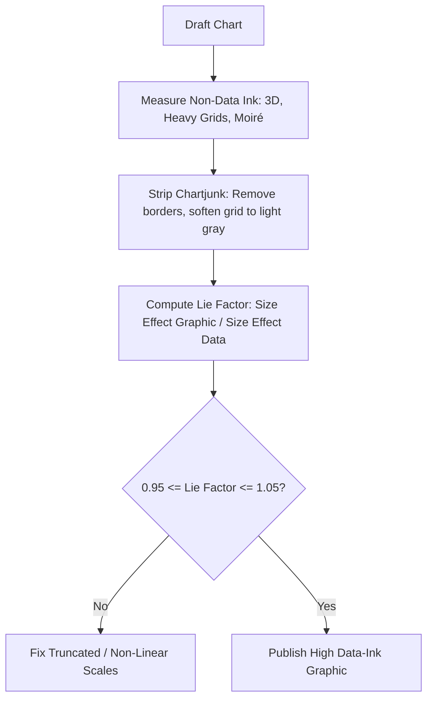

# Analytics Tufte Visual Display
> Based on **The Visual Display of Quantitative Information - Edward R. Tufte**

## 1. Canonical Architecture & Data Modeling (DDL)

```sql
-- Visualization Audit Metrics
CREATE TABLE chart_integrity_audits (
    chart_id VARCHAR(50) PRIMARY KEY,
    chart_title VARCHAR(100) NOT NULL,
    data_ink_ratio DOUBLE PRECISION NOT NULL CHECK (data_ink_ratio > 0.0 AND data_ink_ratio <= 1.0),
    lie_factor DOUBLE PRECISION NOT NULL,
    has_3d_effects BOOLEAN NOT NULL DEFAULT FALSE,
    has_heavy_gridlines BOOLEAN NOT NULL DEFAULT FALSE,
    status VARCHAR(20) NOT NULL CHECK (status IN ('APPROVED', 'REJECTED_CHARTJUNK'))
);
```

## 2. Core Mathematical Foundations & Analytical Invariants

### 2.1 Data-Ink Ratio Invariant
$$\text{Data-Ink Ratio} = \frac{\text{Data-Ink}}{\text{Total Ink Used to Print Graphic}} \le 1.0$$
Objective: Maximize data-ink ratio; erase non-data-ink and redundant data-ink.

### 2.2 Lie Factor Invariant
$$\text{Lie Factor} = \frac{\text{Size of Effect Shown in Graphic}}{\text{Size of Effect in Data}} = \frac{\frac{|G_2 - G_1|}{G_1}}{\frac{|D_2 - D_1|}{D_1}}$$
A truthful graphic must have:
$$0.95 \le \text{Lie Factor} \le 1.05$$

## 3. Pipeline Flow & State Machine Invariants



## 4. Production Implementation Guidelines (Rust / SQL / Python)

```sql
# Tufte Lie Factor Calculator
def calculate_lie_factor(graphic_val_1: float, graphic_val_2: float, data_val_1: float, data_val_2: float) -> float:
    size_effect_graphic = abs(graphic_val_2 - graphic_val_1) / graphic_val_1
    size_effect_data = abs(data_val_2 - data_val_1) / data_val_1
    if size_effect_data == 0:
        return 1.0
    return size_effect_graphic / size_effect_data
```

## 5. Actionable Prompt Recipes

### 5.1 Local Ollama Cheat Sheet (Actionable Constraints & Invariants)
```markdown
- Maximize the Data-Ink Ratio: every drop of ink must represent meaningful quantitative variation.
- Eliminate chartjunk: ban 3D pseudo-perspective, dark grid lines, decorative textures, and useless icons.
- Maintain Lie Factor between 0.95 and 1.05; graphic variations must match data variations.
- Use sparklines (word-sized data graphics) to show dense historical context directly within text.
```

### 5.2 Cloud LLM Architectural Prompt (Comprehensive Engineering Blueprint)
```markdown
Deploy Tufte quantitative visual integrity standards across business intelligence:
1. Audit dashboard assets enforcing Data-Ink Ratio maximization and complete chartjunk elimination.
2. Calculate and alert on Lie Factor violations caused by non-zero baselines or non-linear scaling.
3. Implement small multiples and embedded sparklines displaying high-density temporal context.
```
