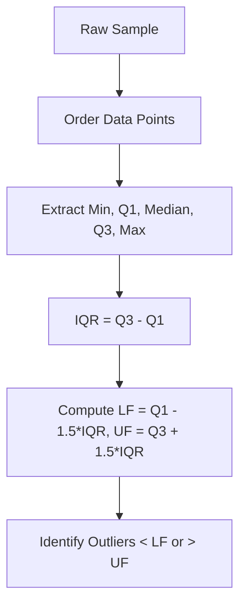

# Analytics Tukey Eda Heuristics
> Based on **Exploratory Data Analysis - John W. Tukey**

## 1. Canonical Architecture & Data Modeling (DDL)

```sql
-- Summary Metrics Table for Tukey EDA Profiling
CREATE TABLE eda_metric_profile (
    metric_name VARCHAR(100) PRIMARY KEY,
    sample_size BIGINT NOT NULL,
    min_val DOUBLE PRECISION NOT NULL,
    q1_val DOUBLE PRECISION NOT NULL,
    median_val DOUBLE PRECISION NOT NULL,
    q3_val DOUBLE PRECISION NOT NULL,
    max_val DOUBLE PRECISION NOT NULL,
    iqr DOUBLE PRECISION NOT NULL,
    lower_fence DOUBLE PRECISION NOT NULL,
    upper_fence DOUBLE PRECISION NOT NULL,
    outlier_count BIGINT NOT NULL
);
```

## 2. Core Mathematical Foundations & Analytical Invariants

### 2.1 Tukey Fences Invariant
Let $Q_1$ and $Q_3$ be the 25th and 75th percentiles. Interquartile Range:
$$IQR = Q_3 - Q_1$$
$$\text{Lower Inner Fence } (LF) = Q_1 - 1.5 \times IQR$$
$$\text{Upper Inner Fence } (UF) = Q_3 + 1.5 \times IQR$$
$$\text{Lower Outer Fence} = Q_1 - 3.0 \times IQR, \quad \text{Upper Outer Fence} = Q_3 + 3.0 \times IQR$$
A data point $x$ is an outlier if $x < LF \lor x > UF$.

## 3. Pipeline Flow & State Machine Invariants



## 4. Production Implementation Guidelines (Rust / SQL / Python)

```sql
# Tukey EDA Fences in Python / Polars
import polars as pl

def compute_tukey_fences(series: pl.Series) -> dict:
    q1 = series.quantile(0.25)
    q3 = series.quantile(0.75)
    iqr = q3 - q1
    lf = q1 - 1.5 * iqr
    uf = q3 + 1.5 * iqr
    outliers = series.filter((series < lf) | (series > uf))
    return {"q1": q1, "q3": q3, "iqr": iqr, "lf": lf, "uf": uf, "outliers_count": len(outliers)}
```

## 5. Actionable Prompt Recipes

### 5.1 Local Ollama Cheat Sheet (Actionable Constraints & Invariants)
```markdown
- Compute Tukey Fences: LF = Q1 - 1.5 * IQR and UF = Q3 + 1.5 * IQR.
- Data points outside inner fences are flagged as potential outliers for manual review.
- Always report 5-number summary (Min, Q1, Median, Q3, Max) rather than solely Mean and StdDev.
- Use median polish for additive two-way contingency tables to resist outlier skew.
```

### 5.2 Cloud LLM Architectural Prompt (Comprehensive Engineering Blueprint)
```markdown
Build automated Tukey EDA heuristic pipelines:
1. Implement vectorized 5-number summary and IQR fence calculations in DuckDB/Polars.
2. Formulate median polish algorithms decomposing row and column effects in matrix data.
3. Automatically generate box-and-whisker distributions and outlier inspection queues.
```
