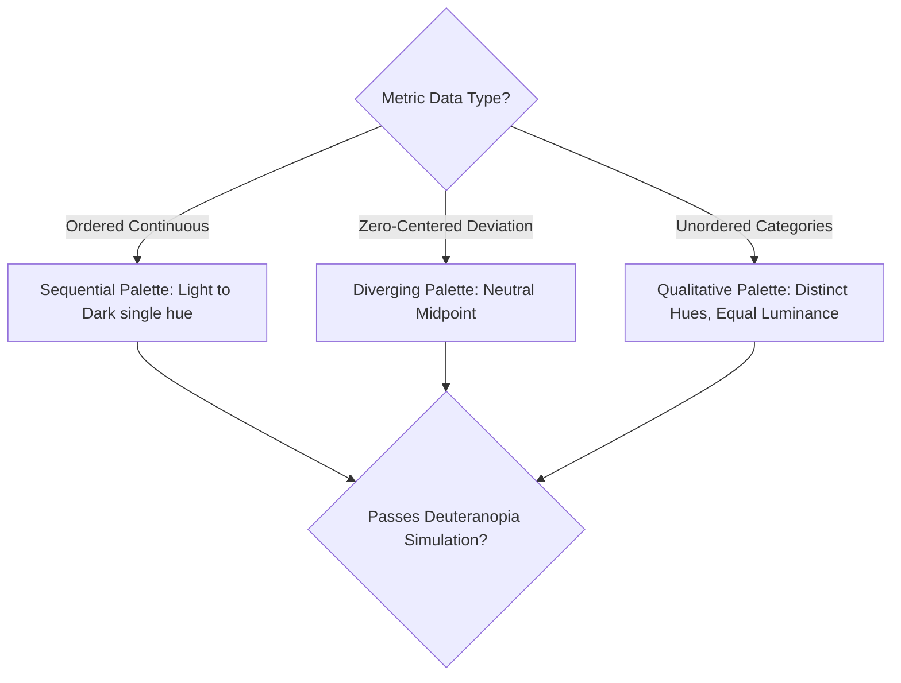

# Analytics Wilke Data Visualization
> Based on **Fundamentals of Data Visualization - Claus O. Wilke**

## 1. Canonical Architecture & Data Modeling (DDL)

```sql
-- Color Scale Registry
CREATE TABLE color_scale_palettes (
    palette_name VARCHAR(50) PRIMARY KEY,
    palette_type VARCHAR(20) NOT NULL CHECK (palette_type IN ('SEQUENTIAL', 'DIVERGING', 'QUALITATIVE')),
    is_colorblind_safe BOOLEAN NOT NULL DEFAULT TRUE,
    hex_values JSONB NOT NULL
);
```

## 2. Core Mathematical Foundations & Analytical Invariants

### 2.1 Perceptually Uniform Color Invariant
Let $\Delta E$ be perceptual color difference in CIELAB space and $\Delta y$ be data variation:
$$\frac{\Delta E(c_1, c_2)}{|y_1 - y_2|} \approx \text{constant}$$
Viridis, Inferno, and Cividis maintain strict perceptual uniformity across all color vision proficiencies.

## 3. Pipeline Flow & State Machine Invariants



## 4. Production Implementation Guidelines (Rust / SQL / Python)

```sql
# Safe Diverging Colormap Midpoint in Python
import matplotlib.colors as mcolors

def get_diverging_norm(vmin: float, vmax: float, vcenter: float = 0.0):
    return mcolors.TwoSlopeNorm(vmin=vmin, vcenter=vcenter, vmax=vmax)
```

## 5. Actionable Prompt Recipes

### 5.1 Local Ollama Cheat Sheet (Actionable Constraints & Invariants)
```markdown
- Use sequential palettes for ordered magnitude; diverging for values with a natural zero midpoint.
- Never use rainbow/jet colormaps; use perceptually uniform Viridis or ColorBrewer palettes.
- Never use dual y-axes with different scales; plot two separate aligned panels instead.
- Verify colorblind accessibility: 8% of men have red-green color vision deficiency.
```

### 5.2 Cloud LLM Architectural Prompt (Comprehensive Engineering Blueprint)
```markdown
Implement rigorous visual encoding standards across enterprise analytics:
1. Deploy perceptually uniform color maps (Viridis, Okabe-Ito) certified for colorblind accessibility.
2. Eliminate misleading dual y-axes by automatically decomposing multi-scale metrics into vertically aligned panels.
3. Validate visual encodings (position, size, color, shape) matching data scale properties.
```
