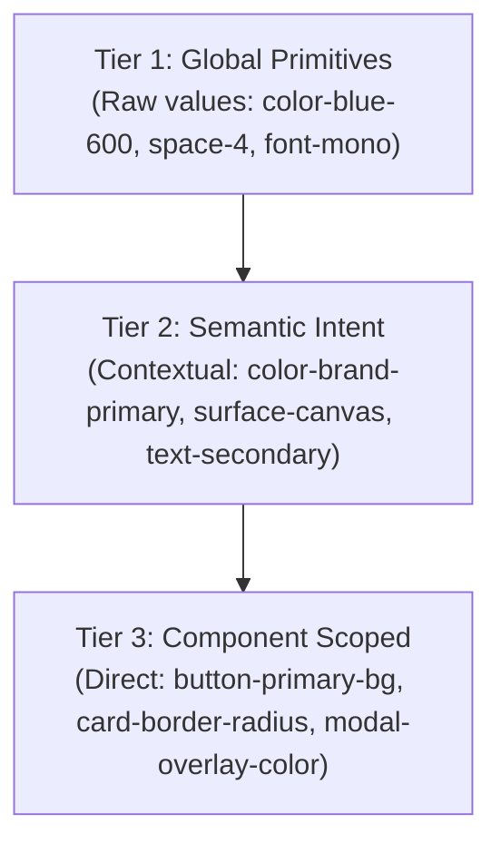

# Design Systems & Token Architecture Engineering Skill

Architectural engineering for scalable, composable, and tokenized design systems, based on Alla Kholmatova's *Design Systems* and Brad Frost's *Atomic Design*.

---

## 1. 3-Tier Design Token Architecture

Tokens bridge design intent and multi-platform implementation (Web, TUI, Mobile, Desktop).



### 1. Global Tokens (Primitives)
Immutable values defining the raw palette, typography scales, and spacing units:
```css
:root {
  --primitive-slate-900: #0f172a;
  --primitive-indigo-600: #4f46e5;
  --primitive-space-1: 0.25rem; /* 4px */
  --primitive-space-2: 0.5rem;  /* 8px */
  --primitive-space-4: 1.0rem;  /* 16px */
}
```

### 2. Semantic Tokens (Intent)
Tokens assigned meaning based on role and theme (dark/light mode switch happens here):
```css
:root {
  --color-surface-canvas: var(--primitive-slate-50);
  --color-surface-panel: #ffffff;
  --color-text-primary: var(--primitive-slate-900);
  --color-action-primary: var(--primitive-indigo-600);
}
[data-theme="dark"] {
  --color-surface-canvas: #020617;
  --color-surface-panel: #0f172a;
  --color-text-primary: #f8fafc;
  --color-action-primary: #6366f1;
}
```

### 3. Component Tokens
Tokens mapped specifically to component internal styling hooks:
```css
.btn-primary {
  background-color: var(--color-action-primary);
  color: #ffffff;
  padding: var(--primitive-space-2) var(--primitive-space-4);
}
```

---

## 2. Atomic Design Hierarchy

1. **Atoms**: Foundational HTML elements / raw UI primitives (Button, Input, Badge, Icon, Avatar).
2. **Molecules**: Simple functional groups of atoms (SearchBar = Input + Button + Icon; UserSnippet = Avatar + Text).
3. **Organisms**: Complex self-contained modules composed of molecules and atoms (HeaderNav, DataTable, ChatPanel).
4. **Templates**: Page-level skeleton wireframes defining layout grid and slot hierarchy without concrete data.
5. **Pages**: Instantiated templates injected with live real-world production data.

---

## 3. Slot Composition Over Prop Explosion

Avoid creating monolithic components with 40+ boolean flags (`hasBadge`, `isSmall`, `iconLeft`, `showSecondaryButton`). Favor composition:

```tsx
// Anti-Pattern: Prop explosion
<Card title="Deploy" showBadge badgeText="Active" buttonText="Run" onButtonClick={fn} />

// Pro-Pattern: Composable Compound Slots
<Card>
  <Card.Header>
    <Card.Title>Deploy</Card.Title>
    <Badge variant="success">Active</Badge>
  </Card.Header>
  <Card.Body>
    <MetricsChart data={metrics} />
  </Card.Body>
  <Card.Footer>
    <Button variant="primary" onClick={fn}>Run</Button>
  </Card.Footer>
</Card>
```

---

## 4. Vibe Coder Directives for AI Prompts

- *"Refactor this component library to use a 3-tier design token architecture with CSS custom variables supporting zero-flash dark mode."*
- *"Break down this 600-line monolithic dashboard component into Atomic Design modules: Atoms (Badge, StatVal), Molecules (MetricTile), Organisms (AnalyticsGrid)."*
- *"Replace all hardcoded hex colors and arbitrary pixel margins with semantic design tokens (`--color-surface-panel`, `--primitive-space-4`)."*
