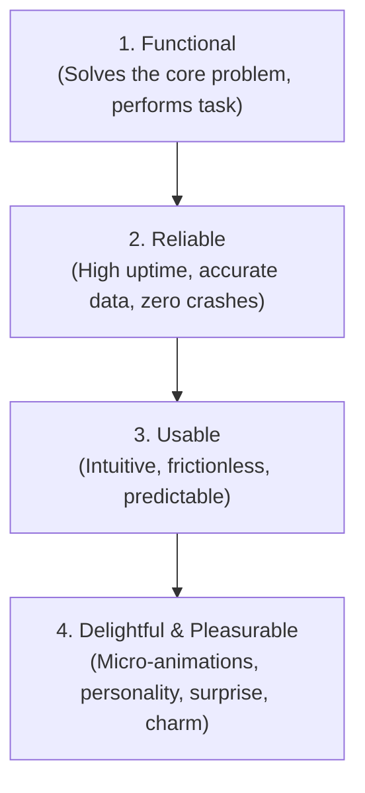

# Designing for Emotion Engineering Skill

Designing interfaces that forge genuine emotional connections, foster user loyalty, and bring psychological delight, based on Aarron Walter's *Designing for Emotion*.

---

## 1. Emotional Design Hierarchy

Just as Maslow mapped human needs, Walter maps user interface expectations:

Delight is not a substitute for functionality; it is the crowning tier built upon rock-solid reliability and frictionless usability.

---

## 2. Humanized Empty States

Never display a dead-end blank canvas. Empty states are prime opportunities to educate, welcome, and guide:
- **Illustrated Vector or Symbol**: A pleasant, thematic visual asset.
- **Narrative Headline**: Friendly phrasing ("No agents running right now").
- **Clear Call to Action (CTA)**: A prominent primary button ("Deploy Your First Agent").
- **Helpful Link**: Secondary documentation or quickstart guide.

---

## 3. Empathetic Error Engineering

When things break, avoid blaming the user or vomiting cryptic stack traces.
1. **Calm Demeanor**: Do not use alarmist sirens or harsh red alert banners unless critical data loss is imminent.
2. **Plain Language**: Translate `NullPointerDereference at 0x7FFF` into *"We encountered a hiccup while parsing that config file"*.
3. **Actionable Path Forward**: Provide clear next steps (*"Check that your YAML syntax is valid, or restore previous version"* with a 1-click button).

---

## 4. Celebratory Milestones & Variable Rewards

When a user completes a major objective (e.g. all 15 test suites pass, deployment successful, first project initialized):
- Provide tasteful micro-delight: subtle confetti burst, celebratory audio chime (opt-out available), or animated achievement badge.
- Reinforce accomplishment with quantitative impact metrics ("All 48 tests passed in 1.2s").

---

## 5. Vibe Coder Directives for AI Prompts

- *"Transform this empty table state into an engaging onboarding invitation: include an SVG icon, encouraging title, and a 'Create your first pipeline' CTA button."*
- *"Rewrite all error dialogs to follow empathetic error guidelines: plain English explanation, reassurance of data safety, and a 1-click 'Retry' button."*
- *"Add a celebratory confetti animation and summary toast when the user's test pipeline reaches 100% pass rate."*
