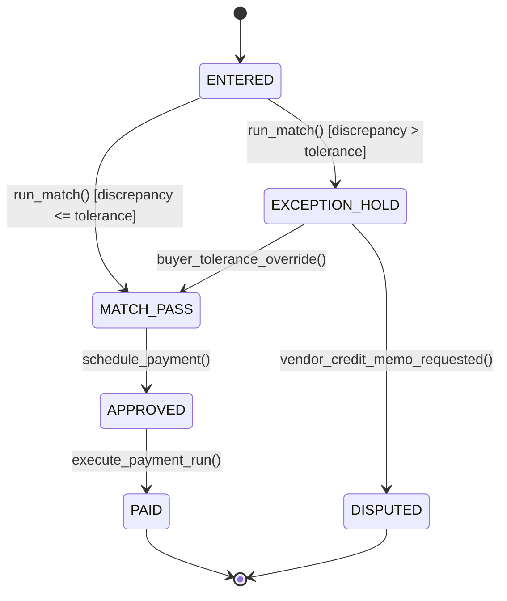

# 3-Way Matching & Accounts Payable: PO, Goods Receipt & Vendor Invoice Reconciliation
> Based on **Accounts Payable Best Practices - Mary Schaeffer**

## 1. Canonical Enterprise Architecture & PostgreSQL Data Model (DDL)

```sql
-- 3-Way Match Verification & GR/IR Clearing Schema
CREATE TABLE goods_receipts (
    gr_id UUID PRIMARY KEY DEFAULT uuid_generate_v4(),
    gr_number VARCHAR(50) NOT NULL UNIQUE,
    po_id UUID NOT NULL REFERENCES purchase_orders(po_id),
    receipt_date TIMESTAMPTZ NOT NULL DEFAULT NOW(),
    received_by_party_id UUID NOT NULL REFERENCES parties(party_id)
);

CREATE TABLE goods_receipt_lines (
    gr_line_id UUID PRIMARY KEY DEFAULT uuid_generate_v4(),
    gr_id UUID NOT NULL REFERENCES goods_receipts(gr_id) ON DELETE CASCADE,
    product_id UUID NOT NULL REFERENCES products(product_id),
    received_quantity NUMERIC(14, 4) NOT NULL CHECK (received_quantity > 0)
);

CREATE TABLE vendor_invoices (
    invoice_id UUID PRIMARY KEY DEFAULT uuid_generate_v4(),
    invoice_number VARCHAR(100) NOT NULL,
    vendor_id UUID NOT NULL REFERENCES vendors(vendor_id),
    invoice_date DATE NOT NULL,
    total_amount NUMERIC(18, 4) NOT NULL,
    status VARCHAR(20) NOT NULL CHECK (status IN ('ENTERED', 'MATCH_PASS', 'EXCEPTION_HOLD', 'APPROVED', 'PAID', 'DISPUTED')),
    CONSTRAINT uq_vendor_invoice UNIQUE (vendor_id, invoice_number)
);

CREATE TABLE three_way_match_checks (
    match_id UUID PRIMARY KEY DEFAULT uuid_generate_v4(),
    invoice_id UUID NOT NULL REFERENCES vendor_invoices(invoice_id),
    po_id UUID NOT NULL REFERENCES purchase_orders(po_id),
    qty_matched BOOLEAN NOT NULL,
    price_matched BOOLEAN NOT NULL,
    qty_discrepancy NUMERIC(14, 4) NOT NULL DEFAULT 0.0000,
    price_discrepancy NUMERIC(18, 4) NOT NULL DEFAULT 0.0000,
    is_passed BOOLEAN GENERATED ALWAYS AS (qty_matched AND price_matched) STORED,
    verified_at TIMESTAMPTZ NOT NULL DEFAULT NOW()
);
```

## 2. Mathematical Foundations & Business Invariants

### 2.1 3-Way Match Verification Invariant
Let $Q_{\text{inv}}$ be the invoice quantity, $Q_{\text{received}}$ be the cumulative GRN received quantity, $P_{\text{inv}}$ be the invoice unit price, and $P_{\text{po}}$ be the authorized PO unit price.
With allowable tolerance thresholds $\tau_{\text{qty}}$ (e.g. 1%) and $\tau_{\text{price}}$ (e.g. 0.5%):
$$\frac{|Q_{\text{inv}} - Q_{\text{received}}|}{Q_{\text{received}}} \le \tau_{\text{qty}}$$
$$\frac{|P_{\text{inv}} - P_{\text{po}}|}{P_{\text{po}}} \le \tau_{\text{price}}$$
If both conditions hold, the match passes and the invoice is released for payment.

### 2.2 GR/IR Clearing Account Mechanics
Upon Goods Receipt:
$$\text{Debit: Raw Materials Inventory} \quad \text{Credit: GR/IR Clearing Account}$$
Upon Invoice Receipt (3-Way Match Pass):
$$\text{Debit: GR/IR Clearing Account} \quad \text{Credit: Accounts Payable Liability}$$

## 3. Finite State Machine (FSM) & Lifecycle Invariants

### 3.1 AP Invoice 3-Way Match FSM


## 4. Production Implementation Guidelines (Rust / SQL / Python)

```rust
use rust_decimal::Decimal;

pub struct MatchEvaluation {
    pub is_passed: bool,
    pub qty_diff: Decimal,
    pub price_diff: Decimal,
}

pub fn execute_three_way_match(
    po_qty: Decimal,
    po_price: Decimal,
    grn_qty: Decimal,
    inv_qty: Decimal,
    inv_price: Decimal,
    qty_tol_pct: Decimal,
    price_tol_pct: Decimal,
) -> MatchEvaluation {
    let qty_diff = inv_qty - grn_qty;
    let price_diff = inv_price - po_price;

    let qty_pct = if grn_qty > Decimal::ZERO { (qty_diff.abs() / grn_qty) } else { Decimal::ONE };
    let price_pct = if po_price > Decimal::ZERO { (price_diff.abs() / po_price) } else { Decimal::ONE };

    let qty_matched = qty_pct <= qty_tol_pct && inv_qty <= grn_qty;
    let price_matched = price_pct <= price_tol_pct;

    MatchEvaluation {
        is_passed: qty_matched && price_matched,
        qty_diff,
        price_diff,
    }
}
```

## 5. Actionable Prompt Recipes

### 5.1 Local Ollama Cheat Sheet (Actionable Constraints & Invariants)
```markdown
- Reconcile Purchase Order (PO), Goods Receipt (GRN), and Vendor Invoice before paying.
- Match Invoice Quantity against Received Quantity (NOT PO quantity).
- Match Invoice Price against Authorized PO Price.
- Never clear GR/IR accounts manually; clear them via verified 3-way match transactions.
```

### 5.2 Cloud LLM Architectural Prompt (Comprehensive Engineering Blueprint)
```markdown
Build a mission-critical 3-Way Matching engine for Accounts Payable:
1. Implement the tolerance engine checking quantity, unit price, and extended line total limits.
2. Construct automated exception workflows routing discrepancies to purchasing agents for review.
3. Manage the GR/IR clearing account lifecycle, identifying unbilled receipts and uncleared invoices.
4. Test edge cases: partial receipts, multiple deliveries against a single PO line, and fractional pennies.
```
