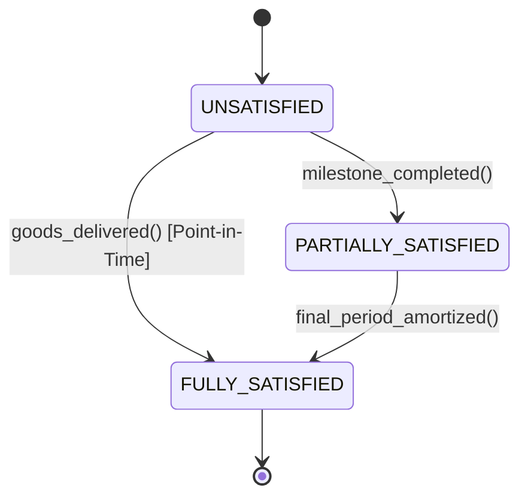

# ASC 606 / IFRS 15 Revenue Recognition: 5-Step Model, SSP Allocation & Deferred Schedules
> Based on **Revenue Recognition: ASC 606 / IFRS 15 - AICPA / Frank Sellitti**

## 1. Canonical Enterprise Architecture & PostgreSQL Data Model (DDL)

```sql
-- ASC 606 / IFRS 15 Revenue Contracts & Performance Obligations
CREATE TABLE revenue_contracts (
    contract_id UUID PRIMARY KEY DEFAULT uuid_generate_v4(),
    customer_party_id UUID NOT NULL REFERENCES parties(party_id),
    contract_number VARCHAR(50) NOT NULL UNIQUE,
    start_date DATE NOT NULL,
    end_date DATE NOT NULL,
    total_transaction_price NUMERIC(18, 4) NOT NULL CHECK (total_transaction_price >= 0),
    status VARCHAR(30) NOT NULL CHECK (status IN ('DRAFT', 'ACTIVE', 'MODIFIED', 'COMPLETED', 'TERMINATED')),
    created_at TIMESTAMPTZ NOT NULL DEFAULT NOW()
);

CREATE TABLE performance_obligations (
    pob_id UUID PRIMARY KEY DEFAULT uuid_generate_v4(),
    contract_id UUID NOT NULL REFERENCES revenue_contracts(contract_id) ON DELETE CASCADE,
    pob_name VARCHAR(150) NOT NULL,
    satisfaction_type VARCHAR(20) NOT NULL CHECK (satisfaction_type IN ('POINT_IN_TIME', 'OVER_TIME')),
    standalone_selling_price NUMERIC(18, 4) NOT NULL CHECK (standalone_selling_price > 0),
    allocated_transaction_price NUMERIC(18, 4) NOT NULL DEFAULT 0.0000,
    recognized_revenue NUMERIC(18, 4) NOT NULL DEFAULT 0.0000,
    status VARCHAR(20) NOT NULL CHECK (status IN ('UNSATISFIED', 'PARTIALLY_SATISFIED', 'FULLY_SATISFIED'))
);

CREATE TABLE revenue_schedules (
    schedule_id UUID PRIMARY KEY DEFAULT uuid_generate_v4(),
    pob_id UUID NOT NULL REFERENCES performance_obligations(pob_id) ON DELETE CASCADE,
    period VARCHAR(7) NOT NULL, -- YYYY-MM
    scheduled_amount NUMERIC(18, 4) NOT NULL CHECK (scheduled_amount > 0),
    is_posted BOOLEAN NOT NULL DEFAULT FALSE,
    journal_entry_id UUID REFERENCES journal_entries(entry_id),
    CONSTRAINT uq_pob_period UNIQUE (pob_id, period)
);
```

## 2. Mathematical Foundations & Business Invariants

### 2.1 Relative Standalone Selling Price (SSP) Allocation Invariant
For contract $C$ with total transaction price $T$ and $m$ distinct performance obligations:
$$\text{Allocation Factor}_k = \frac{\text{SSP}_k}{\sum_{j=1}^m \text{SSP}_j}$$
$$\text{Allocated Price}_k = T \times \text{Allocation Factor}_k$$
$$\text{Conservation Invariant: } \sum_{k=1}^m \text{Allocated Price}_k = T$$

### 2.2 Balance Sheet Revenue Identity
At all times across all periods $t$:
$$\text{Billed To Date} = \text{Cumulative Recognized Revenue} + \text{Deferred Revenue Balance}$$

## 3. Finite State Machine (FSM) & Lifecycle Invariants

### 3.1 Performance Obligation Lifecycle FSM


## 4. Production Implementation Guidelines (Rust / SQL / Python)

```rust
use rust_decimal::Decimal;

pub struct PobAllocation {
    pub pob_id: uuid::Uuid,
    pub ssp: Decimal,
    pub allocated_price: Decimal,
}

pub fn allocate_transaction_price(
    total_price: Decimal,
    ssps: &[(uuid::Uuid, Decimal)],
) -> Vec<PobAllocation> {
    let total_ssp: Decimal = ssps.iter().map(|(_, s)| *s).sum();
    let mut allocations = Vec::new();
    let mut allocated_sum = Decimal::ZERO;

    for (i, (id, ssp)) in ssps.iter().enumerate() {
        let is_last = i == ssps.len() - 1;
        let alloc = if is_last {
            total_price - allocated_sum // Rounding plug to satisfy strict sum == total
        } else {
            (total_price * ssp / total_ssp).round_dp(4)
        };
        allocated_sum += alloc;
        allocations.push(PobAllocation {
            pob_id: *id,
            ssp: *ssp,
            allocated_price: alloc,
        });
    }
    allocations
}
```

## 5. Actionable Prompt Recipes

### 5.1 Local Ollama Cheat Sheet (Actionable Constraints & Invariants)
```markdown
- Implement ASC 606 5-Step process: Contract -> Obligations -> Price -> Allocation -> Recognition.
- Always plug rounding discrepancies on the final obligation to ensure sum(allocations) == total_price.
- Deferred Revenue must be treated as a Balance Sheet Liability until performance obligations are satisfied.
- Point-in-time revenue recognized upon delivery; Over-time revenue recognized via straight-line or milestone completion.
```

### 5.2 Cloud LLM Architectural Prompt (Comprehensive Engineering Blueprint)
```markdown
Architect an ASC 606 / IFRS 15 revenue automation engine:
1. Model revenue contracts, bundled performance obligations, and amortization waterfalls.
2. Implement SSP relative-allocation math with exact decimal conservation and rounding plug logic.
3. Construct daily/monthly revenue recognition schedulers with automated GL postings.
4. Provide unit tests verifying that multi-element contracts (software + support + professional services) allocate and amortize without drift.
```
