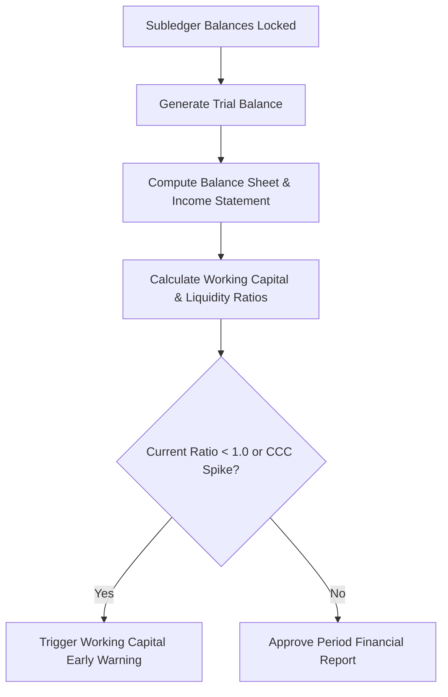

# Working Capital Optimization: Cash Conversion Cycle, Current Ratio & Liquidity Analysis
> Based on **Financial Statement Analysis and Security Valuation - Stephen Penman**

## 1. Canonical Enterprise Architecture & PostgreSQL Data Model (DDL)

```sql
-- Working Capital & Cash Flow Metrics Schema
CREATE TABLE balance_sheet_snapshots (
    snapshot_id UUID PRIMARY KEY DEFAULT uuid_generate_v4(),
    period VARCHAR(7) NOT NULL, -- YYYY-MM
    cash_and_equivalents NUMERIC(18, 4) NOT NULL,
    accounts_receivable NUMERIC(18, 4) NOT NULL,
    inventory_value NUMERIC(18, 4) NOT NULL,
    total_current_assets NUMERIC(18, 4) GENERATED ALWAYS AS (cash_and_equivalents + accounts_receivable + inventory_value) STORED,
    accounts_payable NUMERIC(18, 4) NOT NULL,
    short_term_debt NUMERIC(18, 4) NOT NULL,
    total_current_liabilities NUMERIC(18, 4) GENERATED ALWAYS AS (accounts_payable + short_term_debt) STORED,
    net_working_capital NUMERIC(18, 4) GENERATED ALWAYS AS (
        (cash_and_equivalents + accounts_receivable + inventory_value) - (accounts_payable + short_term_debt)
    ) STORED,
    period_revenue NUMERIC(18, 4) NOT NULL,
    period_cogs NUMERIC(18, 4) NOT NULL,
    period_purchases NUMERIC(18, 4) NOT NULL,
    CONSTRAINT uq_snapshot_period UNIQUE (period)
);
```

## 2. Mathematical Foundations & Business Invariants

### 2.1 Cash Conversion Cycle (CCC) Formulation
The Cash Conversion Cycle measures the time (in days) required to convert resource inputs into cash flows:
$$\text{CCC} = \text{DSO} + \text{DIO} - \text{DPO}$$
Where:
1. **Days Sales Outstanding (DSO)**:
   $$\text{DSO} = \frac{\text{Accounts Receivable}}{\text{Total Credit Sales}} \times 365$$
2. **Days Inventory Outstanding (DIO)**:
   $$\text{DIO} = \frac{\text{Average Inventory}}{\text{Cost of Goods Sold (COGS)}} \times 365$$
3. **Days Payable Outstanding (DPO)**:
   $$\text{DPO} = \frac{\text{Accounts Payable}}{\text{Cost of Goods Sold / Purchases}} \times 365$$

### 2.2 Liquidity Ratios
$$\text{Current Ratio} = \frac{\text{Current Assets}}{\text{Current Liabilities}}$$
$$\text{Quick Ratio} = \frac{\text{Cash} + \text{Marketable Securities} + \text{Accounts Receivable}}{\text{Current Liabilities}}$$
$$\text{Cash Ratio} = \frac{\text{Cash and Equivalents}}{\text{Current Liabilities}}$$

## 3. Finite State Machine (FSM) & Lifecycle Invariants

### 3.1 Financial Statement Analysis Workflow


## 4. Production Implementation Guidelines (Rust / SQL / Python)

```rust
use rust_decimal::Decimal;
use rust_decimal_macros::dec;

pub struct WorkingCapitalMetrics {
    pub nwc: Decimal,
    pub dso: Decimal,
    pub dio: Decimal,
    pub dpo: Decimal,
    pub ccc: Decimal,
    pub current_ratio: Decimal,
}

pub fn calculate_working_capital(
    ar: Decimal,
    inv: Decimal,
    ap: Decimal,
    cash: Decimal,
    current_liab: Decimal,
    revenue: Decimal,
    cogs: Decimal,
    purchases: Decimal,
) -> WorkingCapitalMetrics {
    let days_in_year = dec!(365.0);
    let dso = if revenue > Decimal::ZERO { (ar / revenue) * days_in_year } else { Decimal::ZERO };
    let dio = if cogs > Decimal::ZERO { (inv / cogs) * days_in_year } else { Decimal::ZERO };
    let dpo = if purchases > Decimal::ZERO { (ap / purchases) * days_in_year } else { Decimal::ZERO };
    let ccc = dso + dio - dpo;

    let current_assets = cash + ar + inv;
    let nwc = current_assets - current_liab;
    let current_ratio = if current_liab > Decimal::ZERO { current_assets / current_liab } else { Decimal::ZERO };

    WorkingCapitalMetrics { nwc, dso, dio, dpo, ccc, current_ratio }
}
```

## 5. Actionable Prompt Recipes

### 5.1 Local Ollama Cheat Sheet (Actionable Constraints & Invariants)
```markdown
- Enforce Cash Conversion Cycle identity: CCC = DSO + DIO - DPO.
- Net Working Capital = Current Assets - Current Liabilities.
- Alert when Current Ratio drops below 1.2 or CCC expands by > 15 days in consecutive quarters.
- Ensure denominator checks guard against zero-revenue or zero-cogs division.
```

### 5.2 Cloud LLM Architectural Prompt (Comprehensive Engineering Blueprint)
```markdown
Build an executive working capital and treasury monitoring engine:
1. Ingest balance sheet accounts to compute Net Working Capital, Quick Ratio, and Cash Conversion Cycle.
2. Implement historical trend analysis alerting treasury teams of working capital deterioration.
3. Provide predictive cash flow projections based on contractual payment terms and DSO targets.
```
