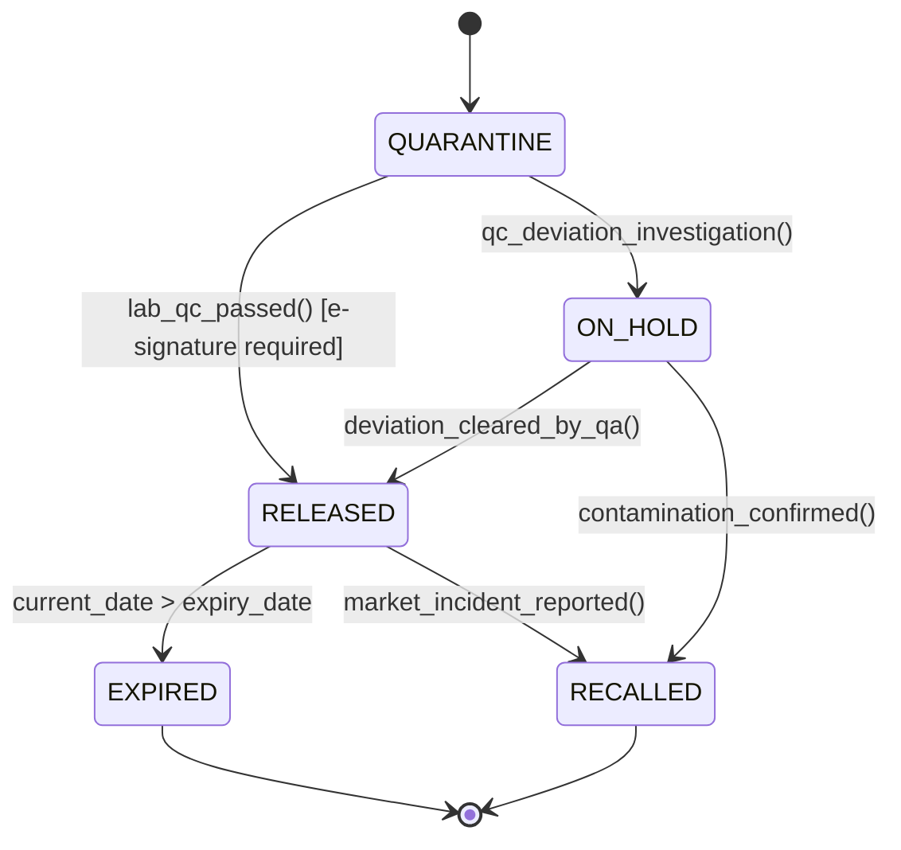

# Lot Traceability & Genealogies: Forward/Backward Tracing & FDA 21 CFR Part 11
> Based on **Traceability in Food and Pharma - GS1 Standard & FDA 21 CFR Part 11**

## 1. Canonical Enterprise Architecture & PostgreSQL Data Model (DDL)

```sql
-- Lot Traceability, Genealogies & Electronic Batch Records
CREATE TABLE inventory_lots (
    lot_id UUID PRIMARY KEY DEFAULT uuid_generate_v4(),
    product_id UUID NOT NULL REFERENCES products(product_id),
    lot_number VARCHAR(100) NOT NULL,
    manufacture_date DATE NOT NULL,
    expiry_date DATE NOT NULL,
    status VARCHAR(20) NOT NULL CHECK (status IN ('QUARANTINE', 'RELEASED', 'ON_HOLD', 'EXPIRED', 'RECALLED')),
    quantity_on_hand NUMERIC(14, 4) NOT NULL CHECK (quantity_on_hand >= 0),
    CONSTRAINT uq_prod_lot UNIQUE (product_id, lot_number),
    CONSTRAINT chk_lot_dates CHECK (expiry_date > manufacture_date)
);

CREATE TABLE lot_genealogy_edges (
    edge_id UUID PRIMARY KEY DEFAULT uuid_generate_v4(),
    parent_lot_id UUID NOT NULL REFERENCES inventory_lots(lot_id), -- Input raw material/intermediate
    child_lot_id UUID NOT NULL REFERENCES inventory_lots(lot_id),  -- Output finished good
    consumed_quantity NUMERIC(14, 4) NOT NULL CHECK (consumed_quantity > 0),
    production_order_id UUID NOT NULL,
    recorded_at TIMESTAMPTZ NOT NULL DEFAULT NOW(),
    CONSTRAINT chk_distinct_genealogy CHECK (parent_lot_id <> child_lot_id)
);

CREATE TABLE electronic_batch_records (
    ebr_id UUID PRIMARY KEY DEFAULT uuid_generate_v4(),
    lot_id UUID NOT NULL REFERENCES inventory_lots(lot_id),
    operator_party_id UUID NOT NULL REFERENCES parties(party_id),
    signature_digest VARCHAR(64) NOT NULL, -- SHA256 digital signature
    signature_timestamp TIMESTAMPTZ NOT NULL DEFAULT NOW(),
    step_description TEXT NOT NULL,
    verification_status VARCHAR(20) NOT NULL CHECK (verification_status IN ('VERIFIED', 'DEVIATION_NOTED'))
);
```

## 2. Mathematical Foundations & Business Invariants

### 2.1 Bidirectional Genealogy DAG Invariant
Let the lot genealogy graph be $G = (V, E)$.
1. **Backward Trace (Root Cause Analysis)**:
   $$\text{TraceBackward}(L) = \{u \in V \mid \text{path } u \rightsquigarrow L \text{ exists in } G\}$$
2. **Forward Trace (Blast Radius for Recall)**:
   $$\text{TraceForward}(L) = \{v \in V \mid \text{path } L \rightsquigarrow v \text{ exists in } G\}$$
**Acyclicity Constraint**: $\forall v \in V, v \notin \text{TraceForward}(v) \land v \notin \text{TraceBackward}(v)$.

### 2.2 First-Expired, First-Out (FEFO) Dispatch Invariant
When picking lot $L$ for delivery at time $t$:
$$\text{ExpiryDate}(L) = \min_{L' \in \text{AvailableLots}(P)} \text{ExpiryDate}(L')$$
Any issue of lot $L'$ with $\text{ExpiryDate}(L') > \min(\text{ExpiryDate})$ is an unauthorized FEFO breach.

## 3. Finite State Machine (FSM) & Lifecycle Invariants

### 3.1 Pharma Lot Quality Quarantine FSM


## 4. Production Implementation Guidelines (Rust / SQL / Python)

```rust
use std::collections::{HashMap, HashSet};

pub struct LotGraph {
    // parent -> list of children
    forward_edges: HashMap<uuid::Uuid, Vec<uuid::Uuid>>,
    // child -> list of parents
    backward_edges: HashMap<uuid::Uuid, Vec<uuid::Uuid>>,
}

impl LotGraph {
    pub fn forward_trace(&self, contaminated_lot: uuid::Uuid) -> HashSet<uuid::Uuid> {
        let mut affected = HashSet::new();
        let mut queue = vec![contaminated_lot];

        while let Some(current) = queue.pop() {
            if let Some(children) = self.forward_edges.get(&current) {
                for &child in children {
                    if affected.insert(child) {
                        queue.push(child);
                    }
                }
            }
        }
        affected
    }
}
```

## 5. Actionable Prompt Recipes

### 5.1 Local Ollama Cheat Sheet (Actionable Constraints & Invariants)
```markdown
- Enforce FEFO (First-Expired, First-Out): always allocate the lot with earliest expiration date.
- Bidirectional traceability: Forward (blast radius recall) and Backward (root cause analysis).
- Never allow consumption of lots in QUARANTINE or ON_HOLD status.
- Electronic Batch Records must store cryptographic signatures complying with 21 CFR Part 11.
```

### 5.2 Cloud LLM Architectural Prompt (Comprehensive Engineering Blueprint)
```markdown
Build a regulated lot traceability and recall management engine:
1. Model lot genealogies as a directed acyclic graph linking raw materials to finished goods.
2. Implement automated mock recall queries identifying all affected customer shipments in < 15 minutes.
3. Build FEFO picking reservation engines blocking expired or quarantined lots.
4. Guarantee 21 CFR Part 11 compliant immutable audit logging and dual-signature authorizations.
```
