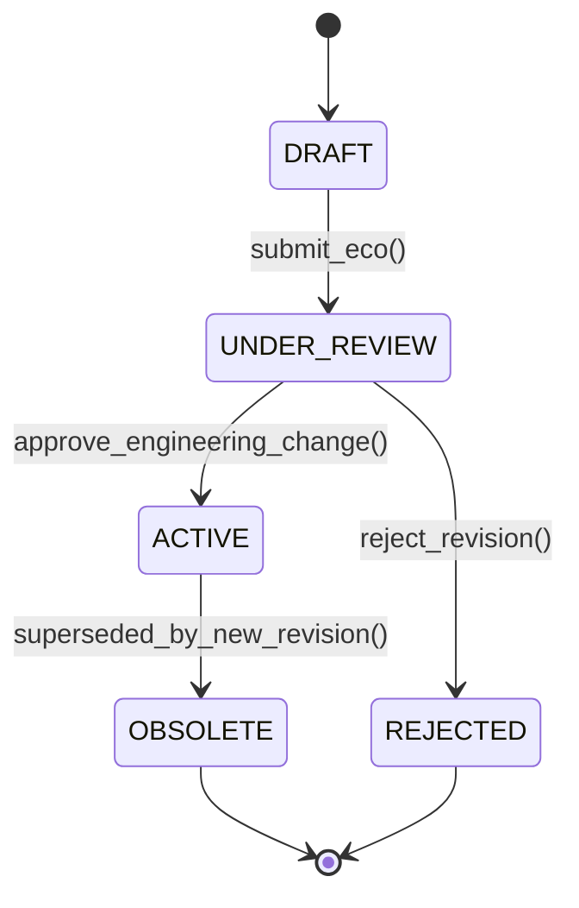

# Bill of Materials & Routing: Low-Level Coding, Multi-Level Explosion & Scrap Factors
> Based on **Orlicky's Material Requirements Planning - Joseph Orlicky / Carol Ptak & Chad Smith**

## 1. Canonical Enterprise Architecture & PostgreSQL Data Model (DDL)

```sql
-- Multi-Level BOM & Routing Operations Schema
CREATE TABLE bills_of_materials (
    bom_id UUID PRIMARY KEY DEFAULT uuid_generate_v4(),
    parent_product_id UUID NOT NULL REFERENCES products(product_id),
    bom_version VARCHAR(20) NOT NULL,
    status VARCHAR(20) NOT NULL CHECK (status IN ('DRAFT', 'ACTIVE', 'OBSOLETE')),
    is_primary BOOLEAN NOT NULL DEFAULT TRUE,
    created_at TIMESTAMPTZ NOT NULL DEFAULT NOW(),
    CONSTRAINT uq_bom_parent_version UNIQUE (parent_product_id, bom_version)
);

CREATE TABLE bom_components (
    component_id UUID PRIMARY KEY DEFAULT uuid_generate_v4(),
    bom_id UUID NOT NULL REFERENCES bills_of_materials(bom_id) ON DELETE CASCADE,
    child_product_id UUID NOT NULL REFERENCES products(product_id),
    quantity_per_assembly NUMERIC(12, 4) NOT NULL CHECK (quantity_per_assembly > 0),
    scrap_percentage NUMERIC(5, 2) NOT NULL DEFAULT 0.00 CHECK (scrap_percentage BETWEEN 0 AND 99.99),
    effective_from DATE NOT NULL,
    effective_thru DATE,
    CONSTRAINT chk_bom_dates CHECK (effective_thru IS NULL OR effective_thru >= effective_from)
);

CREATE TABLE routings (
    routing_id UUID PRIMARY KEY DEFAULT uuid_generate_v4(),
    product_id UUID NOT NULL REFERENCES products(product_id),
    routing_version VARCHAR(20) NOT NULL,
    status VARCHAR(20) NOT NULL CHECK (status IN ('ACTIVE', 'REVISED', 'OBSOLETE'))
);

CREATE TABLE routing_operations (
    operation_id UUID PRIMARY KEY DEFAULT uuid_generate_v4(),
    routing_id UUID NOT NULL REFERENCES routings(routing_id) ON DELETE CASCADE,
    operation_sequence INT NOT NULL,
    work_center_id UUID NOT NULL REFERENCES work_centers(work_center_id),
    setup_time_minutes NUMERIC(8, 2) NOT NULL DEFAULT 0.00 CHECK (setup_time_minutes >= 0),
    run_time_per_unit_minutes NUMERIC(8, 4) NOT NULL CHECK (run_time_per_unit_minutes >= 0),
    CONSTRAINT uq_routing_seq UNIQUE (routing_id, operation_sequence)
);
```

## 2. Mathematical Foundations & Business Invariants

### 2.1 BOM Directed Acyclic Graph (DAG) Invariant
Let $G = (V, E)$ be the BOM graph where vertices $V$ are products and directed edges $(u, v) \in E$ represent component $v$ contained in parent assembly $u$:
$$\forall v \in V, \quad v \notin \text{Descendants}(v) \iff \text{Cycles}(G) = \emptyset$$
Any circular component reference (e.g. $A \to B \to C \to A$) is structurally illegal.

### 2.2 Low-Level Code (LLC) Definition
The Low-Level Code of an item $i$ is the maximum depth at which it appears in any BOM tree:
$$\text{LLC}(i) = \begin{cases} 0 & \text{if } i \text{ is an end-item (never a component)} \\ 1 + \max_{(p, i) \in E} \text{LLC}(p) & \text{otherwise} \end{cases}$$
**MRP Explosion Invariant**: Requirements for an item with LLC $k$ MUST NOT be processed until all items with LLC $< k$ have completed processing.

### 2.3 Scrap Factor Requirement Inflation
For parent requirement $Q_{\text{parent}}$, quantity per assembly $q$, and scrap rate $s \in [0, 1)$:
$$\text{Gross Component Requirement} = \frac{Q_{\text{parent}} \times q}{1 - s}$$

## 3. Finite State Machine (FSM) & Lifecycle Invariants

### 3.1 Engineering Change Order (ECO) BOM Lifecycle


## 4. Production Implementation Guidelines (Rust / SQL / Python)

```rust
use std::collections::{HashMap, HashSet};

pub struct BomComponent {
    pub child_id: &'static str,
    pub qty: f64,
    pub scrap_rate: f64,
}

pub fn explode_bom(
    parent: &'static str,
    needed_qty: f64,
    bom_tree: &HashMap<&'static str, Vec<BomComponent>>,
    visited: &mut HashSet<&'static str>,
) -> Result<HashMap<&'static str, f64>, &'static str> {
    if visited.contains(parent) {
        return Err("BOM cycle detected!");
    }
    visited.insert(parent);

    let mut total_reqs = HashMap::new();
    if let Some(components) = bom_tree.get(parent) {
        for comp in components {
            let gross_child = (needed_qty * comp.qty) / (1.0 - comp.scrap_rate);
            *total_reqs.entry(comp.child_id).or_insert(0.0) += gross_child;

            // Recurse down hierarchy
            let sub_reqs = explode_bom(comp.child_id, gross_child, bom_tree, visited)?;
            for (sub_item, sub_qty) in sub_reqs {
                *total_reqs.entry(sub_item).or_insert(0.0) += sub_qty;
            }
        }
    }
    visited.remove(parent);
    Ok(total_reqs)
}
```

## 5. Actionable Prompt Recipes

### 5.1 Local Ollama Cheat Sheet (Actionable Constraints & Invariants)
```markdown
- Never allow circular parent-child relationships in BOMs: verify acyclic DAG property.
- Assign Low-Level Codes (LLC) to every part; process MRP level by level (level 0 first).
- Inflate gross requirements by scrap rate: Gross = (ParentQty * QtyPer) / (1 - ScrapRate).
- Routing operations must have unique, strictly increasing sequence numbers (10, 20, 30).
```

### 5.2 Cloud LLM Architectural Prompt (Comprehensive Engineering Blueprint)
```markdown
Architect an enterprise Bill of Materials (BOM) and Routing management service:
1. Implement recursive topological sorting to compute Low-Level Codes (LLC) across all assemblies.
2. Build multi-level BOM explosion and implosion (where-used) query engines.
3. Account for scrap percentages and date-effective component cut-ins and cut-outs.
4. Provide unit tests detecting cyclical graph loops and verifying gross requirement calculations.
```
