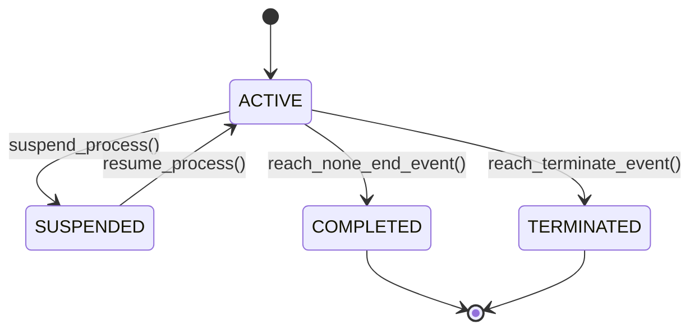

# BPMN 2.0 Process Orchestration: Gateways, Boundary Events & Workflow Patterns
> Based on **Fundamentals of Business Process Management - Marlon Dumas, Marcello La Rosa, Jan Mendling, Hajo Reijers**

## 1. Canonical Enterprise Architecture & PostgreSQL Data Model (DDL)

```sql
-- BPMN 2.0 Process Definitions & Execution Instances
CREATE TABLE bpmn_process_definitions (
    def_id UUID PRIMARY KEY DEFAULT uuid_generate_v4(),
    process_key VARCHAR(100) NOT NULL UNIQUE,
    version INT NOT NULL DEFAULT 1,
    name VARCHAR(255) NOT NULL,
    bpmn_xml TEXT NOT NULL,
    is_active BOOLEAN NOT NULL DEFAULT TRUE,
    deployed_at TIMESTAMPTZ NOT NULL DEFAULT NOW()
);

CREATE TABLE bpmn_process_instances (
    instance_id UUID PRIMARY KEY DEFAULT uuid_generate_v4(),
    def_id UUID NOT NULL REFERENCES bpmn_process_definitions(def_id),
    business_key VARCHAR(100) NOT NULL,
    status VARCHAR(20) NOT NULL CHECK (status IN ('ACTIVE', 'SUSPENDED', 'COMPLETED', 'TERMINATED')),
    variables JSONB NOT NULL DEFAULT '{}',
    started_at TIMESTAMPTZ NOT NULL DEFAULT NOW(),
    ended_at TIMESTAMPTZ
);

CREATE TABLE bpmn_execution_tokens (
    token_id UUID PRIMARY KEY DEFAULT uuid_generate_v4(),
    instance_id UUID NOT NULL REFERENCES bpmn_process_instances(instance_id) ON DELETE CASCADE,
    current_activity_id VARCHAR(100) NOT NULL,
    token_status VARCHAR(20) NOT NULL CHECK (status IN ('ACTIVE', 'WAITING_SIGNAL', 'CONSUMED')),
    created_at TIMESTAMPTZ NOT NULL DEFAULT NOW()
);
```

## 2. Mathematical Foundations & Business Invariants

### 2.1 Workflow Net Soundness Invariant
A workflow net $W$ is sound iff:
1. **Safeness (No Token Multiplication)**: No place in the Petri net ever contains more than one token during normal execution.
2. **Proper Completion**: When the end place is marked with a token, all other places in the net must be empty:
   $$\forall M \in [M_0\rangle, \quad M \ge M_{\text{end}} \implies M = M_{\text{end}}$$
3. **Dead Transition Freedom**: No transition in the workflow net can become unreachable from the start place.

### 2.2 Parallel Split (AND-Split) & Synchronization (AND-Join)
When an AND-Split fires with 1 incoming token, it generates $k$ concurrent tokens on all outgoing branches.
An AND-Join cannot fire until ALL $k$ incoming branch tokens have arrived at its input ports.

## 3. Finite State Machine (FSM) & Lifecycle Invariants

### 3.1 BPMN Process Instance State Machine


## 4. Production Implementation Guidelines (Rust / SQL / Python)

```rust
pub enum GatewayType {
    ExclusiveXor,
    ParallelAnd,
    InclusiveOr,
}

pub struct AndJoinGateway {
    pub required_incoming_tokens: usize,
    pub current_tokens: usize,
}

impl AndJoinGateway {
    pub fn receive_token(&mut self) -> bool {
        self.current_tokens += 1;
        if self.current_tokens >= self.required_incoming_tokens {
            self.current_tokens = 0; // Consume tokens and fire
            true
        } else {
            false
        }
    }
}
```

## 5. Actionable Prompt Recipes

### 5.1 Local Ollama Cheat Sheet (Actionable Constraints & Invariants)
```markdown
- Enforce workflow net soundness: no deadlocks, no dangling unconsumed tokens.
- AND-Join must wait for tokens from all incoming parallel branches before firing.
- XOR-Split evaluates conditions in order and routes token down exactly one branch.
- Boundary error events cancel active tasks within the scope unless configured as non-interrupting.
```

### 5.2 Cloud LLM Architectural Prompt (Comprehensive Engineering Blueprint)
```markdown
Implement an enterprise BPMN 2.0 workflow orchestration engine:
1. Parse executable BPMN 2.0 XML models into Petri net execution graphs.
2. Build an asynchronous token dispatcher supporting Service Tasks, User Tasks, and Gateways.
3. Guarantee proper completion and token hygiene across multi-instance sub-processes.
4. Provide unit tests proving deadlock detection in misconfigured AND/XOR gateway joins.
```
