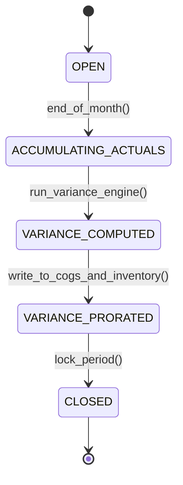

# Cost Accounting & Managerial Control: Standard Costing, ABC & Variance Analysis
> Based on **Cost Accounting: A Managerial Emphasis - Horngren, Datar, Rajan**

## 1. Canonical Enterprise Architecture & PostgreSQL Data Model (DDL)

```sql
-- Cost Accounting & Variance Analysis Tables
CREATE TABLE standard_costs (
    product_id UUID NOT NULL REFERENCES products(product_id),
    cost_version VARCHAR(20) NOT NULL,
    direct_material_standard NUMERIC(14, 4) NOT NULL DEFAULT 0.0000,
    direct_labor_standard NUMERIC(14, 4) NOT NULL DEFAULT 0.0000,
    overhead_standard NUMERIC(14, 4) NOT NULL DEFAULT 0.0000,
    total_standard_cost NUMERIC(14, 4) GENERATED ALWAYS AS (
        direct_material_standard + direct_labor_standard + overhead_standard
    ) STORED,
    effective_from DATE NOT NULL,
    PRIMARY KEY (product_id, cost_version)
);

CREATE TABLE cost_pools (
    pool_id UUID PRIMARY KEY DEFAULT uuid_generate_v4(),
    pool_name VARCHAR(100) NOT NULL UNIQUE,
    cost_driver VARCHAR(50) NOT NULL, -- e.g., 'MACHINE_HOURS', 'SETUP_COUNT'
    budgeted_cost NUMERIC(18, 4) NOT NULL,
    budgeted_driver_units NUMERIC(14, 4) NOT NULL CHECK (budgeted_driver_units > 0),
    predetermined_overhead_rate NUMERIC(14, 4) GENERATED ALWAYS AS (budgeted_cost / budgeted_driver_units) STORED
);

CREATE TABLE production_variances (
    variance_id UUID PRIMARY KEY DEFAULT uuid_generate_v4(),
    production_order_id UUID NOT NULL,
    variance_type VARCHAR(30) NOT NULL CHECK (variance_type IN (
        'MATERIAL_PRICE', 'MATERIAL_EFFICIENCY', 'LABOR_RATE', 'LABOR_EFFICIENCY', 'OVERHEAD_VOLUME', 'OVERHEAD_SPENDING'
    )),
    favorable_or_unfavorable VARCHAR(1) NOT NULL CHECK (favorable_or_unfavorable IN ('F', 'U')),
    amount NUMERIC(18, 4) NOT NULL CHECK (amount >= 0),
    journal_entry_id UUID REFERENCES journal_entries(entry_id),
    recorded_at TIMESTAMPTZ NOT NULL DEFAULT NOW()
);
```

## 2. Mathematical Foundations & Business Invariants

### 2.1 Standard Cost Variance Formulas
1. **Direct Material Price Variance (MPV)**:
   $$\text{MPV} = (\text{Actual Price} - \text{Standard Price}) \times \text{Actual Quantity Purchased}$$
   $(\text{AP} > \text{SP} \implies \text{Unfavorable}; \text{AP} < \text{SP} \implies \text{Favorable})$

2. **Direct Material Efficiency/Quantity Variance (MQV)**:
   $$\text{MQV} = (\text{Actual Quantity Used} - \text{Standard Quantity Allowed}) \times \text{Standard Price}$$

3. **Direct Labor Rate Variance (LRV)**:
   $$\text{LRV} = (\text{Actual Wage Rate} - \text{Standard Wage Rate}) \times \text{Actual Hours Worked}$$

4. **Direct Labor Efficiency Variance (LEV)**:
   $$\text{LEV} = (\text{Actual Hours Worked} - \text{Standard Hours Allowed}) \times \text{Standard Wage Rate}$$

### 2.2 Total Cost Reconciliation
$$\text{Total Actual Cost} = \text{Standard Cost of Output} + \sum \text{Unfavorable Variances} - \sum \text{Favorable Variances}$$

## 3. Finite State Machine (FSM) & Lifecycle Invariants

### 3.1 Cost Accounting Period-End FSM


## 4. Production Implementation Guidelines (Rust / SQL / Python)

```rust
use rust_decimal::Decimal;

pub struct MaterialVarianceResult {
    pub price_variance: Decimal,
    pub price_is_favorable: bool,
    pub efficiency_variance: Decimal,
    pub efficiency_is_favorable: bool,
}

pub fn calculate_material_variances(
    actual_qty: Decimal,
    actual_price: Decimal,
    standard_qty: Decimal,
    standard_price: Decimal,
) -> MaterialVarianceResult {
    let pv = (actual_price - standard_price) * actual_qty;
    let ev = (actual_qty - standard_qty) * standard_price;

    MaterialVarianceResult {
        price_variance: pv.abs(),
        price_is_favorable: pv <= Decimal::ZERO,
        efficiency_variance: ev.abs(),
        efficiency_is_favorable: ev <= Decimal::ZERO,
    }
}
```

## 5. Actionable Prompt Recipes

### 5.1 Local Ollama Cheat Sheet (Actionable Constraints & Invariants)
```markdown
- Differentiate favorable (credit balance / negative cost) from unfavorable (debit balance / positive cost) variances.
- Use predetermined overhead rates: PredeterminedRate = BudgetedCost / BudgetedDriverUnits.
- Material price variance is recognized upon purchase; material quantity variance is recognized upon consumption.
- Variance accounts must be cleared at period-end by disposition to COGS and Ending WIP/Inventory.
```

### 5.2 Cloud LLM Architectural Prompt (Comprehensive Engineering Blueprint)
```markdown
Design a production cost accounting engine following Horngren's Managerial Emphasis:
1. Maintain standard cost component tables (Direct Materials, Direct Labor, Variable Overhead, Fixed Overhead).
2. Build automated variance calculators executing the 4-way variance decomposition for shop floor work orders.
3. Implement activity-based costing (ABC) drivers allocating overhead pools to production runs.
4. Construct period-end variance disposition journal routines routing unabsorbed overhead to COGS.
```
