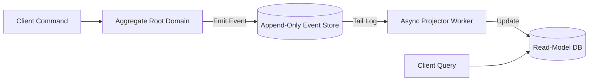

# CQRS & Event Sourcing: Write-Model Event Stores & Read-Model Projections
> Based on **Building Event-Driven Microservices - Adam Bellemare**

## 1. Canonical Enterprise Architecture & PostgreSQL Data Model (DDL)

```sql
-- CQRS Write-Model Event Store & Read-Model Projection Tables
CREATE TABLE es_event_log (
    global_offset BIGSERIAL PRIMARY KEY,
    stream_id UUID NOT NULL,
    stream_version INT NOT NULL,
    event_type VARCHAR(100) NOT NULL,
    payload JSONB NOT NULL,
    timestamp TIMESTAMPTZ NOT NULL DEFAULT NOW(),
    CONSTRAINT uq_es_stream_ver UNIQUE (stream_id, stream_version)
);

CREATE TABLE projection_checkpoints (
    projection_name VARCHAR(100) PRIMARY KEY,
    last_processed_offset BIGINT NOT NULL DEFAULT 0,
    updated_at TIMESTAMPTZ NOT NULL DEFAULT NOW()
);

CREATE TABLE read_model_order_summaries (
    order_id UUID PRIMARY KEY,
    customer_name VARCHAR(255) NOT NULL,
    item_count INT NOT NULL,
    total_amount NUMERIC(18, 4) NOT NULL,
    status VARCHAR(30) NOT NULL,
    last_event_version INT NOT NULL
);
```

## 2. Mathematical Foundations & Business Invariants

### 2.1 State as a Pure Function of Events (Fold Invariant)
The current state $S$ of an aggregate is computed by folding historic events:
$$S_t = \text{foldl}(\text{apply}, S_0, E_{1..t})$$
**Deterministic Replay Invariant**:
Replaying identical events on an uninitialized state MUST always yield identical aggregate state:
$$\text{Replay}(E) = \text{Replay}(E)$$

### 2.2 Projection Checkpoint Monotonicity
For any asynchronous projection reader $P$:
$$\text{Offset}_t(P) \ge \text{Offset}_{t-1}(P)$$

## 3. Finite State Machine (FSM) & Lifecycle Invariants

### 3.1 CQRS Command-to-Projection Pipeline


## 4. Production Implementation Guidelines (Rust / SQL / Python)

```rust
use serde::{Deserialize, Serialize};

#[derive(Serialize, Deserialize, Debug)]
pub enum OrderEvent {
    Created { id: uuid::Uuid, customer: String },
    ItemAdded { price: f64 },
}

#[derive(Default, Debug)]
pub struct OrderState {
    pub id: Option<uuid::Uuid>,
    pub customer: String,
    pub total: f64,
}

impl OrderState {
    pub fn apply(&mut self, event: OrderEvent) {
        match event {
            OrderEvent::Created { id, customer } => {
                self.id = Some(id);
                self.customer = customer;
            }
            OrderEvent::ItemAdded { price } => {
                self.total += price;
            }
        }
    }
}
```

## 5. Actionable Prompt Recipes

### 5.1 Local Ollama Cheat Sheet (Actionable Constraints & Invariants)
```markdown
- Separate write models (Commands) from read models (Queries).
- Event Store is append-only: never UPDATE or DELETE event records.
- Hydrate aggregate by left-folding events starting from snapshot or initial state.
- Keep read projections idempotent so they can be rebuilt from scratch at any time.
```

### 5.2 Cloud LLM Architectural Prompt (Comprehensive Engineering Blueprint)
```markdown
Architect an enterprise CQRS and Event Sourcing system:
1. Build a high-throughput event store with strict optimistic concurrency on stream version.
2. Construct asynchronous projection workers streaming events to optimized PostgreSQL/Elastic read models.
3. Implement snapshotting mechanisms every 100 events to maintain sub-10ms aggregate hydration.
4. Support full replay capability allowing new read models to be generated historically.
```
