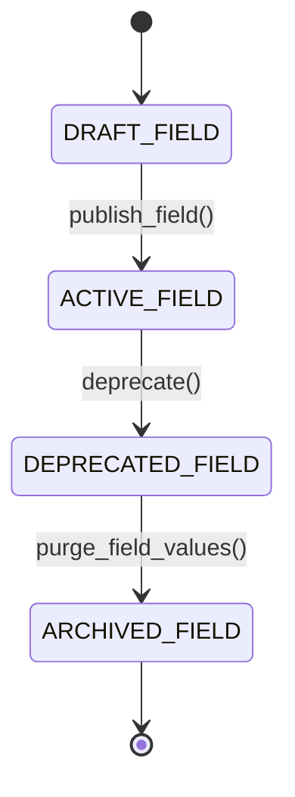

# Metadata-Driven Extensibility: EAV, JSONB Schemas & Dynamic Virtual Fields
> Based on **Enterprise Software Architecture: Extensibility & Custom Fields**

## 1. Canonical Enterprise Architecture & PostgreSQL Data Model (DDL)

```sql
-- Metadata Definitions & Hybrid JSONB Entity Extension
CREATE TABLE entity_custom_field_definitions (
    field_id UUID PRIMARY KEY DEFAULT uuid_generate_v4(),
    entity_name VARCHAR(100) NOT NULL, -- e.g. 'Order', 'Product'
    field_name VARCHAR(50) NOT NULL,
    label VARCHAR(100) NOT NULL,
    data_type VARCHAR(20) NOT NULL CHECK (data_type IN ('STRING', 'NUMBER', 'BOOLEAN', 'DATE', 'SELECT')),
    is_required BOOLEAN NOT NULL DEFAULT FALSE,
    validation_regex TEXT,
    CONSTRAINT uq_entity_field UNIQUE (entity_name, field_name)
);

CREATE TABLE extensible_customers (
    customer_id UUID PRIMARY KEY DEFAULT uuid_generate_v4(),
    name VARCHAR(255) NOT NULL,
    email VARCHAR(255) NOT NULL UNIQUE,
    custom_fields JSONB NOT NULL DEFAULT '{}'
);

-- Fast JSONB index
CREATE INDEX idx_extensible_cust_gin ON extensible_customers USING GIN (custom_fields);
```

## 2. Mathematical Foundations & Business Invariants

### 2.1 Metadata Schema Validation Invariant
For entity $E$ with custom payload $D = \{k_1: v_1, \dots, k_n: v_n\}$:
$$\forall (k, v) \in D, \quad \exists \text{Def} \in \text{Fields}(E) \text{ s.t. } \text{Type}(v) = \text{Def.Type} \land (\text{Regex}(v) = \text{True})$$
If any field violates its defined metadata specification, the insert/update transaction must abort.

## 3. Finite State Machine (FSM) & Lifecycle Invariants

### 3.1 Custom Field Definition Lifecycle


## 4. Production Implementation Guidelines (Rust / SQL / Python)

```rust
use serde_json::Value;

pub fn validate_custom_field(data_type: &str, val: &Value) -> bool {
    match data_type {
        "STRING" => val.is_string(),
        "NUMBER" => val.is_number(),
        "BOOLEAN" => val.is_boolean(),
        _ => false,
    }
}
```

## 5. Actionable Prompt Recipes

### 5.1 Local Ollama Cheat Sheet (Actionable Constraints & Invariants)
```markdown
- Avoid traditional EAV join complexity: prefer PostgreSQL JSONB with GIN indexing.
- Validate custom field types against metadata definitions before writing to JSONB.
- Create functional B-tree indexes for high-frequency custom query filters: (custom_fields->>'tax_code').
- Manage custom field deprecation without dropping historic data.
```

### 5.2 Cloud LLM Architectural Prompt (Comprehensive Engineering Blueprint)
```markdown
Design an enterprise metadata-driven custom fields engine:
1. Support zero-downtime dynamic schema extensions using PostgreSQL JSONB containers.
2. Build schema validators ensuring custom attributes adhere to declared types, limits, and regex constraints.
3. Accelerate search queries using GIN and jsonb_path_ops indexing.
4. Provide unit tests validating dynamic field creation, updating, and type mismatch rejection.
```
